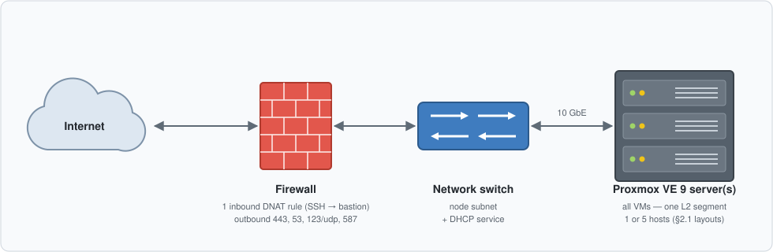

# DTK Test Environment on PVE — Resource Requirements

**Audience:** adopter infrastructure, network, and security teams
**Purpose:** everything to provision and confirm before deployment can begin
**Status:** draft for review
**Date:** 2026-08-31

Each item is marked **[R]** Required or **[REC]** Recommended. Section 11 is the acceptance checklist — the complete list of what is expected to be in place; the environment is "ready for deployment" when every item there is confirmed.

---

## Contents

1. [Purpose and scope](#1-purpose-and-scope) — end state (§1.1), limitations (§1.2)
2. [Design overview](#2-design-overview) — physical topology & hardware layouts (§2.1), logical design (§2.2)
3. [VM inventory](#3-vm-inventory) — Minimum vs. Recommended profiles
4. [Storage](#4-storage)
5. [Proxmox prerequisites](#5-proxmox-prerequisites)
6. [Network](#6-network) — IP plan (§6.1), inbound (§6.2), egress (§6.3)
7. [DNS and TLS](#7-dns-and-tls)
8. [Participant (DFSP) hosts](#8-participant-dfsp-hosts)
9. [Access and credentials](#9-access-and-credentials-supplied-by-the-adopter) — security summary (§9.1)
10. [People and process](#10-people-and-process)
11. [Acceptance checklist](#11-acceptance-checklist)

---

## 1. Purpose and scope

This document specifies the resources needed to host a **test environment** of the Mojaloop Deployment Toolkit (DTK). The environment is for functional and integration testing — participant onboarding over mTLS and end-to-end transfers.

The deployment consists of:

- **1 Tooling Cluster** — shared services: container registry mirror (Harbor), object storage (MinIO), Telemetry (Grafana/Thanos/Loki/Tempo).
- **1 Mojaloop Hub** — the switch: Mojaloop core services, connection manager (MCM), Finance Portal, identity (Ory), and an in-cluster data layer (MySQL, Kafka, MongoDB, Redis).
- **3 Participant (DFSP) hosts** — simulated participants running the integration toolkit under Docker Compose, connected to the hub over mTLS.
- **Support VMs** — SSH bastion, deployment driver ("util"), and DHCP service if the adopter network does not provide one.

**Platform: Proxmox VE 9** is the supported and validated infrastructure. The toolkit provisions the cluster VMs itself through the Proxmox API; nodes run Talos Linux (immutable, no SSH, no packages) and are not managed as conventional servers.

### 1.1 End state

The environment is complete when:

- both clusters are deployed, healthy, and reconciled by GitOps;
- all three participants are onboarded over mTLS through the connection manager;
- an end-to-end transfer between two participants completes successfully;
- operator UIs (MCM, Finance Portal, Grafana, testing toolkit) are reachable through the bastion with valid public TLS certificates;

### 1.2 Limitations

- **Test tier only** — sized for functional testing, not performance benchmarking, high availability, or disaster recovery.
- **Not publicly reachable** — all access is through the SSH bastion; the only inbound exposure is one SSH port on the firewall.

## 2. Design overview

### 2.1 Physical topology

**Server capacity — invariants.** Any hardware layout must satisfy:

- **[R]** Aggregate capacity for the chosen §3 profile — Minimum: ≈45 vCPU, ≈70 GB VM RAM, ≈700 GB SSD; Recommended: ≈57 vCPU, ≈107 GB VM RAM, ≈780 GB SSD. 2:1 CPU overcommit is acceptable at test tier; **RAM is never overcommitted**.
- **[R]** All Proxmox hosts and VMs on **one L2 segment**.
- **[R]** Proxmox VE 9 on every host; multiple hosts joined in one PVE cluster.

**Reference layouts.** Either of the following is acceptable; so is any other layout meeting the invariants.

*Layout A — single host.* Simplest to provide and operate. Caveat: a host failure takes down the entire environment (acceptable at test tier).

| Host | Min spec |
|---|---|
| 1 × all VMs | 32+ physical cores, **128–192 GB RAM** (96 GB suffices with the Minimum profile), ≈1 TB SSD |

*Layout B — five hosts* **[REC]**. Management, hub, and tooling/participant workloads separated:

| Host | Runs | Min spec per host |
|---|---|---|
| 1 × management | bastion, util, DHCP VM, VM template | 4+ cores, 16 GB RAM, 100 GB |
| 3 × hub | 1 hub control plane + 1 hub worker each | 8+ cores, 32 GB RAM, 200 GB SSD |
| 1 × tooling + participants | tooling node, 3 DFSP VMs | 8+ cores, 32 GB RAM, 250 GB SSD |

Layout B is recommended for a concrete reason, not preference: the toolkit maps its placement groups to specific Proxmox hosts, so with three hub hosts the three control planes and three workers get **real anti-affinity** — losing one host leaves the control-plane quorum and two workers intact. On a single host, placement groups provide no isolation. Layout B makes the inter-host network load-bearing — the 10 GbE requirement (see components table below) matters most here.

**Profile pairing:** Layout A fits either §3 profile; Layout B assumes the **Recommended** profile (its three-host hub exists to protect the three control planes — pointless with a single one).

**Other physical components the adopter provides:**

| Component | Requirement | Req |
|---|---|---|
| Network switch / L2 segment | all VMs and Proxmox hosts on one L2 segment; **10 GbE** between hosts | [R] |
| Firewall / router | one inbound DNAT rule (public IP:port → bastion SSH); outbound 443, 53, 123/UDP, 587 per §6.3; hairpin NAT or split DNS if operators sit inside the same network | [R] |
| DHCP service | on the node subnet, from network equipment or the dnsmasq VM (§3, §6.1) | [R] |
| Internet uplink | stable; **≥50 Mbps** downstream recommended — total downloads during deployment exceed 10 GB | [R] |
| Out-of-band management | IPMI / iLO / iDRAC or console access to the Proxmox hosts — not mandatory, but useful for host-level recovery (e.g. a host unreachable after a network or storage change) | [REC] |

### 2.2 Logical design (HLD)

Traffic model:

- **North–south:** all application traffic enters on **443/TCP** at four hub gateway addresses. Participant FSPIOP traffic terminates with **mTLS** at a dedicated endpoint (`extapi.<domain>`); operator and portal UIs use standard TLS on `*.int.<domain>` / `*.ext.<domain>` hostnames.
- **East–west:** intra-cluster traffic is transparently encrypted (Cilium WireGuard). This is internal to the cluster — no VPN or mesh component for the adopter to operate.
- **Egress:** clusters pull images and artifacts from public registries over 443 (optionally via the Harbor pull-through mirror on the Tooling Cluster), and reach the DNS-provider API and ACME CA for certificate automation.
- **Operator access:** the environment is **not publicly reachable**. The bastion is the only inbound path; all operations (SSH, kubectl, talosctl, web UIs) tunnel through it.

## 3. VM inventory

**[R]** Two profiles are offered; the adopter selects one (declared in the §11 checklist). The only functional difference is that **Minimum runs a single hub control plane** (no control-plane HA — acceptable at test tier) with smaller cluster RAM; everything in §§4–10 is identical for both. Intermediate combinations are not offered.

| Group | VM | Qty (min / rec) | vCPU | RAM (min / rec) | Disk(s) | OS | Provisioned by |
|---|---|---|---|---|---|---|---|
| Tooling | node (mixed-plane) | 1 | 8 | 12 / 16 GB | 64 + 64 GB | Talos | toolkit |
| Hub | control plane | **1 / 3** | 6 | 5 / 8 GB | 32 GB | Talos | toolkit |
| Hub | worker | 3 | 6 | 11 / 16 GB | 64 + 64 GB | Talos | toolkit |
| Participants | DFSP host | 3 | 2 | 4 GB | 32 GB | Debian 13 | adopter |
| Support | bastion | 1 | 2 | 2 GB | 20 GB | Debian 13 | adopter |
| Support | util (driver) | 1 | 4 | 4 GB | 40 GB | Debian 13 | adopter |
| Support | DHCP (only if not network-provided) | 0–1 | 1 | 1 GB | 10 GB | Debian 13 | adopter |

| Profile | VMs | vCPU | RAM | Disk |
|---|---|---|---|---|
| **Minimum** | ~11 | ≈45 | ≈70 GB | ≈700 GB |
| **Recommended** | ~13 | ≈57 | ≈107 GB | ≈780 GB |

The Minimum cluster sizes are the toolkit's shipped, lab-validated template values; Recommended adds control-plane quorum and RAM headroom on top of them.

Notes:

- The **cluster VMs are created by the toolkit** via the Proxmox API — the adopter provides capacity and network, not the VMs themselves.
- Debian VMs are cloned from a cloud-init template (~3 GB) built once on the cluster; allow for it in storage.
- All Debian VMs (support and participant) use **SSH key authentication only** — password authentication disabled.
- CPU type is passed through as `host`; nested virtualization is not required.

## 4. Storage

- **[R]** A Proxmox disk pool supporting **raw** images (`local-lvm`, ZFS, or Ceph RBD) with ≈700–780 GB available (per §3 profile).
- **[R]** SSD-backed storage for the data disks. Guideline: ≥3,000 sustained IOPS and p99 write latency < 5 ms for data volumes; ≥500 IOPS general-purpose.
- **[REC]** Thin provisioning is acceptable; test-tier database/broker volumes are small (≤10 GiB each).

## 5. Proxmox prerequisites

- **[R]** **Proxmox VE 9.x** (one node is sufficient for this footprint), API reachable on **8006/TCP** from the util VM.
- **[R]** A storage pool with **`ISO image`** content type (Talos image upload).
- **[R]** A storage pool with the **`Snippets`** content type **enabled** (`pvesm set local --content iso,vztmpl,backup,snippets` — note the content list is absolute, not additive). This is off by default and deployment fails without it.
- **[R]** A network bridge (e.g. `vmbr0`) shared by all VMs, on one L2 segment.
- **[R]** QEMU guest agent permitted (enabled per-VM by the toolkit).
- **[R]** The **util VM** (the machine driving the deployment) carries the toolchain: terraform ≥ 1.9, flux, helm, talosctl, kubectl, yq (mikefarah v4 — not the python one), jq, python3, make. (The toolkit's `make check` re-verifies these at deploy time.)

## 6. Network

### 6.1 IP plan

All addresses on the same L2 segment / subnet as the nodes.

| Purpose | Count | Allocation |
|---|---|---|
| Kubernetes API VIP (tooling + hub) | 2 | **static, outside DHCP scope** |
| Load-balancer addresses (2 tooling + 4 hub gateways) | 6 | **static, outside DHCP scope** |
| Participant (DFSP) host IPs | 3 | **static, never DHCP** (see §8) |
| Bastion, util, DHCP VM | 2–3 | static or reserved lease |
| Cluster node IPs | 5 (Minimum) / 7 (Recommended) | **DHCP lease** |

- **[R]** **DHCP service on the node subnet.** Proxmox provides none; the adopter network must supply it, or approve a small dnsmasq VM (§3). Cluster nodes obtain their addresses by DHCP.
- **[R]** A contiguous reserved block outside the DHCP scope covering the 11 static addresses above simplifies the firewall rules and the address plan.
- Cluster-internal ranges `100.64.0.0/16` (pods) and `172.20.0.0/16` (services) are never routed outside the clusters; flag any conflict with adopter ranges.

### 6.2 Inbound

| Port | To | From | Purpose |
|---|---|---|---|
| 22/TCP (or adopter-chosen, e.g. 2222) | bastion **public IP** | operator source ranges | only path into the environment |
| 443/TCP | 6 LB addresses | operator + participant networks (LAN) | all application traffic; TLS, and mTLS on the FSPIOP endpoint |
| 6443/TCP | 2 API VIPs | util VM / bastion | Kubernetes API |
| 50000–50001/TCP | cluster nodes | util VM / bastion | Talos node management |
| 8006/TCP, 22/TCP | Proxmox nodes | util VM | provisioning |
| 443/TCP | each DFSP host | hub LB addresses | inbound mTLS callbacks |

- **[R]** One **public IP (or port-forward)** for the bastion, SSH allowed from the operators' source ranges (add the DTK support team's ranges if remote assistance is wanted). No other inbound exposure is needed.
- **[REC]** Optionally, the adopter may front the six gateway addresses with a **physical/hardware load balancer** (or border-firewall NAT) carrying public addresses. It must run in **L4/TCP passthrough** mode — no TLS termination or re-encryption — because the participant FSPIOP endpoint authenticates clients by mTLS end-to-end. The toolkit supports this natively: each gateway can declare a WAN address that is 1:1 forwarded to its LAN address, and DNS records are then published for the WAN side automatically. LAN-side clients need hairpin NAT or split DNS in that arrangement.
- Selected services (operator UIs, the FSPIOP endpoint) **can be exposed externally later** purely through network configuration — the DNAT/LB arrangement above — if the adopter desires, subject to the adopter's security policy. The baseline deployment exposes only the bastion's SSH port.

### 6.3 Egress (from cluster nodes, util VM, and DFSP hosts)

- **[R]** HTTPS (443) to: `factory.talos.dev`, `github.com`, `raw.githubusercontent.com`, `ghcr.io`, `docker.io`, `quay.io`, `registry.k8s.io`, `registry.terraform.io`, the DNS-provider API (Route53 / Cloudflare / DigitalOcean), and the ACME directory (Let's Encrypt by default).
- **[R]** **DNS 53** and **NTP 123/UDP** from every node — mandatory; certificate validation and token lifetimes depend on time sync. If the adopter network blocks outbound 53, a permitted internal resolver must be provided (state which in the §11 checklist).
- **[R]** SMTP submission (587/TCP) to the adopter-provided mail relay (§9) — participant onboarding sends activation email.
- **[REC]** HTTPS (443) to `api.telegram.org` — alert delivery to the Telegram channel (§1.2); required once alerting is enabled.

## 7. DNS and TLS

- **[R]** **Two delegated DNS zones** (one per cluster, e.g. `sw1.test.<adopter-domain>` and `cc1.test.<adopter-domain>`), delegated to a supported DNS provider: **Route53, Cloudflare, or DigitalOcean** (hard constraint — records are managed by the toolkit via provider API). Verify delegation with `dig +short NS <zone>` before deployment.
- **[R]** **Do not pre-create records** in these zones — the toolkit owns all records; hand-created ones cause ownership conflicts.
- **[R]** Public TLS certificates are issued automatically via **ACME with DNS-01 challenges** — Let's Encrypt by default; any other **public** CA needs ACME + External Account Binding credentials. **A private/offline CA is not supported** for these certificates — if adopter policy mandates one, raise it now: it is a design-level blocker, not a configuration option.
- Participant mTLS certificates come from a scheme CA inside the hub's Vault — no adopter action needed.
- **[R]** One DNS FQDN per participant (DFSP) host, resolving to its static IP, published **before** participant enrolment. These records live **outside** the two toolkit-managed zones — typically in a **third zone** of the adopter's choosing — and are **managed manually**; the toolkit never creates or modifies them.

## 8. Participant (DFSP) hosts

Three Debian hosts running the integration toolkit under **Docker Compose v2**.

- **[R]** **Static IP addresses — never DHCP.** Participant addresses are published as DNS A records and dialled directly by the hub for mTLS; a lease change silently breaks inbound traffic.
- **[R]** Inbound **443/TCP from the hub** (mTLS endpoint); outbound 443 to the hub.
- Operator-only service ports, reachable from the util VM/bastion and **not** exposed further: 4001 (SDK outbound API), 3001 (agent health), 3003/3004 (simulator backend / test API), 8200 (Vault), 6379 (Redis).

## 9. Access and credentials supplied by the adopter

| Item | Detail | Req |
|---|---|---|
| Proxmox API token | e.g. `pveum user token add … --privsep 0` with Administrator role, or scoped to VM/Datastore/SDN privileges | [R] |
| SSH to each Proxmox node | **username + password** (image and snippet upload; key-agent auth is not supported by the tooling — flag to security team) | [R] |
| DNS provider credentials | Route53 keys, Cloudflare token (`Zone:DNS:Edit`), or DigitalOcean token, scoped to the delegated zones | [R] |
| SMTP account | relay host + credentials for activation mail (any mailbox the adopter controls) | [R] |
| Bastion accounts | SSH key-based accounts for the operators (and DTK support, if remote assistance is wanted) | [R] |
| ACME EAB credentials | only if a CA other than Let's Encrypt is mandated | [REC] |
| Telegram alert channel | a Telegram group/channel and bot token for alert delivery | [REC] |

Everything else — roughly twenty internal service passwords, database credentials, OIDC secrets — is **generated by the toolkit** and retrievable by the hub operator; the adopter does not create or manage them.

Note: no SSH exists on the cluster nodes (Talos); node access is via the Kubernetes and Talos APIs from the util VM only.

### 9.1 Security summary

| Surface | Protection |
|---|---|
| Inbound from internet | one SSH port to the bastion (key-only), nothing else |
| Application traffic | TLS on all gateways; mTLS on the participant FSPIOP endpoint |
| Machine APIs | OAuth2-protected (`gw-intapi`) |
| Intra-cluster traffic | transparently encrypted (WireGuard) |
| Node OS | immutable Talos: no SSH, no shell, no package manager; API-managed with client certificates |
| Secrets | internal credentials generated at deploy time, stored in cluster secrets / Vault; adopter supplies only the external credentials in §9 |
| Certificates | public certs auto-issued/renewed via ACME; participant mTLS certs issued by the in-cluster scheme CA |
| Known exceptions | password SSH to Proxmox nodes; Proxmox API TLS verification disabled by the tooling (both §1.2 / flagged for security review) |

## 10. People and process

- **[R]** The adopter team running the deployment must be able to action firewall, DNS, and Proxmox changes itself, or reach whoever can with a short turnaround (**[REC]** ≤ 2 business days during deployment week) — several checklist items depend on network/DNS changes.
- **[R]** Any internal security-review or change-approval process that applies should be cleared before the deployment window is set, with its lead times known.
- **[REC]** Maintenance-window rules, if any, for the test environment.

## 11. Acceptance checklist

The complete list of what is expected to be in place. Deployment starts when every applicable row is confirmed.

**Hardware & Proxmox**

| # | Check | How to verify |
|---|---|---|
| 1 | VM profile (Minimum / Recommended, §3) and hardware layout (A / B / other, §2.1) chosen | documented choice |
| 2 | Physical CPU cores, RAM, and disk on each host meet the chosen layout's per-host minimums (§2.1); aggregate ≈45–57 vCPU / ≈70–107 GB VM RAM (no RAM overcommit) / ≈700–780 GB SSD per profile | `lscpu`, `free -h`, `pvesm status` on each host |
| 3 | Proxmox VE **9.x** on every host, one PVE cluster if several; API reachable | `pveversion`; `curl -k https://<pve>:8006` |
| 4 | Proxmox API token issued and working | token auth test from util VM |
| 5 | SSH (user+password) to every PVE node | `ssh <user>@<node>` |
| 6 | Storage pools: raw-capable pool ≈700–780 GB free (per profile); ISO pool; **Snippets** content type enabled; SSD meets §4 IOPS guideline | `pvesm status`, `pvesm list` |
| 7 | Bridge (`vmbr0`) on every host; all hosts and VMs on one L2 segment; 10 GbE between hosts (multi-host layouts) | `ip link show vmbr0`; `iperf3` host-to-host |
| 8 | *(optional)* Out-of-band management access to the hosts | IPMI/iLO/iDRAC login |

**Network**

| # | Check | How to verify |
|---|---|---|
| 9 | DHCP serving the node subnet; reserved static block excluded from scope | lease test + scope config |
| 10 | Static IPs allocated and documented: 2 API VIPs, 6 LB addresses, 3 DFSP hosts, support VMs | address plan document |
| 11 | Internet uplink stable, ≥50 Mbps downstream | speed test from node subnet |
| 12 | Egress verified from a host on the node subnet: every §6.3 endpoint, plus DNS 53 and NTP 123/UDP (or the designated internal resolver stated) | `curl -sI https://ghcr.io` etc.; `ntpdate -q <ntp>` |
| 13 | Bastion VM up with public IP (or port-forward); SSH reachable from all operator ranges; operator accounts (SSH keys) created | `ssh -p <port> <bastion>` from outside |
| 14 | SMTP relay reachable on 587 with the prepared credentials | `openssl s_client -starttls smtp` |
| 15 | *(optional)* Telegram channel + bot token prepared, if alerting is enabled | test message via bot API |

**DNS & TLS**

| # | Check | How to verify |
|---|---|---|
| 16 | Two DNS zones delegated to a supported provider (Route53 / Cloudflare / DigitalOcean); **no pre-created records** | `dig +short NS <zone>` |
| 17 | DNS provider credentials issued and scoped to those zones | API test call |
| 18 | Participant FQDNs manually created in the adopter-chosen zone (§7), resolving to their static IPs | `dig +short <dfsp-fqdn>` |
| 19 | *(conditional)* ACME EAB credentials, only if a CA other than Let's Encrypt is mandated | issued by the CA |

**VMs & tooling**

| # | Check | How to verify |
|---|---|---|
| 20 | Support VMs provisioned: bastion, util (Debian 13), **SSH key auth only — password auth disabled**; DHCP VM if the network provides no DHCP | key-based `ssh` to each |
| 21 | Participant VMs provisioned: 3 × Debian 13 with Docker Compose v2, static IPs, SSH key auth only | `docker compose version` on each |
| 22 | Util VM toolchain complete (§5) | `terraform version`, `talosctl version`, `kubectl version --client`, `flux -v`, `helm version`, `yq --version` (must print mikefarah v4), `jq --version` |

**Process**

| # | Check | How to verify |
|---|---|---|
| 23 | Firewall/DNS/Proxmox change turnaround workable during deployment week; any security-review process cleared (§10) | confirmed by the adopter team |
