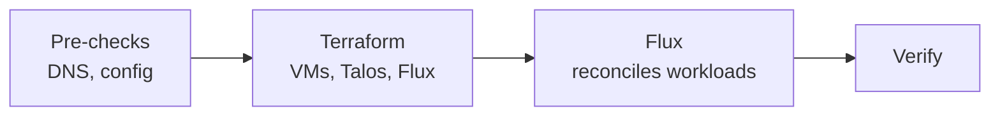

# Deployment

[doc](../../index.md) / [adopter](../index.md) / [deploy](../index.md) / Deployment

**Audiences:** adopter (deploy)

The workflow that turns configuration into a running cluster. It is the same for a Tooling Cluster and a Hub — only `config.yaml` differs. Role-specific inputs and checks are in [Tooling Cluster](tooling-cluster.md) and [Hub](hub.md).

- [The four phases](#the-four-phases)
- [Before you deploy](#before-you-deploy)
- [Deploy](#deploy)
- [Verify, up the stack](#verify-up-the-stack)
- [Commands](#commands)
- [Destroying](#destroying)

## The four phases



**You** run the pre-checks and `make`. **Terraform** provisions VMs, boots Talos, forms the cluster, and installs Flux — then exits. **Flux** keeps working after Terraform returns, pulling the artifact and reconciling everything else.

That last point is the one to internalise: **the cluster is not finished when `make` returns.** Terraform hands off to Flux, and Flux takes several more minutes. A workload that never appears is a Flux question, not a Terraform one — re-running `make apply` will not summon it. See [GitOps structure](../../architecture/gitops-structure.md#how-flux-consumes-it).

## Before you deploy

Two checks here save the two most common slow failures.

**Confirm the DNS zone is delegated.** cert-manager proves domain ownership through DNS-01 challenges. If the zone is not delegated to your provider, certificate issuance fails slowly and with a confusing error rather than a clear one.

```bash
dig +short NS <your-domain>
```

This must return your DNS provider's nameservers before you deploy. If it returns nothing, the delegation is not in place — fix that first.

**Confirm the config and credentials are in place.** The environment needs both files:

```bash
ls config/environments/<env>/config.yaml config/environments/<env>/.env
```

The credentials your role needs are listed in [Prerequisites](prerequisites.md#credentials-checklist). A missing one typically fails deep into reconciliation, not at plan time, so it is worth checking now.

## Deploy

Run the three steps explicitly. `ENV=` selects the environment — there is no default, always pass it.

```bash
make init ENV=<env>      # download providers, configure the backend
make plan ENV=<env>      # compute and save the plan
make apply ENV=<env>     # apply the saved plan
```

**Do not skip `init`.** It downloads the provider plugins and configures the state backend for this environment. `plan` and `apply` assume it has run; on a fresh environment, or after switching `ENV`, running them without `init` first fails or acts against the wrong backend.

`plan` then `apply` lets you read the plan before it executes — worth doing on a first deploy and on any infrastructure change. If state drifts between the two, `apply` reports a stale plan; the fix is `make plan-apply ENV=<env>`, which does both in one step and is the safer default once you trust the config.

Then wait. Terraform provisions and hands off to Flux:

| Phase | Tooling Cluster | Hub |
|-------|:---:|:---:|
| Terraform — VMs, Talos, Flux | ~15–20 min | ~20–30 min |
| Flux — reconcile workloads | ~10–15 min | ~20–30 min |

A Hub takes longer because its chain waits for databases to come up before running migrations. Apparent inactivity during these windows is normal.

## Verify, up the stack

Check from the bottom up — infrastructure, then OS, then Kubernetes. A failure is easiest to place when you know which layer it is in.

**Proxmox — are the VMs running?** From any Proxmox node:

```bash
pvesh get /cluster/resources --type vm --output-format json \
  | jq -r '.[] | "\(.node)\t\(.name)\t\(.status)"'
```

**Talos — is the OS healthy?** Against the cluster VIP:

```bash
talosctl --talosconfig $(pwd)/artifacts/<env>/talos-config/talosconfig \
  -n <vip> health
```

For a live per-node view of CPU, memory, and services:

```bash
talosctl --talosconfig $(pwd)/artifacts/<env>/talos-config/talosconfig \
  -n <vip> dashboard
```

Press `q` to exit.

**Kubernetes — has Flux converged?**

```bash
export KUBECONFIG=$(pwd)/artifacts/<env>/kubernetes/kubeconfig

kubectl get nodes                              # all Ready
kubectl get kustomizations -n flux-system -w   # all Ready: True
```

The Kustomizations become Ready in dependency order — early ones report Ready while later ones are still applying. That is the chain working, not a partial failure. Leave the `-w` watch running until it settles.

If one stays `Ready: False` for more than a few minutes, find the **earliest** failing Kustomization — later failures are usually downstream consequences. See [Troubleshooting](../operate/troubleshooting.md).

Role-specific verification and the service URLs follow in [Tooling Cluster](tooling-cluster.md#verify) and [Hub](hub.md#verify-the-cluster).

## Commands

All commands run from the repository root. `ENV=` selects the environment.

### Deploy

| Command | Does |
|---------|------|
| `make init ENV=<env>` | Download providers, configure the state backend. **Run first on any new environment.** |
| `make plan ENV=<env>` | Compute and save the plan |
| `make apply ENV=<env>` | Apply the saved plan; fails if none exists |
| `make plan-apply ENV=<env>` | Plan and apply in one step — avoids stale-plan errors |
| `make apply-direct ENV=<env>` | Apply with auto-approve, no saved plan |

### Inspect

| Command | Does |
|---------|------|
| `make validate ENV=<env>` | Check configuration syntax |
| `make show ENV=<env>` | Show current state |
| `make list ENV=<env>` | List resources in state |

These load the environment's `.env`, so they need `ENV=` like everything else.

### Tear down

| Command | Does |
|---------|------|
| `make destroy ENV=<env>` | Destroy all infrastructure — 5-second cancel window |
| `make destroy-fast ENV=<env>` | Destroy without refreshing state — 3-second window |
| `make clean ENV=<env>` | Delete `artifacts/` — **including Terraform state** |

## Destroying

`make destroy ENV=<env>` tears down everything Terraform provisioned, after a five-second cancel window and no other prompt.

Across clusters, **destroy Hubs before the Tooling Cluster** they depend on — otherwise the Hubs lose their registry and secrets mid-teardown and the destroy can stall.

**`make clean` deletes Terraform state.** After a clean, Terraform has no record of any infrastructure; anything still running is orphaned and must be removed by hand. Never `clean` a live environment. Back up `artifacts/` first — see [Recover → What you must keep](../recover/disaster-recovery.md#what-you-must-keep).
