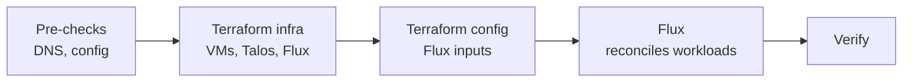

# Deployment

[doc](../../index.md) / [adopter](../index.md) / [deploy](../index.md) / Deployment

**Audiences:** adopter (deploy)

The workflow that turns configuration into a running cluster. It is the same for a Tooling Cluster and a Hub — only the environment's configuration differs. Role-specific inputs and checks are in [Tooling Cluster](tooling-cluster.md) and [Hub](hub.md).

- [The five phases](#the-five-phases)
- [Two stacks](#two-stacks)
- [State is bound per environment](#state-is-bound-per-environment)
- [Pre-deploy checks](#pre-deploy-checks)
- [Deploy](#deploy)
- [Changing configuration afterwards](#changing-configuration-afterwards)
- [Verify, up the stack](#verify-up-the-stack)
- [Commands](#commands)
- [Destroying](#destroying)

## The five phases



**The adopter** runs the pre-checks and `make`. **The infra stack** provisions VMs, boots Talos, forms the cluster, and installs Flux. **The config stack** then writes everything Flux consumes — the `OCIRepository`, the Kustomization graph, `cluster-config` and `cluster-secrets` — in seconds. **Flux** keeps working after Terraform returns, pulling the artifact and reconciling everything else.

That last point is the one to internalise: **the cluster is not finished when `make` returns.** Terraform hands off to Flux, and Flux takes several more minutes. A workload that never appears is a Flux question, not a Terraform one — re-running `make apply` will not summon it. See [GitOps structure](../../architecture/gitops-structure.md#how-flux-consumes-it).

## Two stacks

Terraform is split into two roots with separate state, and knowing which one a change belongs to is what makes day-2 work cheap ([ADR-015](../../architecture/decisions/015-two-stack-capability-config.md)).

| Stack | Owns | State | Applies in |
|-------|------|-------|-----------|
| **infra** (`src/infra`) | VMs or managed cluster, Talos, Flux controllers | `../artifacts/<env>/state/infra.tfstate` | about five minutes |
| **config** (`src/config`) | `OCIRepository`, Kustomizations, `cluster-config`, `cluster-secrets`, values overrides | `../artifacts/<env>/state/config.tfstate` | seconds |

The config stack has no provider that can address a VM, so a config-only change physically cannot disturb the cluster. `make plan-apply` runs both in order — infra first, then config against the real cluster.

## State is bound per environment

The two stack directories, `src/infra` and `src/config`, are shared by every environment. What separates one environment from another is not the directory but the backend: state lives per environment at `../artifacts/<env>/state/infra.tfstate` and `../artifacts/<env>/state/config.tfstate` — under `ARTIFACTS_ROOT`, a sibling of the clone — selected by `terraform init -backend-config`. The `state/` directory is created mode `0700` and holds the non-regenerable, secret-bearing part of the artifacts tree; saved plans land separately in `../artifacts/<env>/plans/`, which is disposable.

Every make target that runs Terraform rebinds the backend to `ENV=` immediately before doing so — `plan`, `apply`, `destroy`, `secrets`, `list`, `show`, all of them. Two consequences worth knowing:

- **Environments cannot cross-contaminate.** A command run with `ENV=a` operates on environment `a`'s state, whatever was initialised in that directory last.
- **`ENV=` must always be passed.** Every target that touches an environment requires it and errors out immediately when it is missing, so there is no default environment to fall back on.

## Pre-deploy checks

Two checks here save the two most common slow failures.

**Confirm the DNS zone is delegated.** cert-manager proves domain ownership through DNS-01 challenges. If the zone is not delegated to the DNS provider, certificate issuance fails slowly and with a confusing error rather than a clear one.

```bash
dig +short NS <domain>
```

This must return the DNS provider's nameservers before deploying. If it returns nothing, the delegation is not in place — fix that first.

**Confirm the config and credentials are in place.** The environment needs both files:

```bash
ls ../environments/<env>/config.yaml ../environments/<env>/.env
```

Then validate the configuration itself:

```bash
make validate ENV=<env>
```

This schema-checks `config.yaml`, the selected template, the provider's `params.yaml`, and the environment's `placement.yaml`, `proxmox/proxmox.yaml`, and `talos.yaml` before Terraform runs. The credentials each role needs are listed in [Prerequisites](prerequisites.md#credentials-checklist) — a missing one is not caught here, and typically fails deep into reconciliation rather than at plan time, so it is worth checking now.

## Deploy

`ENV=` selects the environment — there is no default, always pass it.

```bash
make init ENV=<env>      # download providers, configure both backends
make plan ENV=<env>      # plan both stacks — read the plan
make apply ENV=<env>     # apply the saved infra plan, then plan and apply config
# make plan-apply ENV=<env> chains all of the above without a pause to read the plan
```

Reading the plan before it executes is worth doing on a first deploy and on any infrastructure change. `make apply` re-plans the config stack after infra has applied, so the sequence is safe on a fresh deploy — the config plan is made against the real cluster. `make plan` runs `init` for both stacks itself, so the explicit `init` is mostly there to make the step visible. Switching `ENV` needs no special handling: every target rebinds the backend to the environment it was given ([State is bound per environment](#state-is-bound-per-environment)).

Then wait. Terraform provisions and hands off to Flux:

| Phase | Tooling Cluster | Hub |
|-------|:---:|:---:|
| Terraform infra — VMs, Talos, Flux | ~5 min | ~5 min |
| Terraform config — Flux inputs | seconds | seconds |
| Flux — reconcile workloads | ~10–15 min | ~20–30 min |

A Hub takes longer to reconcile because its chain waits for databases to come up before running migrations ([ADR-019](../../architecture/decisions/019-health-gated-reconciliation.md)). Apparent inactivity during these windows is normal.

## Changing configuration afterwards

Most edits after the first deploy touch nothing physical — an alert recipient, an artifact version, a Helm value override, an SMTP host. Those belong to the config stack:

```bash
make apply-config ENV=<env>
```

It applies the config stack alone: seconds, no infrastructure plan to read, and no way for it to reach a VM. Flux re-reads its substitution sources on the next reconcile cycle, so the change converges without another command.

Reach for `make plan-apply` when the change is infrastructural — a different `template`, more nodes, a new VIP, a changed `placement.yaml`, Talos or Kubernetes versions. Those are the ones whose plan is worth reading line by line.

Retrieve the generated internal passwords at any time:

```bash
make secrets ENV=<env>
```

## Verify, up the stack

Check from the bottom up — infrastructure, then OS, then Kubernetes. A failure is easiest to place once its layer is known.

**Proxmox — are the VMs running?** From any Proxmox node:

```bash
pvesh get /cluster/resources --type vm --output-format json \
  | jq -r '.[] | "\(.node)\t\(.name)\t\(.status)"'
```

**Talos — is the OS healthy?** Against the cluster VIP:

```bash
talosctl --talosconfig ../artifacts/<env>/talos-config/talosconfig \
  -n <vip> health
```

For a live per-node view of CPU, memory, and services:

```bash
talosctl --talosconfig ../artifacts/<env>/talos-config/talosconfig \
  -n <vip> dashboard
```

Press `q` to exit.

**Kubernetes — has Flux converged?**

```bash
export KUBECONFIG=$(pwd)/../artifacts/<env>/kubernetes/kubeconfig

kubectl get nodes                              # all Ready
kubectl get kustomizations -n flux-system -w   # all Ready: True
```

The Kustomizations become Ready in dependency order — early ones report Ready while later ones are still applying. That is the chain working, not a partial failure. Leave the `-w` watch running until it settles.

If one stays `Ready: False` for more than a few minutes, find the **earliest** failing Kustomization — later failures are usually downstream consequences. See [Troubleshooting](../operate/troubleshooting.md).

Role-specific verification and the service URLs follow in [Tooling Cluster](tooling-cluster.md#verify) and [Hub](hub.md#verify-the-cluster).

## Commands

All commands run from the clone root. `ENV=` selects the environment — the directory `../environments/<env>/`.

### Deploy

| Command | Does |
|---------|------|
| `make init ENV=<env>` | Download and **upgrade** providers, configure both state backends. `plan` and `plan-apply` run it first |
| `make plan ENV=<env>` | Plan both stacks and save the plans |
| `make apply ENV=<env>` | Apply the saved infra plan, then plan and apply config |
| `make plan-apply ENV=<env>` | Plan and apply both stacks in order — avoids stale-plan errors |
| `make apply-config ENV=<env>` | **Fast path** — plan and apply the config stack only |
| `make plan-infra ENV=<env>` / `make apply-infra ENV=<env>` | Infra stack alone |
| `make plan-config ENV=<env>` | Config stack alone, without applying |

### Inspect

| Command | Does |
|---------|------|
| `make validate ENV=<env>` | Schema-validate `config.yaml`, the template, the provider `params.yaml`, and the placement/proxmox/talos sidecar files, then `terraform validate` both stacks |
| `make check` | Run the repo contract checks in `tools/checks/` — tokens, `valuesFrom` chains, the `P_*` interface, placement, literals, tool versions. No `ENV=` needed |
| `make check-pristine ENV=<env>` | Apply-time gate — clean tree, exact release tag, and the environment's `dtk_version` when set |
| `tools/render.sh <env>` | Offline render, no cluster needed — merged values chains, kustomize builds of every layer, Talos fragment validation, into `../artifacts/<env>/render/` |
| `make secrets ENV=<env>` | Print the generated internal service passwords |
| `make show ENV=<env>` | Show current infra-stack state |
| `make list ENV=<env>` | List resources in both stacks' state |
| `tools/support-bundle.sh <env>` | Build a whitelist-based support bundle — config, render output, versions; never state, kubeconfigs, or `.env` |

These load the environment's `.env`, so they need `ENV=` like everything else.

### Tear down

| Command | Does |
|---------|------|
| `make destroy ENV=<env>` | Destroy config then infra — 5-second cancel window |
| `make destroy-fast ENV=<env>` | Destroy skipping the state refresh on both stacks — 3-second window |
| `make clean ENV=<env>` | Delete one environment's generated artifacts — kubeconfig, Talos config and secrets, saved plans. **Terraform state (`state/`) is preserved** |

## Destroying

`make destroy ENV=<env>` tears down everything Terraform provisioned — config stack first, then infra — after a five-second cancel window and no other prompt.

Across clusters, **destroy Hubs before the Tooling Cluster** they depend on — otherwise the Hubs lose their registry and secrets mid-teardown and the destroy can stall.

**`make clean ENV=<env>` keeps the state.** It is scoped to one environment and removes only that environment's generated artifacts — `../artifacts/<env>/kubernetes`, `talos-config`, `talos-secrets`, and the saved plans in `plans/`. `../artifacts/<env>/state/` is left untouched: deleting state orphans running VMs and managed clusters, and loses the generated passwords held in `config.tfstate`. `ENV=` is required, as everywhere else.

The removed files are Terraform-managed copies — `kubeconfig`, `talosconfig`, the per-node machine configs, and `talos-secrets/secrets.yaml` are all written from infra state, so the next apply writes them back. The state is the authoritative copy, which is why it is the thing to back up. See [Recover → What the adopter must keep](../recover/disaster-recovery.md#what-the-adopter-must-keep).
