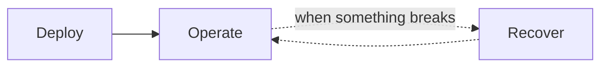

# Adopter Guide

[doc](../index.md) / Adopter

**Audiences:** adopter (deploy, recover, operate)

You run a Hub. This guide takes you from an empty Proxmox cluster to a running Mojaloop switch, keeps it recoverable, and keeps it healthy.

You configure two files per environment and run Terraform through Make. You never fork the distribution or edit the bundle — everything specific to your deployment lives in your own configuration. If you need to change the distribution itself, that is the [Integrator](../integrator/index.md) guide.

## Three journeys

| Journey | You are here when | Start |
|---------|-------------------|-------|
| **[Deploy](deploy/prerequisites.md)** | Standing up a Tooling Cluster or a Hub | [Prerequisites](deploy/prerequisites.md) |
| **[Operate](operate/monitoring.md)** | Running it day to day — watching, diagnosing | [Monitoring](operate/monitoring.md) |
| **[Recover](recover/backup.md)** | Restoring data, or rebuilding after loss | [Backups](recover/backup.md) |

## Deploy

Getting from nothing to a running switch.

| Page | Covers |
|------|--------|
| [Prerequisites](deploy/prerequisites.md) | Tools, accounts, and credentials you need first |
| [Provider setup](deploy/provider-setup.md) | Preparing Proxmox and your DNS zone |
| [Configuration](deploy/configuration.md) | `config.yaml`, `.env`, and the vocabulary mapping |
| [Deployment](deploy/deployment.md) | The deploy workflow, commands, and verification |
| [Deploy a Tooling Cluster](deploy/tooling-cluster.md) | Role `cc` — registry, secrets, observability backend |
| [Deploy a Hub](deploy/hub.md) | Role `env` — the Mojaloop switch |
| [Upgrading](deploy/upgrading.md) | Moving to a new artifact or infrastructure change |
| [Known issues](deploy/known-issues.md) | Deployment-time issues and workarounds |

Deploy the Tooling Cluster first if you are using one, then Hubs. A single Hub can run without a Tooling Cluster by pulling from a public registry.

## Operate

Keeping a running Hub healthy.

| Page | Covers |
|------|--------|
| [Monitoring](operate/monitoring.md) | Dashboards, what to watch, log and metric queries |
| [Troubleshooting](operate/troubleshooting.md) | Symptom-first diagnosis |
| [Onboarding participants](operate/onboarding-participants.md) | The Hub-side onboarding procedure |
| [Known issues](operate/known-issues.md) | Runtime issues and workarounds |

## Recover

Restoring data and rebuilding after loss. Read this **before** you need it — the first recovery should not be your first read.

| Page | Covers |
|------|--------|
| [Backups](recover/backup.md) | What is backed up, what is not, and what you must back up yourself |
| [Restore](recover/restore.md) | Restoring MySQL, MongoDB, and Vault |
| [Disaster recovery](recover/disaster-recovery.md) | Rebuilding a cluster, and the material you cannot rebuild without |

## Before you start

Two things about this toolkit will save you time if you know them going in:

**Namespaces do not match intuition.** The data layer is in `data`, not `mojaloop`. The auth stack is in `ory`. A `kubectl` command against the wrong namespace returns an empty list that looks like success. See [System overview](../architecture/system-overview.md#what-a-hub-runs).

**A Hub takes time to converge, on purpose.** The reconciliation chain waits for each layer to be healthy before starting the next, because database migrations must run against databases that already exist. "Looks stuck" for several minutes after `make apply` is usually normal. See [Reconciliation order](../architecture/system-overview.md#reconciliation-order).
