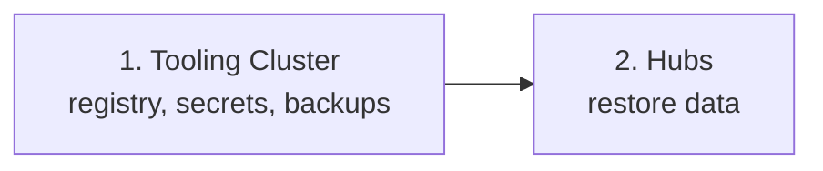

# Disaster Recovery

[doc](../../index.md) / [adopter](../index.md) / [recover](../index.md) / Disaster recovery

**Audiences:** adopter (recover)

Rebuilding a cluster that is gone, and the material no rebuild can do without. Restoring individual data stores on a living cluster is [Restore](restore.md); this is for total loss.

- [What the adopter must keep](#what-the-adopter-must-keep)
- [The recovery order](#the-recovery-order)
- [Rebuilding a Hub](#rebuilding-a-hub)
- [Rebuilding a Tooling Cluster](#rebuilding-a-tooling-cluster)
- [What cannot be recovered](#what-cannot-be-recovered)

## What the adopter must keep

A cluster can be rebuilt from the artifact and the configuration — but only if the adopter still holds three things. None is captured by the automatic backups. **If this page prompts one action, make it confirming all three exist, offline, for every cluster.**

| Keep | Why | Without it |
|------|-----|-----------|
| **Vault unseal keys / root token** | The Secret in the `vault` namespace, which dies with the cluster | The raft snapshots are encrypted and unopenable — the PKI is lost |
| **Terraform state** (`artifacts/<env>/`) | Terraform's record of the infrastructure — and, on Talos environments, the machine secrets (the Talos CA key, also written to `artifacts/<env>/talos-secrets/secrets.yaml`) | Terraform cannot manage or cleanly rebuild what it no longer knows exists; on Talos, expired client certs become a [permanent lockout](../operate/known-issues.md#lost-or-expired-cluster-access-kubeconfig-and-talosconfig) — the API is mTLS-only with no fallback |
| **`config.yaml` and `.env`** | The environment's identity and secrets | No way to reproduce the same cluster |

Back the first two up explicitly — see [Backups → What the adopter must back up](backup.md#what-the-adopter-must-back-up). The third is the adopter's to keep safe from the moment it is created; `.env` is git-ignored and exists nowhere but the adopter's disk.

A rebuild with all three is a procedure. A rebuild missing any of them is a partial reconstruction with permanent loss — know which situation applies before starting.

## The recovery order

When more than one cluster is gone, order matters:



The Tooling Cluster comes first — Hubs depend on it for the registry cache, backup storage, and observability. A Hub restored before its Tooling Cluster has nowhere to pull backups from.

When Hubs run without a Tooling Cluster, each is independent and the order does not apply.

## Rebuilding a Hub

1. **Restore the environment files.** Put `config.yaml` and `.env` back under `config/environments/<env>/`.
2. **Restore Terraform state**, if rebuilding onto surviving infrastructure. On genuinely new infrastructure, start clean — but expect Terraform to provision everything fresh.
3. **Provision:**
   ```bash
   make init ENV=<env>
   make plan ENV=<env>       # read this carefully — it is rebuilding real infrastructure
   make apply ENV=<env>
   ```
4. **Let Flux converge.** The platform, data layer, and applications reconcile as on a first deploy.
5. **Restore Vault**, if the PKI was lost. Restore the raft snapshot and confirm the scheme CA responds — see [Restore → Vault](restore.md#vault). Without this, no participant can connect.
6. **Restore the databases** to the target point in time — see [Restore](restore.md).
7. **Re-verify participants.** The trust bundle and certificates must line up after a Vault restore. Participants enrolled after the restored snapshot will need to re-enrol.

The sequence is deliberate: infrastructure, then secrets/PKI, then data. Restoring data before Vault leaves services unable to authenticate; restoring before the cluster exists has nowhere to land.

## Rebuilding a Tooling Cluster

The same shape, and simpler — a Tooling Cluster holds no scheme PKI and no ledger:

1. Restore `config.yaml` and `.env`.
2. `make init && make plan && make apply`.
3. Let Flux bring up Harbor, MinIO, and the observability stack.
4. **Restore its Vault** if lost — it holds registry and storage credentials, not the scheme CA, so the blast radius is smaller, but services still need it.
5. Confirm Harbor, MinIO, and Grafana respond before rebuilding any Hub against it.

Object storage is the subtle one: if MinIO's backing volumes were lost, the **backups themselves are gone** — a Tooling Cluster rebuild does not restore data it was the store for. For anything critical, replicate the S3 bucket off the Tooling Cluster.

## What cannot be recovered

Some loss is permanent regardless of preparation. Knowing which is which prevents chasing the unrecoverable during an incident:

- **In-flight Kafka events** — no backup exists; settled state is in MySQL and MongoDB, in-flight is not.
- **Data written after the restore point** — a point-in-time restore is a deliberate rollback; everything after the target time is discarded by choice.
- **The Vault snapshot gap** — up to ~1h45m between the last snapshot and the loss.
- **Anything issued in a restore gap** — a participant enrolled between the snapshot and the restore is unknown to the restored Hub and must re-enrol.

The honest summary: with the three items in [What the adopter must keep](#what-the-adopter-must-keep), the adopter can rebuild to a recent point. Without them, the same cluster cannot be rebuilt at all. That gap sits entirely on the side of preparation the adopter controls — which is why the unseal-key and state backups are worth doing the day of the deploy, not the day they are needed.
