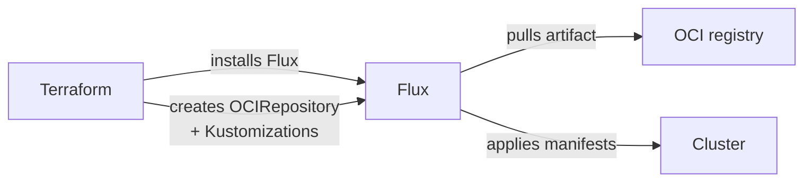

# GitOps Structure

[doc](../index.md) / [architecture](index.md) / GitOps structure

**Audiences:** architect, platform developer, system integrator

How the OCI artifact is laid out, how Flux consumes it, and how one artifact serves every environment.

- [One artifact, not a Git repository](#one-artifact-not-a-git-repository)
- [Artifact layout](#artifact-layout)
- [How Flux consumes it](#how-flux-consumes-it)
- [Substitution](#substitution)
- [Versioning](#versioning)
- [How the chain is ordered](#how-the-chain-is-ordered)

## One artifact, not a Git repository

Flux reconciles from an **OCI artifact**, not from a Git branch ([ADR-001](decisions/001-oci-over-git.md)). The artifact is a tarball of `gitops/` pushed to a registry and pulled by the cluster.

This matters for three reasons:

- **Adopters need no Git access.** A registry pull is the only dependency, which suits air-gapped and restricted networks.
- **Versions are immutable and content-addressed.** A tag resolves to a digest; the digest proves exactly what is deployed.
- **Integrators republish rather than fork-and-diverge.** A customized artifact is consumed exactly like the upstream one.

All layers ship as **one artifact**, not one per component ([ADR-007](decisions/007-single-oci-artifact.md)) — the layers are interdependent, and mixing versions across them breaks in ways that are hard to diagnose.

## Artifact layout

```
gitops/
  platform/                  # Every cluster: cert-manager, ESO, external-dns,
                             # metrics-server, VPA, Goldilocks, reloader
  dns/
    route53/ cloudflare/ digitalocean/
  platform-config/           # Gateways, cluster-wide config
  talos/                     # Self-managed only: Cilium, Gateway API CRDs,
                             # LB-IPAM, OpenEBS

  tooling/                        # Tooling Cluster: namespaces, Vault operator
  tooling-config/                 #   Vault, Harbor, MinIO
  tooling-routes/                 #   HTTPRoutes
  tooling-observability/          #   Thanos, Loki, Tempo, Grafana, dashboards, alerts
  tooling-observability-routes/   #   HTTPRoutes

  hub/                       # Hub: namespaces, database operators
  hub-data/                  #   One root per store: common/, mysql/, kafka/,
                             #   mongodb/, redis/
  hub-auth/                  #   Vault, Ory (Kratos, Hydra, Keto, Oathkeeper)
  hub-auth-config/           #   Bootstrap jobs, Oathkeeper maester seed
  hub-app/                   #   Mojaloop, MCM, Finance Portal, extapi Envoy,
                             #   Oathkeeper access rules
  hub-observability-agent/   #   Alloy, kube-state-metrics, node-exporter
```

Each top-level directory is a Kustomization root, with one exception: `hub-data/` has no root of its own — its subdirectories are the roots, producing the `hub-data-common` and `hub-data-<store>` Kustomizations, one per in-cluster store. Which roots are applied depends on `cluster.role` — see [System overview](system-overview.md#reconciliation-order).

`gitops/talos/` is the only vendor directory, matching the supported deployment infrastructure. A new provider that needs cluster-level resources adds one alongside it — see [Provider model](provider-model.md#where-provider-differences-live).

## How Flux consumes it



Terraform's job ends once Flux and the Kustomization objects exist. From there Flux owns convergence: it polls the registry every 10 minutes and applies what it finds.

This is the split worth internalising — **Terraform provisions, Flux reconciles.** A drifted workload is a Flux question, not a Terraform one, and re-running `make apply` will not fix it.

## Substitution

The artifact contains no environment-specific values. Manifests carry placeholders that Flux fills at apply time:

```yaml
hostnames:
  - "grafana.int.${domain}"
```

Values come from two objects Terraform creates in `flux-system`:

| Object | Contains |
|--------|----------|
| `cluster-config` ConfigMap | Non-secret values — domain, cluster name, endpoints, IP ranges, template tuning |
| `cluster-secrets` Secret | Credentials — database passwords, tokens, OIDC secrets. The internal ones are generated by Terraform, not authored |

Every Kustomization declares both under `postBuild.substituteFrom`.

Two consequences follow, and both explain otherwise-confusing behaviour:

**The same artifact deploys anywhere.** Nothing is rebuilt per environment. An integrator's customized artifact stays environment-neutral too.

**Changing a value requires Terraform, not a Flux reconcile.** The substitution inputs are written by the config stack — `make apply-config ENV=<env>`, which runs in seconds and cannot touch infrastructure. Editing a manifest in the cluster is overwritten on the next reconcile; editing `config.yaml` without applying changes nothing. Once applied, Flux re-reads both objects on its next cycle, so no further command is needed.

## Versioning

The `OCIRepository` points at the tag from the environment's `artifact` section:

```yaml
artifact:
  url: "oci://ghcr.io/<org>/ml-deployment-toolkit"
  version: "latest"     # or a pinned tag
```

`latest` follows the newest published artifact — changes arrive within the poll interval, without action. A pinned tag holds until the adopter changes it.

**Pin production.** Following `latest` means an upstream publish reaches the cluster unannounced.

Publishing and promotion: [Platform → Building artifacts](../platform/index.md). Maintaining a customized artifact: [Integrator](../integrator/index.md).

## How the chain is ordered

Kustomizations declare `dependsOn` and health gates rather than applying in parallel ([ADR-019](decisions/019-health-gated-reconciliation.md)). Each link encodes a hard requirement of the next:

| Gate | Requirement it satisfies |
|------|--------------------------|
| `platform` before everything | cert-manager and ESO webhooks live, or dependent resources are rejected |
| `dns` before `platform-config` | Gateways need a working issuer to obtain certificates |
| vendor before role layers | CNI and storage exist before workloads schedule |
| `hub-data-mysql` before `hub-auth` | Ory migrations need their databases and users to exist — the gate is the MySQL cluster reporting `ready`, which the operator sets only once users do |
| `hub-auth-config` before `hub-app` | Applications expect bootstrapped identities and the seeded Oathkeeper rule store |

A stalled Kustomization blocks everything behind it. When diagnosing, find the **earliest** failing one — later failures are usually consequences, not causes.
