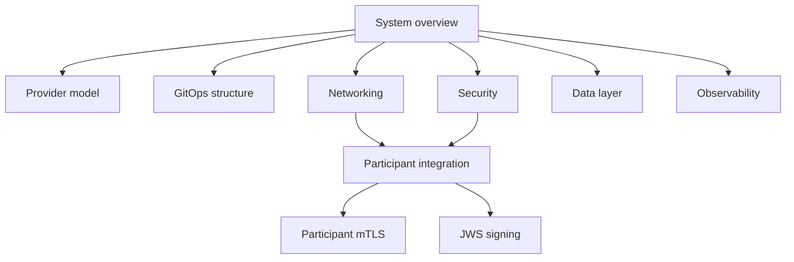

# Architecture

[doc](../index.md) / Architecture

**Audiences:** all

Why the system is built this way. Every other guide references these pages rather than restating them — if a procedure explains *why*, the explanation belongs here.

## Where to start

**New to the toolkit?** Read [System overview](system-overview.md). It covers the delivery chain, cluster roles, reconciliation order, and the configuration system, and is the prerequisite for everything else.

## How these fit together

## Documents

| Document | Covers |
|----------|--------|
| [System overview](system-overview.md) | Delivery chain, cluster roles, reconciliation order, configuration tiers |
| [Provider model](provider-model.md) | Infrastructure and DNS providers, what is supported, deployment templates |
| [GitOps structure](gitops-structure.md) | OCI artifact layout, Flux consumption, substitution, versioning |
| [Networking](networking.md) | Three entry points, gateways, load balancer addresses, DNS, certificates |
| [Security](security.md) | Secret isolation, Ory identity, authorization model, encryption, hardening |
| [Data layer](data-layer.md) | The four stores, backup and PITR coverage, what is not recoverable |
| [Observability](observability.md) | Metrics, logs, tracing, dashboards, alerting, retention |
| [Participant integration](participant-integration.md) | Onboarding choreography and the two-party interface contract |
| [Participant mTLS](participant-mtls.md) | Scheme PKI, certificate lifecycle across components, rotation, planned edge controls |
| [JWS message signing](jws-signing.md) | Message-level signing, Hub key distribution and rotation |

## Decision records

Non-obvious design choices are recorded in [decisions/](decisions/). Each captures the context, the alternatives weighed, and the consequences.

Records are **append-only**. A decision the system has moved past is marked superseded and points at its replacement — it is never deleted, because the reasoning stays useful even when the conclusion changes.

## Reading these against a running system

One thing in these pages is stated as **target** rather than current behaviour: participants reach MCM and Kratos self-service through `gw-ext`. Tracked in `discrepancies.md` item 1.

Everything else describes what the code does today, including where a capability is designed but not yet wired — [Data layer](data-layer.md) on external database endpoints, for instance.

## Looking for procedures?

This section explains. The guides instruct:

- [Adopter](../adopter/index.md) — deploy, recover, operate a Hub
- [Participant](../participant/index.md) — connect to a Hub
- [Platform](../platform/index.md) — build and extend the distribution
- [Integrator](../integrator/index.md) — customize and republish
