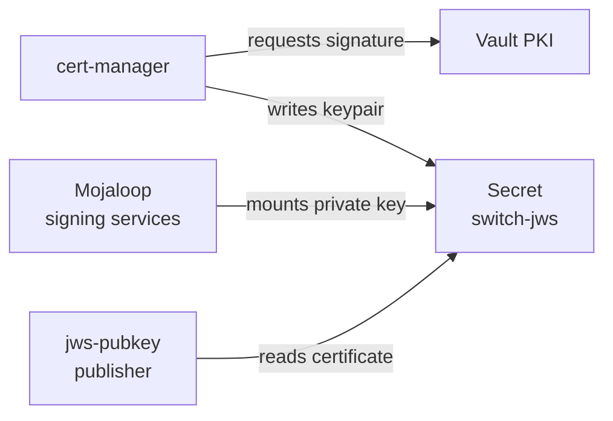
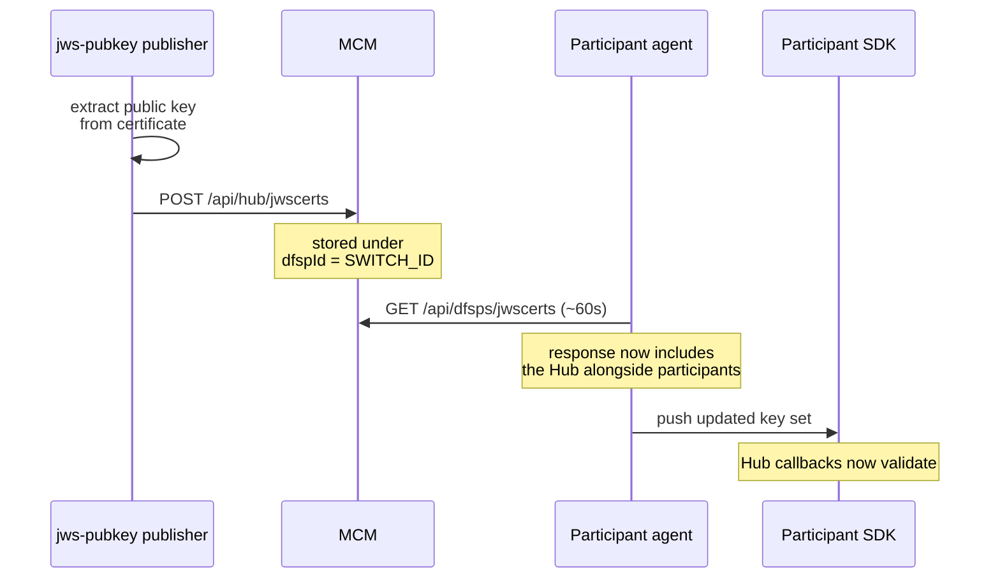

# JWS Message Signing

[doc](../index.md) / [architecture](index.md) / JWS message signing

**Audiences:** architect, platform developer, adopter (operate)

How FSPIOP messages are signed, and how the Hub's public key reaches every participant.

This is a cross-component lifecycle. It spans cert-manager, Vault, the Mojaloop services, MCM, each participant's agent, and each participant's SDK — no single component's documentation can describe it, which is why it lives here.

- [What JWS protects](#what-jws-protects)
- [The Hub signs as one identity](#the-hub-signs-as-one-identity)
- [Key lifecycle](#key-lifecycle)
- [Distribution](#distribution)
- [Rotation](#rotation)
- [When validation fails](#when-validation-fails)

## What JWS protects

Mutual TLS authenticates the *connection*. JWS authenticates the *message*.

Every FSPIOP request and callback carries a signature over its body. The receiver verifies it against the sender's public key, which proves the message was produced by the claimed party and was not altered — independently of which TLS connection carried it.

Both directions rely on it:

| Direction | Signed by | Verified by |
|-----------|-----------|-------------|
| Participant → Hub | The participant's JWS key | Mojaloop services |
| Hub → Participant | The Hub's JWS key | The participant's SDK |

Because verification is over **exact bytes**, anything that re-serializes a payload between signing and verification breaks it. That is the cause of most JWS failures — see [When validation fails](#when-validation-fails).

## The Hub signs as one identity

The Hub signs callbacks with `fspiop-source` set to its participant name. Three components must agree on that string:

| Setting | Component | Purpose |
|---------|-----------|---------|
| `HUB_PARTICIPANT.NAME` | Mojaloop services | The `fspiop-source` on outbound callbacks |
| `SWITCH_ID` | MCM | The `dfspId` the Hub's public key is stored under |
| `HUB_NAME` | Onboarding | The participant name created in the central ledger |

All three derive from a **single** Terraform variable, `hub_participant_name` (default `Hub`). That single source is deliberate: when these three drifted apart, participants received a public key filed under one name and callbacks signed with another, and validation failed with no obvious cause.

**Do not set these independently.** Renaming the Hub means changing that one variable.

The Hub also signs with **one shared key across all services**. Upstream Mojaloop charts generate a separate keypair per service when none is supplied — which would mean a participant needing a different public key per service, with no way to know which was which. A single `switch-jws` Secret is mounted by every signing service instead.

## Key lifecycle

The Hub's JWS keypair is issued by the same scheme CA that signs the FSPIOP endpoint certificate.



| Property | Value |
|----------|-------|
| Issuer | `vault-pki-issuer` — the scheme CA |
| Key | RSA 4096, rotated on every renewal |
| Lifetime | 30 days, renewed at 15 days |
| Common name | `<hub_participant_name>.<domain>` |

The certificate is never TLS-validated — only its public key is consumed — so it reuses the server issuing role rather than needing a dedicated one.

Note `rotationPolicy: Always`: each renewal produces a **new private key**, not merely a new certificate. Distribution therefore has to run again on every renewal, which is what the next section handles.

## Distribution

The Hub's public key reaches participants through MCM, using the same channel participants already poll for each other's keys.



The publisher is a small Deployment in the `mojaloop` namespace. It extracts the public key from the certificate with `openssl`, posts it to MCM, and then idles.

Nothing participant-side is special-cased. MCM stores the Hub as a virtual participant, so the existing polling loop picks it up like any other key — which is why no participant configuration changes when the Hub rotates.

## Rotation

Rotation is automatic and requires no coordination with participants.

1. cert-manager renews `switch-jws` at 15 days, generating a new keypair
2. Stakater Reloader detects the Secret change and restarts both the signing services and the publisher
3. The publisher posts the new public key to MCM
4. Each participant's agent picks it up on its next poll, within about a minute

**The brief window matters.** Between a signing service restarting with the new key and a participant's agent fetching it, Hub-signed callbacks can fail validation. The window is bounded by the poll interval and is normally under a minute, but it is a real gap — JWS failures immediately after a certificate renewal point to this window, so the timing is worth checking before investigating further.

## When validation fails

The error names the missing key and lists what the SDK does have:

```
Inbound request failed JWS validation
JWS public key for 'Hub' not available. Unable to verify JWS.
Only have keys for: ["dfsp-201","dfsp-202"]
```

Work outward from the Hub:

| Check | How |
|-------|-----|
| Is the key registered? | `GET /api/dfsps/jwscerts` on MCM should list the Hub alongside participants |
| Is it filed under the right name? | The returned `dfspId` must equal the `fspiop-source` on Hub callbacks |
| Did the publisher run? | Check its logs in the `mojaloop` namespace |
| Has the participant polled since? | The agent fetches roughly every 60 seconds |

A name mismatch is the most common cause, and the most confusing: the key is present and correct, but filed under a different string than the one signing the callbacks, so the SDK never finds it.

### A different failure that looks the same

An `Invalid signature` error at the **transfer prepare** step, on the payee side, is a separate problem and is not fixed by anything above.

The Hub's notification handler consumes a transfer from Kafka, deserializes the payload, and re-serializes it when forwarding to the payee. The re-serialized bytes differ from the payer-signed original — key order or whitespace — so a signature computed over exact bytes no longer verifies, even though the key is correct.

The tell is that **quotes validate and transfers do not**: the quoting service proxies HTTP directly and preserves the body, while the transfer path reconstructs it.

Distinguish the two before investigating. Missing-key errors name the key; byte-mismatch errors report an invalid signature with the key present.
