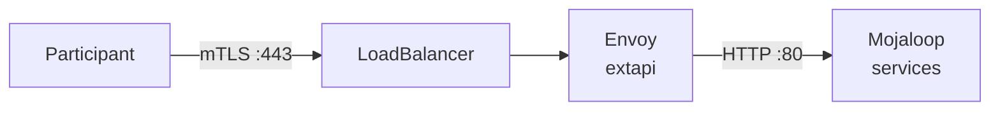

# Networking

[doc](../index.md) / [architecture](index.md) / Networking

**Audiences:** architect, platform developer, adopter

Ingress topology, the four load balancers, and how DNS and certificates are issued.

- [Four entry points](#four-entry-points)
- [What is on each gateway](#what-is-on-each-gateway)
- [The FSPIOP endpoint is not a gateway](#the-fspiop-endpoint-is-not-a-gateway)
- [Load balancer addresses](#load-balancer-addresses)
- [DNS](#dns)
- [Certificates](#certificates)

## Four entry points

A Hub exposes four independent load-balanced addresses. Each has a different audience and a different trust model, so each gets its own load balancer rather than a slot on a shared gateway ([ADR-008](decisions/008-three-lb-architecture.md), [ADR-018](decisions/018-per-gateway-lb-pools.md)).

| Entry point | Hostname pattern | Audience | TLS |
|-------------|-----------------|----------|-----|
| `gw-int` | `*.int.${DOMAIN}` | In-house operations — web UIs | Server TLS, ACME CA |
| `gw-ext` | `*.ext.${DOMAIN}` | External parties | Server TLS, ACME CA |
| `gw-extapi` | `extapi.${DOMAIN}` | Participant FSPIOP traffic | **Mutual TLS**, scheme CA |
| `gw-intapi` | `intapi.int.${DOMAIN}` | Machine APIs for scheme and participant tooling, without mTLS | Server TLS, ACME CA |

`gw-int`, `gw-ext`, and `gw-intapi` are Gateway API Gateways in `platform-system`. The FSPIOP mTLS endpoint is not — see [below](#the-fspiop-endpoint-is-not-a-gateway).

A Tooling Cluster uses only `gw-int` and `gw-ext`, hosting its own services rather than Mojaloop's.

## What is on each gateway

### `gw-int` — internal operations

Every host on `gw-int` is authenticated: natively (Grafana, Harbor, MinIO, Vault, Kratos), or through Oathkeeper (session cookie + Keto permission — the route's backend is `oathkeeper-proxy`, and the matching Rule carries the upstream).

| Host | Service | Auth |
|------|---------|------|
| `mcm.int` | Connection Manager UI and API — HubOps onboarding | Oathkeeper |
| `finance-portal.int` | Finance Portal | Oathkeeper (API routes) |
| `auth.int` | Kratos self-service — login, recovery, account settings | Kratos itself |
| `vault.int` | Vault UI | Vault itself |
| `flux.int` | Flux Operator UI | Oathkeeper (`opsui` role) |
| `hubble.int` | Cilium Hubble network observability | Oathkeeper (`opsui` role) |
| `goldilocks.int` | Resource recommendations | Oathkeeper (`opsui` role) |
| `ttk.int`, `ttk-backend.int` | Testing Toolkit | Oathkeeper (`opsui` role) |

On a Tooling Cluster only the natively-authenticated UIs are routed: `harbor.int`, `minio.int`, `s3.int`, `grafana.int`. Flux, Goldilocks, and Hubble have no route there (no IAM stack to gate them) — operators use `kubectl port-forward`. The observability backends have no `gw-int` route at all; ingest lives on `gw-ext` (below) and Grafana queries them in-cluster.

### `gw-intapi` — operator machine APIs (OAuth2)

`gw-intapi` carries cluster APIs consumed by the scheme's own tooling — test harnesses, provisioning scripts, back-office integrations — over server TLS without a client certificate. A single host, `intapi.int`, routes everything through Oathkeeper: callers present a Hydra client-credentials token (`hydra.ext`), and Keto authorizes the client (`intapi` role — membership is granted per `client_id`, so a DFSP's MCM machine client has no access here). Settlement rides this host as a path prefix (`/settlements`, `/settlementWindows`, `/settlementModels`); the FSPIOP mirror prefixes remain part of the surface, behind the same OAuth2 gate.

It still sits on its own gateway with its own dedicated address so it can be firewalled independently of the ops UIs, and it shares `gw-int`'s wildcard certificate.

### `gw-ext` — external parties

| Host | Service |
|------|---------|
| `mcm.ext` | Connection Manager API — path prefix `/pm4mlapi`, rewritten to `/api` |
| `hydra.ext` | OAuth2 token endpoint and JWKS |

Participants authenticate at `hydra.ext` and manage their enrolment through `mcm.ext`.

On a Tooling Cluster, `gw-ext` additionally serves the telemetry ingest hosts — `thanos.ext`, `loki.ext`, `tempo.ext` — routing only the push paths through the obs-ingest basic-auth front (accounts declared under `observability.ingest_users`). Query APIs get no route; the `.ext` wildcard is a publicly-trusted ACME certificate, so pushers verify TLS.

> **Target state.** Participants — human and machine — reach MCM through `gw-ext`; `gw-int` is for in-house HubOps only. The MCM UI and Kratos self-service currently resolve to `.int` hosts, so account activation is performed on the Hub side today.

## The FSPIOP endpoint is not a gateway

`extapi.${DOMAIN}` is a standalone Envoy deployment behind its own LoadBalancer service. It does not use Gateway API, and no HTTPRoute points at it. Cilium's Gateway cannot terminate mTLS for traffic originating outside the cluster, so this endpoint runs its own Envoy ([ADR-004](decisions/004-standalone-envoy-inbound-mtls.md)).



The service is named `cilium-gateway-gw-extapi`, which is misleading — it is a plain LoadBalancer service, not a Cilium-managed gateway. The name is historical.

Envoy requires a client certificate on every connection and routes by path prefix to account lookup, quoting, the ML API adapter, the bulk adapter, and transaction requests. Certificates and the trust bundle are hot-reloaded from watched directories, so enrolling a participant neither restarts Envoy nor drops connections.

## Load balancer addresses

On self-hosted infrastructure, Cilium LB-IPAM assigns addresses the adopter defines, announced on the local network via L2. Each gateway owns a dedicated single-IP pool, so every endpoint's address is known before the cluster exists ([ADR-018](decisions/018-per-gateway-lb-pools.md)).

```yaml
cluster:
  lb_ipam:
    pools:
      gw-int:
        lan: "192.168.0.215"
      gw-ext:
        lan: "192.168.0.216"
        wan: "203.0.113.10"   # optional — see below
      gw-extapi:
        lan: "192.168.0.217"
      gw-intapi:
        lan: "192.168.0.218"
```

**A Hub needs four addresses** — `gw-int`, `gw-ext`, `gw-extapi`, and `gw-intapi`. **A Tooling Cluster needs two** — it has no FSPIOP endpoints, so only `gw-int` and `gw-ext` are accepted. These pools are the cluster's entire load-balancer address supply; a Service that matches no pool stays Pending.

Every pool selects its gateway's Service by label (`lb-pool: <gateway>`), delivered through the Gateway's `spec.infrastructure.labels`. Cilium LB-IPAM has no pool priority, so a selectorless pool would match every LoadBalancer Service and make assignment nondeterministic — never add one.

Each `lan` address must sit outside the local DHCP scope. Overlap produces intermittent, hard-to-diagnose failures as addresses are handed out twice.

Setting `wan` on a pool declares that the border firewall 1:1-DNATs that outside address to the gateway's `lan` address. external-dns then publishes the `wan` address for everything attached to that gateway (via the `external-dns.alpha.kubernetes.io/target` annotation) instead of the LAN address. Caveat: LAN clients — DFSP VMs included — then resolve the public address too, and need hairpin NAT or split DNS to reach the gateway.

## DNS

`external-dns` watches HTTPRoutes and Services and reconciles records automatically. The operator never pre-creates records for Hub services — hand-created records cause ownership conflicts.

Every record is a **per-host A record**: one for each HTTPRoute hostname (`mcm.int.${DOMAIN}`, `intapi.int.${DOMAIN}`, …) pointing at its gateway's address, and one for the FSPIOP endpoint from the annotation on its Service. There are no wildcard DNS records — the wildcards exist only as certificate names.

Note that `extapi.${DOMAIN}` sits at the apex level, not under `.int` or `.ext`.

Participant FQDNs are the participant's own responsibility, in their own zone. The Hub never creates records for them, and each participant needs an individual record — there is no wildcard on that side.

Supported DNS providers: Route53, Cloudflare, DigitalOcean. The choice is independent of the infrastructure provider.

## Certificates

Public-facing certificates come from the configured ACME CA (`cert.server`, [ADR-016](decisions/016-generic-acme-ca.md)) via cert-manager, using **DNS-01** challenges ([ADR-011](decisions/011-dns01-over-http01.md)). DNS-01 is what allows wildcard certificates and issuance before any ingress path is reachable.

The FSPIOP endpoint certificate is the exception: issued by Vault against the scheme CA, 30-day lifetime, renewed at 15 days. See [Security](security.md#certificate-authorities) for the two PKIs and [Participant mTLS](participant-mtls.md) for the participant certificate lifecycle.
