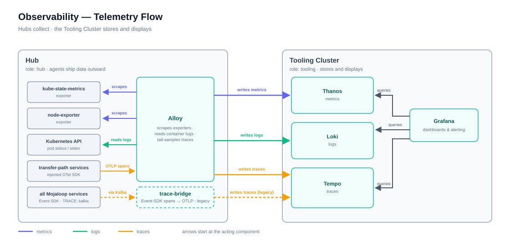
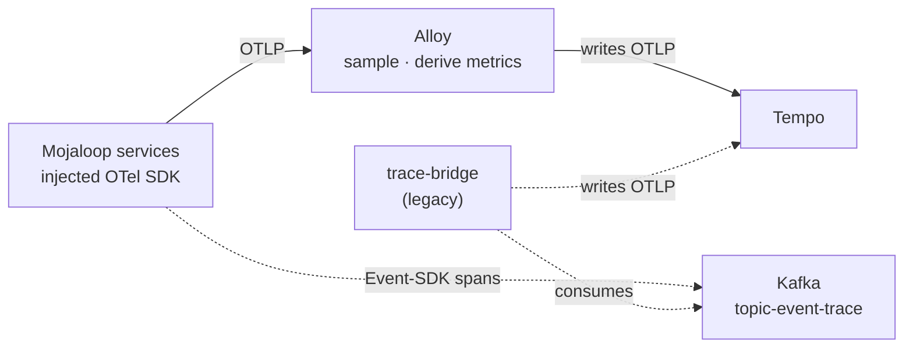

# Observability

[doc](../index.md) / [architecture](index.md) / Observability

**Audiences:** architect, platform developer, adopter (operate)

Where metrics, logs, and traces go, and what is already built to read them.

- [Split responsibility](#split-responsibility)
- [Metrics](#metrics)
- [Logs](#logs)
- [Tracing](#tracing)
- [Correlation](#correlation)
- [Dashboards](#dashboards)
- [Alerting](#alerting)
- [Retention](#retention)

## Split responsibility

Hubs collect. The Tooling Cluster stores and displays.

Read the arrows as actions: **Alloy** scrapes the exporters, receives OTLP spans, and writes all three signals outward; **trace-bridge** still writes traces on the legacy path; **Grafana** queries all three backends. Nothing on the Tooling Cluster reaches into a Hub.

A Hub runs **no Grafana, no Prometheus, no Loki, and no Tempo.** It runs agents that ship data outward. If the Tooling Cluster is unreachable, a Hub keeps serving traffic but the operator loses visibility into it — there is no local fallback UI.

Several Hubs report into one Tooling Cluster. Series are tagged by cluster, which is why alerts group on cluster name as well as alert name.

## Metrics

Grafana Alloy scrapes each Hub and remote-writes to Thanos on the Tooling Cluster, where four components divide the work: **receive** ingests, **query** serves reads, **store** reads historical blocks from object storage, and **compact** downsamples.

Thanos rather than Mimir ([ADR-003](decisions/003-thanos-over-mimir.md)).

The ingest path has a durability characteristic worth knowing: Thanos Receive holds recent samples in a write-ahead log and flushes completed blocks to object storage roughly every two hours. A crash replays the WAL and recovers most of it, but a window of recent samples can be lost. Metrics are not a system of record.

## Logs

Alloy tails container logs and pushes to Loki. Query them in Grafana with LogQL, filtered by namespace, pod, or label.

Logs are shipped, not stored locally — a Hub keeps only what the container runtime holds.

## Tracing

Tracing is **deployed and working**, over two paths that coexist: a native OpenTelemetry path, which is primary, and the original Event-SDK bridge, which it supersedes but has not yet retired.

**The OTel path.** Mojaloop v17.x images already ship OpenTelemetry instrumentation in `@mojaloop/central-services-stream`, but no SDK — so every span is silently discarded. The OpenTelemetry Operator (platform layer) injects a Node.js SDK into any pod annotated `instrumentation.opentelemetry.io/inject-nodejs`, activating that dormant instrumentation with no image change. The transfer path is annotated — central-ledger and its handlers, quoting, ml-api-adapter, account-lookup — and spans are sent directly to Alloy over OTLP. Trace context still crosses Kafka, but only as a `traceparent` message header: the consuming service continues the producer's trace, which is what joins one transfer into a single end-to-end trace.

Alloy enriches spans with Kubernetes metadata, then splits the stream. **Spanmetrics and servicegraph see 100% of spans** — RED metrics per service/operation (under the `traces_span_metrics` prefix, shipped to Thanos with everything else) and a who-calls-whom topology, computed before sampling so counts and percentiles are not distorted. Only the branch bound for Tempo is **tail-sampled**: every error trace is kept, every trace slower than 1 s (deliberately the p99 SLO) is kept, and 10% of the rest.

Two operational consequences:

- **Tempo does not hold every trace.** A specific healthy, fast transfer has a 90% chance of not being there. That is sampling, not breakage — errors and SLO breaches are always kept, and the span-derived metrics count everything.
- **Tail-sampling `decision_wait` (30 s) is load-bearing.** At a shorter wait, the sampling decision fires before the consuming service's spans arrive, truncating every trace at the Kafka produce — which looks exactly like consumer instrumentation being broken.

**The legacy path** is the Event SDK, configured with `TRACE: kafka` across every service: spans are published to `topic-event-trace`, and trace-bridge consumes the topic, converts to OTLP, and forwards to Tempo. It is superseded but still deployed for one reason: Event-SDK spans carry business-level names (e.g. `qs_quote_handleQuoteRequest`) that existing dashboards and saved Tempo queries are keyed on, and the OTel path names spans by operation instead (`SEND:`/`RECEIVE:`, HTTP routes, SQL). The retirement preconditions live in `gitops/env-app/observability/trace-bridge.yaml`.

Only the legacy path depends on Kafka to *deliver* spans. If Kafka is unhealthy the Event-SDK stream stops, but annotated services keep exporting over OTLP — trace gaps are no longer primarily a Kafka symptom.

## Correlation

The three signals are wired together in Grafana rather than left as separate silos:

- A **trace ID appearing in a log line** becomes a link into Tempo
- A **span in Tempo** links back to its logs in Loki and to metrics in Thanos

This is what makes a single transfer traceable end to end — find it in the logs, jump to the trace, see which service spent the time.

## Dashboards

Thirty dashboards ship pre-provisioned, in five folders.

| Folder | Count | Covers |
|--------|:---:|--------|
| **Home** | 1 | Switch Overview — the intended landing page |
| **Infrastructure** | 10 | Nodes, cluster, pods, CoreDNS, Cilium, API server, kubelet, volumes, namespaces, Proxmox hosts |
| **Data Layer** | 5 | MySQL, PXC/Galera, Redis, Kafka, MongoDB |
| **Platform** | 7 | cert-manager, external-dns, Vault, Ory Auth, Oathkeeper, Flux, Keycloak |
| **Mojaloop** | 7 | Transfer pipeline, account lookup, Node.js runtime, quoting, participant mTLS gateway, load test, participant overview |

Start at **Switch Overview**. It is built as the entry point, with drill-downs into the rest.

One caveat: the **Keycloak** dashboard in the Platform folder queries a namespace that no longer has workloads and will always render empty. Keycloak was replaced by Ory. Its removal is tracked in `discrepancies.md`.

## Alerting

Grafana unified alerting is configured and active — **22 rules** across four groups:

| Group | Rules |
|-------|:---:|
| Infrastructure | 9 |
| Platform | 6 |
| Data Layer | 4 |
| Mojaloop | 3 |

Two contact points are wired: **email** and **Telegram**. A single notification policy routes everything to both, grouping by alert name and cluster, waiting 30 seconds to group, and repeating every 4 hours.

**Alerting is silent unless the adopter configures delivery.** The rules evaluate regardless, but nothing is sent without both halves: the destinations in `config.yaml` — `email.host`, `email.port`, `email.from`, `alerting.email.to`, `alerting.telegram.chat_id` — and their credentials in `.env` — `SMTP_USER`, `SMTP_PASSWORD`, `TELEGRAM_BOT_TOKEN`. There is no warning when they are missing — alerts simply fire into nothing. The Telegram contact point is provisioned with a placeholder token when none is supplied, so it exists and delivers nowhere.

This is the most common way a deployment ends up believing it has no alerting when it has 22 rules running.

## Retention

Metrics, logs, and traces are retained for **7 days** each by default, backed by object storage on the Tooling Cluster.

Seven days suits a lab. Production schemes with audit obligations will want longer, which means both a retention change and enough object storage to hold it.
