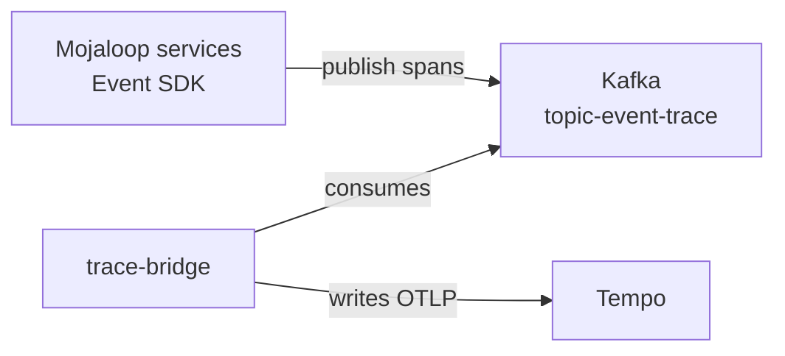

# Observability

[doc](../index.md) / [architecture](index.md) / Observability

**Audiences:** architect, platform developer, adopter (operate)

Where metrics, logs, and traces go, and what is already built to read them.

- [Split responsibility](#split-responsibility)
- [Metrics](#metrics)
- [Logs](#logs)
- [Tracing](#tracing)
- [Correlation](#correlation)
- [Dashboards](#dashboards)
- [Alerting](#alerting)
- [Retention](#retention)

## Split responsibility

Hubs collect. The Tooling Cluster stores and displays.

Read the arrows as actions: **Alloy** scrapes the exporters and writes outward; **trace-bridge** writes traces; **Grafana** queries all three backends. Nothing on the Tooling Cluster reaches into a Hub.

A Hub runs **no Grafana, no Prometheus, no Loki, and no Tempo.** It runs agents that ship data outward. If the Tooling Cluster is unreachable, a Hub keeps serving traffic but the operator loses visibility into it — there is no local fallback UI.

Several Hubs report into one Tooling Cluster. Series are tagged by cluster, which is why alerts group on cluster name as well as alert name.

## Metrics

Grafana Alloy scrapes each Hub and remote-writes to Thanos on the Tooling Cluster, where four components divide the work: **receive** ingests, **query** serves reads, **store** reads historical blocks from object storage, and **compact** downsamples.

Thanos rather than Mimir ([ADR-003](decisions/003-thanos-over-mimir.md)).

The ingest path has a durability characteristic worth knowing: Thanos Receive holds recent samples in a write-ahead log and flushes completed blocks to object storage roughly every two hours. A crash replays the WAL and recovers most of it, but a window of recent samples can be lost. Metrics are not a system of record.

## Logs

Alloy tails container logs and pushes to Loki. Query them in Grafana with LogQL, filtered by namespace, pod, or label.

Logs are shipped, not stored locally — a Hub keeps only what the container runtime holds.

## Tracing

Tracing is **deployed and working**. The path is indirect, which is why it is often assumed not to be:

Mojaloop services are instrumented through the Event SDK, configured with `TRACE: kafka` across every service. Spans are published to `topic-event-trace` rather than sent directly to a collector. A bridge consumes that topic, converts to OTLP, and forwards to Tempo.

The consequence: **tracing depends on Kafka.** If Kafka is unhealthy, traces stop even though Tempo and the bridge are fine. Trace gaps are a Kafka symptom more often than a Tempo one.

## Correlation

The three signals are wired together in Grafana rather than left as separate silos:

- A **trace ID appearing in a log line** becomes a link into Tempo
- A **span in Tempo** links back to its logs in Loki and to metrics in Thanos

This is what makes a single transfer traceable end to end — find it in the logs, jump to the trace, see which service spent the time.

## Dashboards

Thirty dashboards ship pre-provisioned, in five folders.

| Folder | Count | Covers |
|--------|:---:|--------|
| **Home** | 1 | Switch Overview — the intended landing page |
| **Infrastructure** | 10 | Nodes, cluster, pods, CoreDNS, Cilium, API server, kubelet, volumes, namespaces, Proxmox hosts |
| **Data Layer** | 5 | MySQL, PXC/Galera, Redis, Kafka, MongoDB |
| **Platform** | 7 | cert-manager, external-dns, Vault, Ory Auth, Oathkeeper, Flux, Keycloak |
| **Mojaloop** | 7 | Transfer pipeline, account lookup, Node.js runtime, quoting, participant mTLS gateway, load test, participant overview |

Start at **Switch Overview**. It is built as the entry point, with drill-downs into the rest.

One caveat: the **Keycloak** dashboard in the Platform folder queries a namespace that no longer has workloads and will always render empty. Keycloak was replaced by Ory. Its removal is tracked in `discrepancies.md`.

## Alerting

Grafana unified alerting is configured and active — **22 rules** across four groups:

| Group | Rules |
|-------|:---:|
| Infrastructure | 9 |
| Platform | 6 |
| Data Layer | 4 |
| Mojaloop | 3 |

Two contact points are wired: **email** and **Telegram**. A single notification policy routes everything to both, grouping by alert name and cluster, waiting 30 seconds to group, and repeating every 4 hours.

**Alerting is silent unless the adopter configures delivery.** The rules evaluate regardless, but nothing is sent without `SMTP_HOST`, `SMTP_PORT`, `SMTP_USER`, `SMTP_PASSWORD`, `ALERT_EMAIL_FROM`, `ALERT_EMAIL_TO`, `TELEGRAM_BOT_TOKEN`, and `TELEGRAM_CHAT_ID`. There is no warning when they are missing — alerts simply fire into nothing.

This is the most common way a deployment ends up believing it has no alerting when it has 22 rules running.

## Retention

Metrics, logs, and traces are retained for **7 days** each by default, backed by object storage on the Tooling Cluster.

Seven days suits a lab. Production schemes with audit obligations will want longer, which means both a retention change and enough object storage to hold it.
