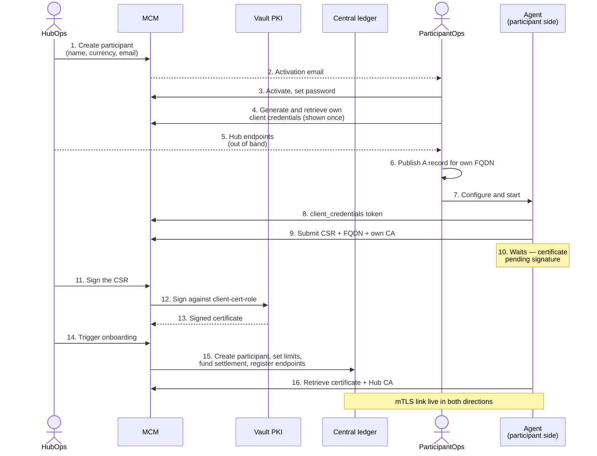
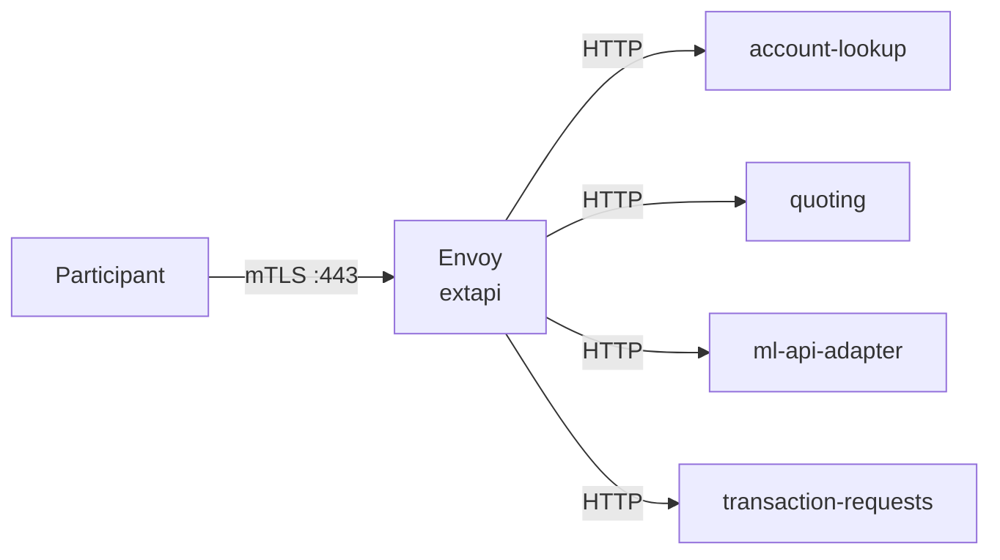
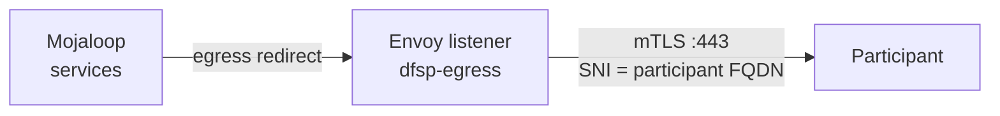

# Participant Integration

[doc](../index.md) / [architecture](index.md) / Participant integration

**Audiences:** all

The onboarding choreography between a Hub and a Participant, and the interface contract between them.

This page is the **canonical source** for the sequence. The [adopter](../adopter/index.md) guide owns the Hub-side procedure; the [participant](../participant/index.md) guide owns the participant-side procedure. Both reference this page — neither restates it.

- [Two parties, two roles](#two-parties-two-roles)
- [The choreography](#the-choreography)
- [Interface contract](#interface-contract)
- [Certificate lifecycle](#certificate-lifecycle)
- [Inbound: participant to Hub](#inbound-participant-to-hub)
- [Outbound: Hub to participant](#outbound-hub-to-participant)
- [What runs on each side](#what-runs-on-each-side)

## Two parties, two roles

Onboarding is a two-party exchange. Neither side can complete it alone, and each side acts on infrastructure the other cannot see.

| Role | Who | Acts on |
|------|-----|---------|
| **HubOps** | Hub operator | The Hub — MCM, Vault PKI, the scheme's central ledger |
| **ParticipantOps** | The connecting institution | Their own infrastructure, DNS, and integration stack |

The Hub operator never touches the participant's cluster; the participant never touches the Hub's.

**Access boundary.** HubOps works on `*.int.${domain}` — internal, in-house. Participants work on `*.ext.${domain}` — externally reachable. A participant is never expected to reach an `.int` host.

## The choreography

**Two distinct HubOps actions, in order.** Signing the CSR (step 11) issues the participant's certificate. Triggering onboarding (step 14) is what actually creates the participant *in the scheme* — the central-ledger record, its net debit cap, its funded settlement account, and its registered endpoints. Until step 14 the participant exists in MCM but not in the ledger, and no transfer involving it can settle.

Steps 3, 4, 6, 7 are ParticipantOps. Step 5 is a human handoff — the endpoints are not secret, but they are not discoverable either.

Step 10 is the one that looks like a failure and is not: the agent completes CSR submission, then stops and waits for a human on the Hub side. It resumes on its own once step 11 happens.

**Why the participant generates their own credentials.** HubOps creates the account but cannot generate or read the participant's client secret. The authorization model enforces this: `Dfsp.credentialsAccess` is granted to members of that participant only, with no Hub-admin traversal — unlike `Dfsp.view` and `Dfsp.manage`, which Hub admins do inherit. The secret is shown once, to the participant, and the Hub never holds it.

## Interface contract

The two tables below are what make the guides independently readable. Each side states what it needs and what it must return.

### Hub → Participant

Handed over once, out of band, after the account is created.

| Value | Form | What it is |
|-------|------|-----------|
| MCM endpoint | `https://mcm.ext.${domain}/pm4mlapi` | Connection Manager API. The `/pm4mlapi` prefix is rewritten to `/api` at the gateway |
| IAM provider URL | `https://hydra.ext.${domain}` | OAuth2 issuer. `client_credentials` grant; tokens are JWTs |
| Hub FSPIOP endpoint | `extapi.${domain}` | Where the participant sends FSPIOP traffic, mTLS required |
| Participant ID | e.g. `dfsp-201` | Scheme identifier. Also the OAuth2 `client_id` |
| Currency | ISO 4217 | Must match the scheme's configured currency |

Client credentials are **not** in this table. The participant generates those themselves in step 4.

### Participant → Hub

| Value | Where it is used |
|-------|-----------------|
| **FQDN** | Registered as the callback target. Becomes the Envoy upstream, the SNI, the egress policy DNS entry, and the callback URL in the central ledger |
| **CA bundle** | Concatenated into the Hub's inbound trust bundle so the Hub trusts the participant's client certificates |
| **Client certificate and key** | Presented by the Hub when calling the participant back |
| **CSR** | Signed by the Hub's Vault PKI |

The FQDN must resolve publicly **before** enrolment. The Hub's egress policy pins it by DNS name, and enrolment fails if it does not resolve.

## Certificate lifecycle

The Hub operates a scheme certificate authority in Vault. It is not Let's Encrypt, and it is not the same PKI that issues the Hub's public web certificates.

| Property | Value |
|----------|-------|
| Root CA | `Mojaloop Hub CA`, RSA 4096, 10-year TTL, generated internally |
| Participant client certs | `client-cert-role` — RSA 4096, max TTL 5 years, client usage only |
| Hub server certs | `server-cert-role` — RSA 4096, max TTL 5 years, constrained to the Hub domain |
| Hub FSPIOP endpoint cert | 30-day lifetime, renewed at 15 days, signed by the scheme root |

The Hub's FSPIOP endpoint therefore presents a certificate signed by the **scheme CA**, not by a public issuer. A participant validating that endpoint against the public trust store will fail — it must trust the Hub CA explicitly.

Two rotation cadences coexist: the Hub's endpoint certificate rotates monthly and automatically, while participant certificates are long-lived and rotate on enrolment.

## Inbound: participant to Hub

Participant FSPIOP traffic arrives at `extapi.${domain}` on port 443 and terminates at a **standalone Envoy deployment** — not at a Gateway API route.

Envoy requires a client certificate on every connection, validating it against the accumulated trust bundle of all enrolled participants. Past that boundary, traffic is plain HTTP inside the cluster.

Path routing: `/participants` and `/parties` to account lookup; `/quotes`, `/fxQuotes`, `/bulkQuotes` to quoting; `/transfers` and `/fxTransfers` to the ML API adapter; `/bulkTransfers` to the bulk adapter; `/transactionRequests` and `/authorizations` to transaction requests.

**Why standalone Envoy rather than Cilium.** Cilium's L7 load balancing runs on an east-west BPF path that requires pod identities, which north-south traffic from outside the cluster does not have. See [ADR-004](decisions/004-standalone-envoy-inbound-mtls.md).

Both the server certificate and the trust bundle are hot-reloaded from watched directories, so enrolling a participant does not restart Envoy or interrupt live traffic.

## Outbound: Hub to participant

Callbacks are the reverse direction and use a different mechanism: a network policy redirects egress through an in-cluster Envoy listener that originates mTLS.

The Hub presents the participant's own client certificate — the one issued at enrolment — when calling back.

**The policy is deliberately scoped** to the four services that actually make callbacks, rather than applying cluster-wide. An unscoped policy would capture all TCP 80/443 egress in the namespace and force it through a plain-HTTP listener, breaking unrelated outbound TLS such as database backups to object storage.

**One thing that looks like a defect and is not.** The callback URL registered in the central ledger is `http://<fqdn>`, with no port and no TLS. The egress policy intercepts port 80 as well as 443, and Envoy originates TLS on 443 regardless. The registered scheme is not what goes on the wire.

## What runs on each side

**Hub side** — in this repository. MCM, Vault PKI, the inbound Envoy, the egress policy, and the automation that renders participant certificates into the trust bundle and registers participants in the central ledger.

**Participant side** — the [Integration Toolkit](https://github.com/mojaloop/integration-toolkit). A Docker Compose stack providing the enrolment agent, a per-participant Vault, the SDK scheme adapter, a Redis cache, and a simulator backend to stand in for a core banking system.

The Hub is engineered against the Integration Toolkit's conventions — the `/pm4mlapi` API prefix is accommodated directly at the gateway. A participant may use a different stack, but must satisfy the same interface contract.

Participant-side deployment is documented in [Participant → Integrate](../participant/index.md). Hub-side onboarding is documented in [Adopter → Operate](../adopter/index.md).
