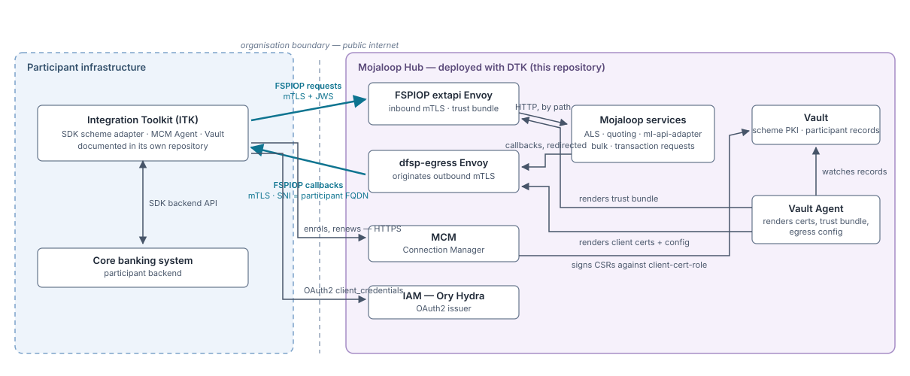
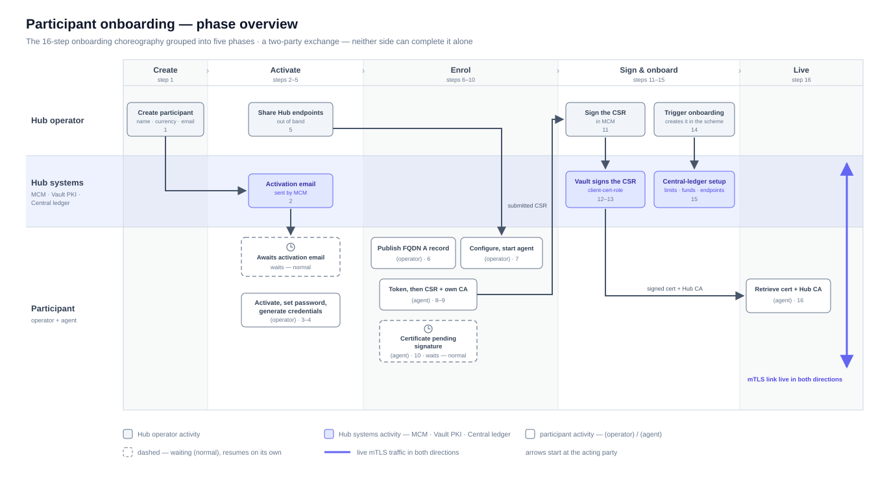
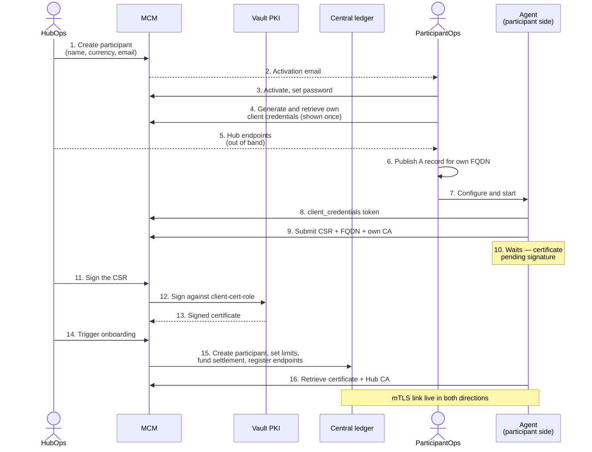
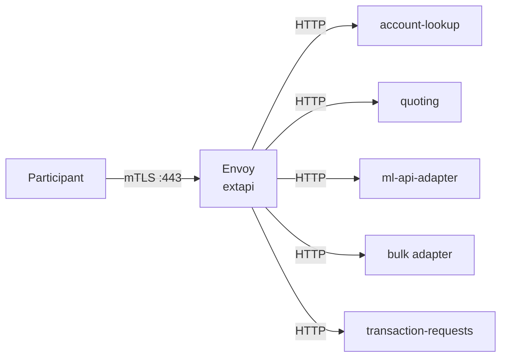
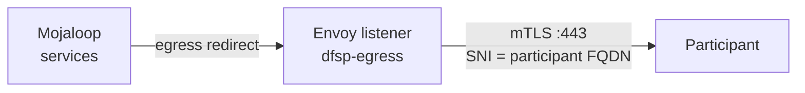

# Participant Integration Contract

[doc](../index.md) / [architecture](index.md) / Participant integration contract

**Audiences:** all

**Contract revision: 1** · 2026-08-07

The contract between a Hub and a Participant: the onboarding choreography, what each side hands the other, and the protocol semantics both sides implement.

This page is the **canonical source** for everything that crosses the boundary. The [adopter guide](../adopter/operate/onboarding-participants.md) owns the Hub-side procedure; the [Integration Toolkit](https://github.com/mojaloop/integration-toolkit) owns the participant journey end to end. Both reference this page — neither restates it beyond the declared mirrors below.

- [Two parties, two roles](#two-parties-two-roles)
- [The boundary at a glance](#the-boundary-at-a-glance)
- [The choreography](#the-choreography)
- [Interface contract](#interface-contract)
- [Protocol semantics](#protocol-semantics)
- [Certificate lifecycle](#certificate-lifecycle)
- [Inbound: participant to Hub](#inbound-participant-to-hub)
- [Outbound: Hub to participant](#outbound-hub-to-participant)
- [What runs on each side](#what-runs-on-each-side)
- [Mirrors and revision history](#mirrors-and-revision-history)

## Two parties, two roles

Onboarding is a two-party exchange. Neither side can complete it alone, and each side acts on infrastructure the other cannot see.

| Role | Who | Acts on |
|------|-----|---------|
| **HubOps** | Hub operator | The Hub — MCM, Vault PKI, the scheme's central ledger |
| **ParticipantOps** | The connecting institution | Their own infrastructure, DNS, and integration stack |

The Hub operator never touches the participant's cluster; the participant never touches the Hub's.

**Access boundary.** The participant-facing surface is `mcm.ext`, `hydra.ext`, and `extapi.${domain}`. HubOps works on `*.int.${domain}` — internal, in-house. The MCM UI and Kratos self-service currently resolve to `.int` hosts, so the account-activation step is completed with Hub-side assistance today; the target state routes it through `gw-ext` ([Networking](networking.md#gw-ext--external-parties)).

## The boundary at a glance

The participant side collapses to its stack; the Hub side shows the machinery this contract binds. The Integration Toolkit's own architecture page draws the same boundary with the emphasis reversed.

## The choreography

The overview above groups the exchange into its five phases; the sequence below gives the step-by-step detail.

**Two distinct HubOps actions, in order.** Signing the CSR (step 11) issues the participant's certificate. Triggering onboarding (step 14) is what actually creates the participant *in the scheme* — the central-ledger record, its net debit cap, its funded settlement account, and its registered endpoints. Until step 14 the participant exists in MCM but not in the ledger, and no transfer involving it can settle.

Steps 3, 4, 6, 7 are ParticipantOps. Step 5 is a human handoff — the endpoints are not secret, but they are not discoverable either. The activation email in step 2 is sent by the Hub's Kratos courier, so it depends on the Hub's SMTP configuration.

Step 10 is the one that looks like a failure and is not: the agent completes CSR submission, then stops and waits for a human on the Hub side. It resumes on its own once step 11 happens.

**The participant generates their own credentials.** HubOps creates the account but cannot generate or read the participant's client secret — `Dfsp.credentialsAccess` is granted to members of that participant only, with no Hub-admin traversal ([Security](security.md#authorization-model)). The secret is shown once, to the participant, and the Hub never holds it.

## Interface contract

The two tables below are the boundary. Each side states what it needs and what it must return.

### Hub → Participant

Handed over once, out of band, after the account is created.

| Value | Form | What it is |
|-------|------|-----------|
| MCM endpoint | `https://mcm.ext.${domain}/pm4mlapi` | Connection Manager API. The `/pm4mlapi` prefix is rewritten to `/api` at the gateway |
| IAM provider URL | `https://hydra.ext.${domain}` | OAuth2 **issuer** — a bare URL with no path; the client appends the token route itself |
| Hub FSPIOP endpoint | `extapi.${domain}` | Where the participant sends FSPIOP traffic, mTLS required |
| Hub callback source address | IP or range, stated by HubOps | The address Hub callbacks arrive **from** — not necessarily the `extapi` address; the participant's firewall must admit it |
| Participant ID | e.g. `dfsp-201` | Scheme identifier. Also the OAuth2 `client_id` |
| Currency | ISO 4217 | Must match the scheme's configured currency |

Client credentials are **not** in this table. The participant generates those themselves in step 4.

### Participant → Hub

| Value | Where it is used |
|-------|-----------------|
| **FQDN** | Registered as the callback target. Becomes the Envoy upstream, the SNI, the egress policy DNS entry, and the callback URL in the central ledger |
| **CA bundle** | Concatenated into the Hub's inbound trust bundle so the Hub trusts the participant's client certificates |
| **Client certificate and key** | Presented by the Hub when calling the participant back |
| **CSR** | Signed by the Hub's Vault PKI — at enrolment and at every agent-initiated renewal |

The FQDN must resolve publicly **before** enrolment. The Hub's egress policy pins it by DNS name, and enrolment fails if it does not resolve.

## Protocol semantics

The facts both sides implement, stated once:

- **FSPIOP API 2.0.** Requests and callbacks carry `application/vnd.interoperability.*+json;version=2.0` content types.
- **JWS in both directions.** Every request and callback is signed; the receiver validates against the sender's registered key. Hub-signed messages carry `fspiop-source: Hub`. Key distribution and rotation are the Hub's machinery ([JWS signing](jws-signing.md)); signature *format* has varied across SDK releases, so the participant runs the Integration Toolkit's pinned SDK version or newer.
- **PUT `/parties` callbacks are exempt from JWS validation** in the SDK's default configuration; quotes and transfers are always validated.
- **OAuth2 is `client_credentials` against the issuer.** The `client_id` is the participant ID; the token endpoint is derived from the issuer URL by the client. Tokens are JWTs validated by issuer and signature — no audience claim is required ([Security](security.md#identity-and-access)).
- **Callbacks may arrive from an address other than `extapi`.** The Hub's egress path presents its own source address; a participant firewall that admits only the `extapi` address silently drops callbacks.

## Certificate lifecycle

The Hub operates a scheme certificate authority in Vault. It is a private CA — not the public ACME authority that issues the Hub's web certificates.

| Property | Value |
|----------|-------|
| Root CA | `Mojaloop Hub CA`, RSA 4096, 10-year TTL, generated internally |
| Participant client certs | `client-cert-role` — RSA 4096, max TTL 5 years, client usage only |
| Hub server certs | `server-cert-role` — RSA 4096, max TTL 5 years, constrained to the Hub domain |
| Hub FSPIOP endpoint cert | 30-day lifetime, renewed at 15 days, signed by the scheme root |

The Hub's FSPIOP endpoint therefore presents a certificate signed by the **scheme CA**, not by a public issuer. A participant validating that endpoint against the public trust store will fail — it must trust the Hub CA explicitly.

Two rotation cadences coexist. The Hub's endpoint certificate rotates monthly and automatically. Participant certificates are long-lived; the participant's agent initiates renewal on its own when the certificate comes within its expiry threshold, and the renewal CSR waits for a HubOps signature exactly like an enrolment CSR ([Participant mTLS → Rotation](participant-mtls.md#rotation)).

## Inbound: participant to Hub

Participant FSPIOP traffic arrives at `extapi.${domain}` on port 443 and terminates at a **standalone Envoy deployment** ([ADR-004](decisions/004-standalone-envoy-inbound-mtls.md)) — not at a Gateway API route.

Envoy requires a client certificate on every connection, validating it against the accumulated trust bundle of all enrolled participants. Past that boundary, traffic is plain HTTP inside the cluster.

Path routing: `/participants` and `/parties` to account lookup; `/quotes`, `/fxQuotes`, `/bulkQuotes` to quoting; `/transfers` and `/fxTransfers` to the ML API adapter; `/bulkTransfers` to the bulk adapter; `/transactionRequests` and `/authorizations` to transaction requests.

Both the server certificate and the trust bundle are hot-reloaded from watched directories, so enrolling a participant does not restart Envoy or interrupt live traffic.

## Outbound: Hub to participant

Callbacks are the reverse direction and use a different mechanism: a network policy redirects egress through an in-cluster Envoy listener that originates mTLS.

The Hub presents the participant's own client certificate — the one issued at enrolment — when calling back.

The redirect policy selects exactly the services that make callbacks ([ADR-021](decisions/021-scoped-callback-egress.md)); all other egress from the namespace is untouched.

**One thing that looks like a defect and is not.** The callback URL registered in the central ledger is `http://<fqdn>`, with no port and no TLS. The egress policy intercepts port 80 as well as 443, and Envoy originates TLS on 443 regardless. The registered scheme is not what goes on the wire.

## What runs on each side

**Hub side** — in this repository. MCM, Vault PKI, the inbound Envoy, the egress policy, and the automation that renders participant certificates into the trust bundle and registers participants in the central ledger.

**Participant side** — the [Integration Toolkit](https://github.com/mojaloop/integration-toolkit). A Docker Compose stack providing the enrolment agent, a per-participant Vault, the SDK scheme adapter, a Redis cache, and a simulator backend to stand in for a core banking system. Its documentation carries the full participant journey — prerequisites, enrolment, verification, operation.

The Hub is engineered against the Integration Toolkit's conventions — the `/pm4mlapi` API prefix is accommodated directly at the gateway. A participant may use a different stack, but must satisfy this contract.

Hub-side onboarding procedure: [Adopter → Onboarding participants](../adopter/operate/onboarding-participants.md).

## Mirrors and revision history

Contract material a participant needs day-to-day is mirrored into the Integration Toolkit's documentation. Each mirror names this page as canonical and cites the revision it was written against; a mirror citing an older revision is stale.

| Mirror | Lives in |
|--------|----------|
| Onboarding choreography (sequence) | ITK `doc/integration.md` |
| Hub → Participant table | ITK `doc/integration.md` |
| Participant → Hub table | ITK `doc/integration.md` |

Any change to what crosses this boundary bumps the revision below in the same PR.

| Revision | Date | Change |
|:---:|------|--------|
| 1 | 2026-08-07 | First versioned statement of the contract. Adds the Hub callback source address to the hand-over, the protocol-semantics section, and agent-initiated certificate renewal |
