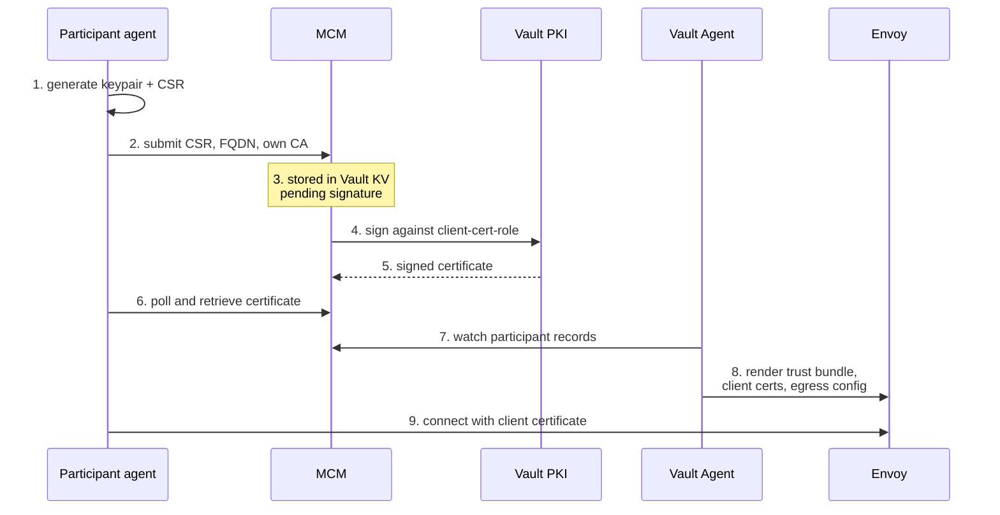
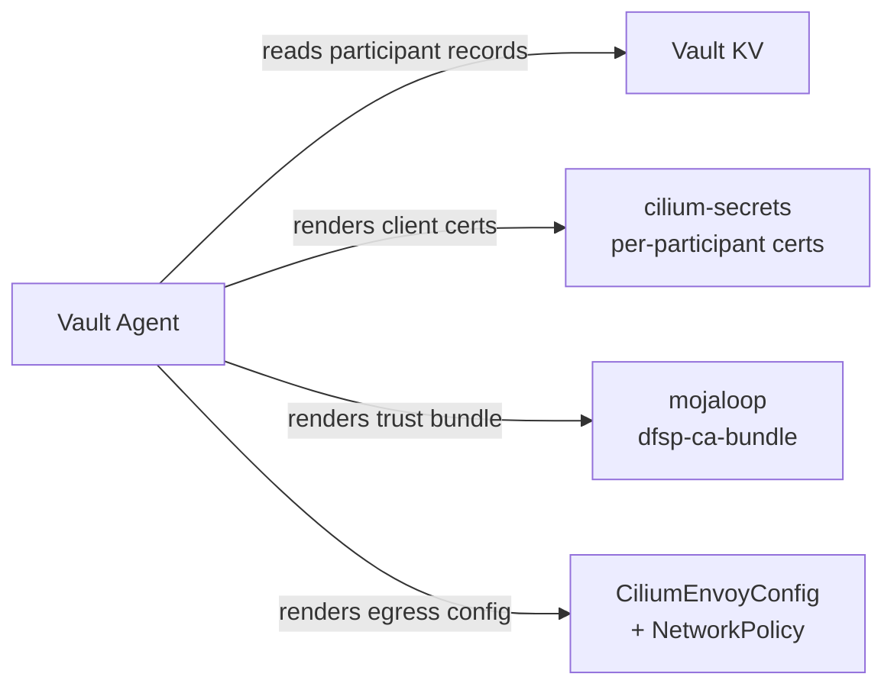

# Participant mTLS

[doc](../index.md) / [architecture](index.md) / Participant mTLS

**Audiences:** architect, platform developer, adopter (operate)

The certificate machinery behind participant connections — how certificates are issued, distributed, and rotated.

For the onboarding sequence and the interface contract, see [Participant integration](participant-integration.md). For the trust model overview, see [Security](security.md#certificate-authorities).

This is a cross-component lifecycle spanning Vault, MCM, each participant's agent, the Vault Agent, and Envoy. No single component's documentation covers it end to end, which is why it lives here.

- [The scheme PKI](#the-scheme-pki)
- [Certificate inventory](#certificate-inventory)
- [End-to-end lifecycle](#end-to-end-lifecycle)
- [How certificates reach the data plane](#how-certificates-reach-the-data-plane)
- [The trust bundle](#the-trust-bundle)
- [Rotation](#rotation)
- [Blocking and offboarding](#blocking-and-offboarding)
- [Additional edge controls (work in progress)](#additional-edge-controls-work-in-progress)

## The scheme PKI

Vault runs a private certificate authority, separate from the public issuer used for web endpoints.

| Property | Value |
|----------|-------|
| Root | `Mojaloop Hub CA`, RSA 4096, 10-year lifetime |
| Generated | Internally in Vault; the private key is never exported |
| Mount | `pki`, max lease 10 years |

Two issuing roles sit beneath it:

| Role | Constraint | Usage | Max lifetime |
|------|-----------|-------|:---:|
| `server-cert-role` | Restricted to the Hub's domain and subdomains | Server | 5 years |
| `client-cert-role` | Any name — participants use their own domains | Client only | 5 years |

The client role permits any subject name deliberately: participants present certificates for their own FQDNs, which the Hub cannot enumerate in advance. Constraint comes from the enrolment process, not from the certificate profile.

## Certificate inventory

Three distinct certificates are in play, with very different lifetimes:

| Certificate | Issued to | Signed by | Lifetime |
|-------------|-----------|-----------|----------|
| Scheme root | The Hub CA itself | Self | 10 years |
| Hub FSPIOP endpoint (`extapi-tls`) | `extapi.${domain}` | Scheme CA | **30 days** |
| Participant client certificates | Each participant | Scheme CA | Up to 5 years |

The 30-day endpoint certificate is issued by cert-manager through a Vault issuer and renewed automatically at 15 days. The long-lived participant certificates rotate only at enrolment.

**Participants must trust the scheme CA explicitly.** The FSPIOP endpoint does not present a publicly-trusted certificate, so validating it against the system trust store fails by design.

## End-to-end lifecycle

Six components take part. Following a certificate from request to live connection is the fastest way to understand where to look when something fails.

| Step | Component | What happens |
|:---:|-----------|--------------|
| 1–2 | Participant agent | Generates the keypair locally — the private key never leaves the participant — and submits the CSR with the FQDN and the participant's own CA |
| 3 | MCM | Records it in Vault KV under the participant's entry, awaiting a HubOps signature |
| 4–5 | Vault PKI | Signs against `client-cert-role` once approved |
| 6 | Participant agent | Polls, retrieves the signed certificate and the Hub CA, and hands them to its SDK over its control channel |
| 7–8 | Vault Agent | Watches Vault, renders the Kubernetes resources Envoy consumes |
| 9 | Envoy | Accepts the connection, validating against the rendered trust bundle |

Two properties worth noting:

**The participant's private key never reaches the Hub.** Only a CSR crosses the boundary. The Hub cannot impersonate a participant on the inbound path.

**Step 3 blocks on a human.** The agent submits and then waits — it does not fail. HubOps signs in MCM, and the agent resumes on its next poll. An agent sitting idle after CSR submission is working correctly, not stuck.

**Where failures land.** Steps 1–6 are participant-side and MCM: a failure here means enrolment never completes and the agent reports it. Steps 7–8 are Hub-side automation: a failure here means enrolment *appears* to succeed but the participant cannot connect, because the trust bundle was never updated. Those two look identical from the participant's side and are diagnosed in completely different places.

## How certificates reach the data plane

Certificate material lives in Vault, but Envoy reads Kubernetes Secrets. A **Vault Agent** deployment bridges the two.

The agent watches participant records in Vault and regenerates four things whenever they change:

| Output | Namespace | Purpose |
|--------|-----------|---------|
| `<host>-clientcert-tls` | `cilium-secrets` | The certificate the Hub presents when calling that participant |
| `dfsp-ca-bundle` | `mojaloop` | Combined trust bundle for inbound mTLS |
| `dfsp-callback-mtls` | `mojaloop` | Envoy config — one upstream per participant |
| `dfsp-callback-egress` | `mojaloop` | Network policy redirecting callbacks through Envoy |

Client certificates **must** live in `cilium-secrets` — Cilium's secret discovery service reads only from that namespace.

Note it is a standalone Deployment, not a sidecar, and it runs a **single replica**. While it is down, enrolment changes do not reach the data plane: existing connections are unaffected, but a newly enrolled participant will not be trusted until it returns.

## The trust bundle

Inbound mTLS validates against one file: the scheme root certificate, followed by every enrolled participant's CA, concatenated.

Envoy watches the directory holding it. **Enrolling a participant does not restart Envoy or drop connections** — the trust bundle is re-read in place. The same applies to the endpoint certificate at renewal.

This is why the mTLS boundary can absorb onboarding during live traffic.

## Rotation

| What | Cadence | Triggered by |
|------|---------|-------------|
| Hub FSPIOP endpoint certificate | 30 days, renewed at 15 | cert-manager, automatic |
| Participant client certificates | Up to 5 years | Re-enrolment |
| Scheme root | 10 years | Manual — no automation exists |

The root is the one to plan for. Rotating it means re-issuing every participant certificate and coordinating trust across every connected institution. Nothing in the toolkit automates this, and a ten-year horizon makes it easy to defer past the point where anyone remembers the procedure. Record the expiry somewhere durable.

## Blocking and offboarding

### Stopping a participant transacting

**Disable them in the Finance Portal.** This is the operational control, it takes effect immediately, and it is the correct action for a suspended, defaulting, or compromised participant.

The `participantDisableEnable` permission is held by the `manager`, `clerk`, and `financemanager` roles. A disabled participant is rejected by the central ledger, so transfers, quotes, and lookups all fail regardless of the state of its certificates.

Think of it as two independent layers:

| Layer | Controls | How to act |
|-------|----------|-----------|
| **Scheme membership** | Whether the participant can transact | Disable in the Finance Portal — immediate |
| **Transport** | Whether the TLS connection is accepted | Certificate lifecycle |

Blocking is a membership action, not a certificate action. Stopping a participant never touches PKI.

### Certificate cleanup at offboarding

Removing a participant's record from Vault does not remove what was generated from it. The trust bundle is applied without pruning, so the departed participant's CA remains in it, and its client certificate Secret and Envoy upstream persist.

The participant cannot transact once disabled, but its certificate is still accepted at the TLS layer until those artifacts are cleaned up. Tracked in `discrepancies.md` item 5.

Vault publishes a CRL, but neither Envoy consults it, so revoking a certificate has no effect on connections. Treat certificate cleanup as a follow-up housekeeping step after disabling — not as the mechanism for stopping a participant.

## Additional edge controls (work in progress)

> **Not implemented.** This section describes intended design so the current security posture is legible. Neither control is active today. Tracked in `discrepancies.md` item 5c.

The FSPIOP endpoint currently authenticates with **one factor**: the client certificate. A valid certificate reaches every FSPIOP service, from any source address, with no second check. Two controls are planned to change that.

### Token validation

Participants already obtain OAuth2 tokens from the Hub for the MCM API, and Oathkeeper already validates them there. The FSPIOP path does not participate in that.

The intent is to require a valid token **in addition to** the client certificate, so a stolen or mis-issued certificate is not sufficient alone. The likely mechanism is a JWT filter on the inbound Envoy validating against the Hub's JWKS endpoint, keeping enforcement at the edge rather than in each service.

One design question is open: today the FSPIOP `source` header, the token subject, and the certificate common name are **three independent identities** that nothing cross-checks. Binding them is arguably more valuable than adding the token alone, and the design should settle whether all three must agree.

### Source address filtering

**The data model already exists.** MCM is configured with internal and external IP whitelist bundles stored in Vault, and participants can register source ranges. Nothing reads them — no Envoy filter or network policy consumes the data.

The intent is to enforce those registered ranges on inbound connections, rejecting a valid certificate presented from an unexpected address. The natural mechanism is the Vault Agent template that already renders per-participant Envoy configuration — the whitelist is another output from data it already watches, rather than new machinery.

One caveat governs whether this works at all: if the load balancer replaces the source address, every connection appears to originate from the same place and the filter silently passes everything. Address preservation has to be verified first, not after.

### Why this matters now

These are defence in depth, and the depth is currently thin. With no CRL enforcement and participant certificates valid for up to five years, the client certificate is a long-lived single factor protecting the highest-value surface in the system. Treat the certificate as the only thing standing between an attacker and the FSPIOP API when reasoning about risk today.

