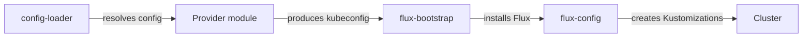

# Provider Model

[doc](../index.md) / [architecture](index.md) / Provider model

**Audiences:** architect, platform developer, adopter (deploy)

How infrastructure and DNS providers plug in, and what is actually supported today.

- [Two independent choices](#two-independent-choices)
- [Infrastructure providers](#infrastructure-providers)
- [DNS providers](#dns-providers)
- [What the provider layer owns](#what-the-provider-layer-owns)
- [Deployment templates](#deployment-templates)
- [Where provider differences live](#where-provider-differences-live)

## Two independent choices

Infrastructure and DNS are separate dimensions. Any combination is valid — Proxmox compute with Cloudflare DNS, or DigitalOcean compute with Route53.

```yaml
infra:
  provider: proxmox
dns:
  provider: cloudflare
```

Provider-specific behaviour is confined to a Terraform module and an optional vendor Kustomization ([ADR-024](decisions/024-narrow-provider-boundary.md)). Everything above that is identical.

## Infrastructure providers

**Proxmox with Talos Linux is the supported deployment infrastructure.**

```yaml
infra:
  provider: proxmox
```

Additional providers are planned. The provider abstraction below is what makes adding them a contained piece of work rather than a rewrite.

### Proxmox and Talos

The toolkit provisions VMs on Proxmox and installs [Talos Linux](https://www.talos.dev/) — an immutable, API-managed Kubernetes OS with no shell and no package manager ([ADR-006](decisions/006-talos-for-onprem.md)).

Because the cluster is self-managed, a vendor layer supplies what a managed Kubernetes service would otherwise provide:

| Component | Why |
|-----------|-----|
| Cilium | CNI — a managed service would ship its own |
| Gateway API CRDs | Not pre-installed on a bare cluster |
| LB-IPAM | No cloud load balancer to allocate addresses |
| OpenEBS | No cloud block storage driver |

This is why a self-managed cluster needs per-gateway addresses in `cluster.lb_ipam.pools`.

## DNS providers

Three are supported, each a self-contained directory of cert-manager and external-dns configuration:

| Provider | Credential |
|----------|-----------|
| **Route53** | IAM access key with scoped hosted-zone permissions |
| **Cloudflare** | API token scoped to `Zone:DNS:Edit` |
| **DigitalOcean** | API token with write access |

The DNS provider is an independent choice — Route53 with Proxmox is a normal combination, and the DNS provider has no bearing on where compute runs.

## Certificate issuance

All three DNS providers use **DNS-01** ACME challenges ([ADR-011](decisions/011-dns01-over-http01.md)), which is what allows wildcard certificates and works before any ingress path is reachable.

The ACME account contact is `cert.email` in the environment config — required, not defaulted ([ADR-017](decisions/017-explicit-capability-endpoints.md)).

**The certificate authority is a configuration dimension, not a code path.** There is no CA enum to extend — the directory URL *is* the provider identity, exactly as in Traefik (`caServer`) and Caddy (`acme_ca`). Two knobs cover every ACME authority, current or future ([ADR-016](decisions/016-generic-acme-ca.md)):

| Knob | Where | Notes |
|------|-------|-------|
| Directory URL | `cert.server` in `config.yaml` | required — the issuing authority is always stated, never inherited |
| EAB credentials | `ACME_EAB_KEY_ID` + `ACME_EAB_HMAC_ENCODED` in `.env` | optional; required by every public CA except Let's Encrypt |

External Account Binding is emitted only when both credentials are present — there is no toggle, credential presence is the switch. Its schema is fixed by RFC 8555 at keyID plus HMAC key and does not vary by CA, so adding a provider means changing two values, never a manifest.

Adding Google Trust Services, ZeroSSL or SSL.com is therefore a config edit. `cert.server` is required rather than defaulted, so the authority every platform certificate comes from is always visible in the config rather than inherited from a hidden fallback. A private CA (Vault PKI) remains out of scope: only ACME issuance is implemented.

The scheme's own CA is separate and unrelated — see [Security](security.md#certificate-authorities).

## What the provider layer owns

A provider module is responsible for exactly one thing: **producing a reachable Kubernetes cluster and a kubeconfig.** Everything after that is provider-agnostic.



Read the arrows as actions — each module is the actor performing the step to its right.

The boundary is narrow ([ADR-024](decisions/024-narrow-provider-boundary.md)): adding a provider means implementing cluster creation and returning a kubeconfig, and touching no DNS, TLS, observability, or application code. The full list of registration edits lives in [Platform → Adding providers](../platform/index.md).

## Deployment templates

Node counts and machine sizes come from named templates per role, not from hand-written values ([ADR-012](decisions/012-tps-sizing-profiles.md), reshaped by [ADR-015](decisions/015-two-stack-capability-config.md)).

| Role | Available templates |
|------|--------------------|
| Tooling Cluster (`tooling`) | `dev`, `small`, `medium` |
| Hub (`hub`) | `dev`, `tps-1`, `tps-10` |
| Platform-only (`bare`) | `small` |

Hub templates are named for the transaction rate they are sized to sustain. `dev` is the smallest footprint for development clusters; `tps-1` is a functional lab; `tps-10` is the larger validated tier.

```yaml
template: "tps-10"
```

A template is a **provider-specific full overlay**. Each provider directory carries one complete file per role and tier — node groups with count, cores, memory, disks, and placement groups, plus the replica counts and data-layer tuning that must scale with them — with no knobs and no conditionals. Selection is `config.yaml`'s `template` value combined with `cluster.role` and `infra.provider`:

| File | Contents | Owner |
|------|----------|-------|
| `config/templates/<provider>/<role>/<name>/` | Full overlay directory — `template.yaml` tuning, `placement.yaml` topology, `values/`/`patches/`/`talos/` surfaces | Distribution, one directory per provider, role, and tier |
| `config/templates/<provider>/params.yaml` | The provider interface: a `params` section (`P_*` values) and an `infra` section consumed by Terraform | Distribution, one file per provider |

On Proxmox a node group expands into `count` individually-placed VMs; on a managed service it becomes a node group or pool of that size.

### The provider interface

`params.yaml` is the contract between a provider and the shared layers above it. Its `params` section defines exactly the `P_*` variables the shared manifests substitute — `P_GATEWAY_CLASS`, `P_STORAGE_CLASS`, `P_NODE_ROLE_LABEL_KEY`, `P_L2_INTERFACE_REGEX`, `P_KUBE_API_HOST`, `P_KUBE_API_PORT` — validated against `config/schemas/params.schema.json` in both directions: a provider must supply every interface variable, and may supply nothing outside it. The `P_*` namespace is disjoint from `config.yaml`'s: `P_*` values resolve from `params.yaml` only, and a `config.yaml` that defines or shadows one fails validation. An adopter editing `params.yaml` is forking the distribution, and the pristine check reports it.

The interface is proven by a second provider consuming it. The `aws` and `digitalocean` template directories exist and pass schema validation, but their interface values are marked **UNVALIDATED** until a second provider is brought up against them — Proxmox is the only validated set today.

## Where provider differences live

Four places, and nowhere else:

| Location | Contains |
|----------|----------|
| `src/modules/<provider>/` | Cluster provisioning |
| `config/templates/<provider>/` | Full template overlays per role and tier, plus `params.yaml` — the `P_*` interface and Terraform-consumed infra constants |
| `gitops/talos/` | Vendor layer — self-managed clusters only |
| `gitops/dns/<provider>/` | cert-manager issuer and external-dns config |

Nothing in `gitops/platform/`, `gitops/hub*/`, or `gitops/tooling*/` is provider-aware. That is what makes the same artifact deployable everywhere, and it is the constraint to preserve when extending the toolkit.
