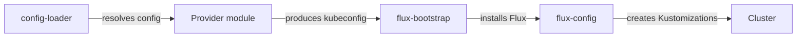

# Provider Model

[doc](../index.md) / [architecture](index.md) / Provider model

**Audiences:** architect, platform developer, adopter (deploy)

How infrastructure and DNS providers plug in, and what is actually supported today.

- [Two independent choices](#two-independent-choices)
- [Infrastructure providers](#infrastructure-providers)
- [DNS providers](#dns-providers)
- [What the provider layer owns](#what-the-provider-layer-owns)
- [Sizing profiles](#sizing-profiles)
- [Where provider differences live](#where-provider-differences-live)

## Two independent choices

Infrastructure and DNS are separate dimensions. Any combination is valid — Proxmox compute with Cloudflare DNS, or DigitalOcean compute with Route53.

```yaml
infra:
  provider: proxmox
dns:
  provider: cloudflare
```

The separation holds because provider-specific behaviour is confined to a Terraform module and an optional vendor Kustomization. Everything above that is identical.

## Infrastructure providers

**Proxmox with Talos Linux is the supported deployment infrastructure.**

```yaml
infra:
  provider: proxmox
```

Additional providers are planned. The provider abstraction below is what makes adding them a contained piece of work rather than a rewrite.

### Proxmox and Talos

The toolkit provisions VMs on Proxmox and installs [Talos Linux](https://www.talos.dev/) — an immutable, API-managed Kubernetes OS with no shell and no package manager ([ADR-006](decisions/006-talos-for-onprem.md)).

Because the cluster is self-managed, a vendor layer supplies what a managed Kubernetes service would otherwise provide:

| Component | Why |
|-----------|-----|
| Cilium | CNI — a managed service would ship its own |
| Gateway API CRDs | Not pre-installed on a bare cluster |
| LB-IPAM | No cloud load balancer to allocate addresses |
| OpenEBS | No cloud block storage driver |

This is why a self-managed cluster needs an address range in `app.lb_ipam.range`.

## DNS providers

Three are supported, each a self-contained directory of cert-manager and external-dns configuration:

| Provider | Credential |
|----------|-----------|
| **Route53** | IAM access key with scoped hosted-zone permissions |
| **Cloudflare** | API token scoped to `Zone:DNS:Edit` |
| **DigitalOcean** | API token with write access |

The DNS provider is an independent choice — Route53 with Proxmox is a normal combination, and the DNS provider has no bearing on where compute runs.

## Certificate issuance

All three DNS providers use **DNS-01** ACME challenges ([ADR-011](decisions/011-dns01-over-http01.md)), which is what allows wildcard certificates and works before any ingress path is reachable.

**Let's Encrypt is the only supported ACME provider.** The issuer is fixed; other ACME-compatible certificate authorities are not currently selectable. Making this configurable is tracked in `discrepancies.md` item 7.

The scheme's own CA is separate and unrelated — see [Security](security.md#certificate-authorities).

## What the provider layer owns

A provider module is responsible for exactly one thing: **producing a reachable Kubernetes cluster and a kubeconfig.** Everything after that is provider-agnostic.



Read the arrows as actions — each module is the actor performing the step to its right.

The boundary is deliberately narrow. Adding a provider means implementing cluster creation and returning a kubeconfig; it means touching no DNS, TLS, observability, or application code. See [Platform → Adding providers](../platform/index.md).

## Sizing profiles

Node counts and machine sizes come from named profiles per provider and role, not from hand-written values ([ADR-012](decisions/012-tps-sizing-profiles.md)).

| Role | Available profiles |
|------|--------------------|
| Tooling Cluster (`cc`) | `small`, `medium` |
| Hub (`env`) | `tps-1`, `tps-10` |
| Platform-only (`base`) | `small` |

Hub profiles are named for the transaction rate they are sized to sustain. `tps-1` is a functional lab; `tps-10` is the larger validated profile.

```yaml
cluster:
  profile: "tps-10"
```

## Where provider differences live

Four places, and nowhere else:

| Location | Contains |
|----------|----------|
| `src/modules/<provider>/` | Cluster provisioning |
| `config/providers/<provider>/` | Defaults and sizing profiles |
| `gitops/talos/` | Vendor layer — self-managed clusters only |
| `gitops/dns/<provider>/` | cert-manager issuer and external-dns config |

Nothing in `gitops/platform/`, `gitops/env*/`, or `gitops/cc*/` is provider-aware. That is what makes the same artifact deployable everywhere, and it is the constraint to preserve when extending the toolkit.
