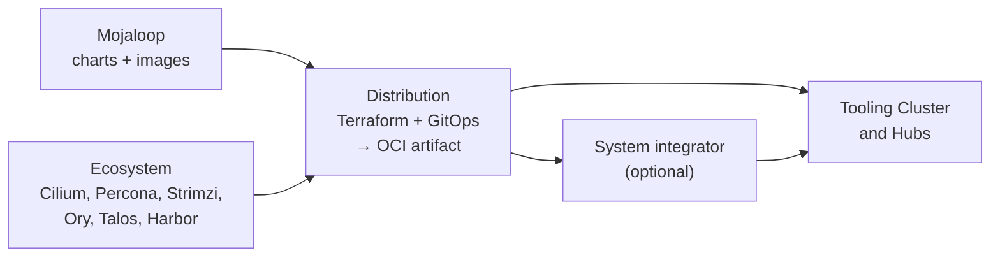

# System Overview

[doc](../index.md) / [architecture](index.md) / System overview

**Audiences:** all

How the distribution is assembled, what a cluster is made of, and how configuration reaches a running system. Every other guide references this page rather than restating it.

- [What this is](#what-this-is)
- [The deployed system](#the-deployed-system)
- [Delivery chain](#delivery-chain)
- [Cluster roles](#cluster-roles)
- [What a Tooling Cluster runs](#what-a-tooling-cluster-runs)
- [What a Hub runs](#what-a-hub-runs)
- [Reconciliation order](#reconciliation-order)
- [Configuration tiers](#configuration-tiers)
- [Configuration layers](#configuration-layers)
- [Provider independence](#provider-independence)

## What this is

ML Deployment Toolkit packages [Mojaloop](https://mojaloop.io/) into an infrastructure-agnostic distribution. It bundles Terraform modules and FluxCD GitOps manifests into OCI artifacts, consumed directly by adopters or customized and republished by system integrators.

The distribution owns everything below the application layer: Kubernetes provisioning, networking, secrets, TLS, observability, data services, and the Mojaloop deployment itself.

## The deployed system

Everything `make plan-apply` leaves running, in one picture:

The Hub carries the switch; the Tooling Cluster hosts the supporting services a Hub points at — and is optional, as covered in [Cluster roles](#cluster-roles). The four entry points on the left of the Hub are separate load balancers by design ([Networking](networking.md#four-entry-points)); the arrows into the Tooling Cluster are the three standing relationships between the clusters — artifact pulls, backups, and telemetry.

## Delivery chain

Packaging multiple upstreams into one deployable artifact is what makes this a distribution rather than a chart collection. See [ADR-001](decisions/001-oci-over-git.md) for why the artifact is OCI rather than Git, and [ADR-007](decisions/007-single-oci-artifact.md) for why it is a single artifact.

## Cluster roles

A cluster's role determines which Flux Kustomizations are created. The value is set in `config.yaml` as `cluster.role` and validated against exactly three values.

| Role | Reader-facing name | Purpose |
|------|-------------------|---------|
| `tooling` | **Tooling Cluster** | Supporting services — registry, secrets, object storage, observability backend |
| `hub` | **Hub** | The Mojaloop switch and its data layer |
| `bare` | — | Platform layer only; no role-specific workloads |

A Tooling Cluster is optional, and it is a reference implementation rather than a requirement: the three supporting-service endpoints a Hub consumes — image registry, backup target, telemetry sink — are bound independently in configuration and may point anywhere, including the adopter's own hosts ([ADR-017](decisions/017-explicit-capability-endpoints.md)). A single Hub can pull artifacts from any external OCI registry. The Tooling Cluster earns its place in multi-environment and air-gapped operation, where it provides a pull-through cache, shared object storage, and aggregated observability.

## What a Tooling Cluster runs

| Component | Namespace | Role |
|-----------|-----------|------|
| Vault | `vault` | Secrets and PKI |
| Harbor | `harbor` | OCI registry and pull-through proxy cache |
| MinIO | `minio` | S3-compatible object storage — backups, metrics, logs, traces, and Harbor's registry storage |
| Thanos | `observability` | Long-term metrics (receive, query, store, compact) |
| Loki | `observability` | Log aggregation |
| Tempo | `observability` | Trace storage |
| Grafana | `observability` | Dashboards and alerting |

## What a Hub runs

| Component | Namespace | Role |
|-----------|-----------|------|
| Mojaloop core | `mojaloop` | Central ledger, account lookup, quoting, settlements, transfers |
| Finance Portal | `finance-portal` | Operational UI |
| MCM | `mcm` | Connection manager — participant onboarding and certificates |
| Kratos | `ory` | Identity and sessions |
| Hydra | `ory` | OAuth2 / OIDC for machine clients |
| Keto | `ory` | Relationship-tuple authorization |
| Oathkeeper | `ory` | Identity-aware proxy |
| Vault | `vault` | Runtime secrets and the scheme PKI (3-node Raft) |
| MySQL, Kafka, MongoDB, Redis | `data` | Data layer |
| Alloy | `observability` | Telemetry agent — scrapes metrics, tails logs, receives OTLP traces; ships all three to the Tooling Cluster |
| OpenTelemetry Operator | `platform-system` | Injects the OTel SDK into annotated Mojaloop pods, activating their built-in trace instrumentation |

Authentication and authorization are Ory end to end. Keycloak is not deployed. See [Security](security.md#identity-and-access) for the identity model.

Note the namespace split: **the data layer lives in `data`, not `mojaloop`**, **the auth stack lives in `ory`**, and **the Finance Portal has its own `finance-portal` namespace**. Commands that target the wrong namespace return nothing and look like a healthy empty result.

## Reconciliation order

Flux applies Kustomizations as a dependency graph, not a flat list. Each stage waits for the previous one to report healthy.

Every role shares the same four-stage prefix — `platform` → `dns` → `platform-config` → `talos`. `platform` gates on the cert-manager and external-secrets webhooks being live. The vendor stage is named for the infrastructure provider — `talos` on Proxmox — and is skipped on providers that need no vendor layer.

The **Tooling Cluster** adds five stages. `tooling-config` gates on Harbor and MinIO. `tooling-observability` gates on Thanos receive and query, plus Loki, Tempo, and Grafana.

The **Hub** adds a gated chain at every step: `hub` waits for the PXC, PSMDB, and Strimzi operators; `hub-data-common` fans out into one Kustomization per in-cluster store — `hub-data-mysql` waits for the MySQL cluster to report `ready`, Kafka and MongoDB for their custom resources to be healthy, while Redis has no status worth gating on and applies ungated; `hub-vault` waits for Vault; `hub-iam` waits for Kratos, Keto, and Hydra; `hub-app` waits for Mojaloop, MCM, and Finance Portal.

A store bound to `external-unmanaged` gets no Kustomization at all — the fan-out is built from the stores that are actually in-cluster, so `hub-vault` and `hub-app` gate only on what this deployment runs. See [Configuration → Data modes](../adopter/deploy/configuration.md#data-modes).

Each link gates on the *health* of what the previous one produced, not on its application ([ADR-019](decisions/019-health-gated-reconciliation.md)) — so a Hub converges serially, and an early failure blocks everything downstream. `hub-observability-agent` is a parallel branch off `platform-config` and does not block the application chain.

## Configuration tiers

Configuration merges from three tiers at plan time, each tier layered over the one before it.

| Tier | Owner | Contents | Location |
|------|-------|----------|----------|
| Common gitops | Distribution team | Environment-neutral GitOps manifests and Terraform modules — the distribution artifact | `gitops/`, `src/` |
| Provider template | Distribution team | A full overlay directory per provider — one per role and tier (template.yaml, placement.yaml, values/, patches/, talos/), no knobs or conditionals — plus the provider interface and its Terraform-consumed `infra` block | `providers/<provider>/templates/<role>/<name>/`, `providers/<provider>/params.yaml` |
| Environment | Adopter | Capability bindings, cluster name, domain, template name, placement, external credentials, optional Helm value overrides and manifest patches | `../environments/<env>/` — a sibling of the clone, each environment its own git repository: `config.yaml`, `.env`, `placement.yaml`, `talos.yaml`, `values/`, `patches/`, `talos/` |

Parameterization is **orthogonal to the tiers, not a tier of its own**: `config.yaml` and `.env` supply the values that `${UPPER_SNAKE}` tokens in any tier resolve to — they select and fill the layers rather than sitting between them.

The `config-loader` Terraform module merges the tiers: it reads the environment config, selects the template overlay from `config.yaml`'s `template` plus `cluster.role` and `infra.provider`, loads the provider's `params.yaml`, expands node groups into concrete machines, resolves each capability to concrete endpoints, and produces one unified configuration for downstream modules.

Adopters touch the environment tier only. The other two arrive read-only in the clone; editing them is forking the distribution, and the pristine check reports it.

Terraform itself is two stacks with separate state ([ADR-015](decisions/015-two-stack-capability-config.md)): **infra** (`src/infra`) builds the cluster and installs Flux; **config** (`src/config`) writes everything Flux consumes. Both load the same merged configuration; only the second can be applied on its own, with `make apply-config`.

Values that must reach a running workload are injected two ways — a `cluster-config` ConfigMap for non-secret values and a `cluster-secrets` Secret for credentials, both written by the config stack and consumed by Flux `postBuild` substitution. That is how a manifest in the artifact ends up carrying the environment's domain name without the artifact being rebuilt per environment. The internal service passwords in `cluster-secrets` are generated there rather than authored.

## Configuration layers

The tiers above say who *owns* each input. This says how an input *reaches* a running workload, and which layer wins when more than one speaks to the same setting.

A value takes one of three routes.

**Route 1 — substitution, for anything the distribution templated.** The artifact's manifests carry `${UPPER_SNAKE}` placeholders — bare names only, no operators or inline defaults. The parameters are exactly the config-derived values and the provider interface — templates supply none. Terraform resolves them into `cluster-config` and `cluster-secrets`, and every Flux Kustomization substitutes from that pair, so the placeholder becomes this environment's value at reconcile time:

| Step | Where |
|------|-------|
| Environment config — capability bindings, domain, cluster identity | `../environments/<env>/config.yaml` |
| Supplied credentials | `../environments/<env>/.env` |
| Generated credentials — the ~20 internal service passwords | created by the config stack, never authored |
| The provider interface — the `P_*` symbols | `providers/<provider>/params.yaml` |
| ↓ resolved by `config-loader`, written by the config stack | `cluster-config` ConfigMap + `cluster-secrets` Secret |
| ↓ Flux `postBuild.substituteFrom` | the rendered manifest |

Substitution is **strict**: an undefined variable fails the reconcile rather than passing through, and a literal `${` is escaped as `$${...}`. Two things follow. A value only reaches a workload here if the distribution left a placeholder for it — substitution fills blanks, it does not introduce new settings. And because Flux re-reads both objects each reconcile, changing one is `make apply-config` (seconds, no infrastructure touched) rather than a redeploy.

**Route 2 — Helm values, for chart settings.** Each HelmRelease composes its values from several sources, and the merge order decides the winner:

| Order | Source | Owner |
|:---:|--------|-------|
| 1 | Upstream chart defaults | Chart author |
| 2 | `<release>-values` ConfigMap, generated from `gitops/<layer>/values/<namespace>/<release>.yaml` (itself substituted by route 1) | Distribution |
| 3 | `providers/<provider>/templates/<role>/<name>/values/<namespace>/<release>.yaml` → the `<targetNamespace>-<release>-values-template` ConfigMap | Template |
| 4 | `../environments/<env>/values/<namespace>/<release>.yaml` → the override twins: a `<targetNamespace>-<release>-values-override` **ConfigMap**, then a **Secret** of the same name | Adopter |

A values file's path *is* the binding — the `<namespace>/<release>` layout names the HelmRelease it targets, with no `target:` header inside the file, and the `values/<namespace>/<release>.yaml` suffix is identical across the common, template, and environment layers, so diffing an override against its base is a direct path comparison. Every HelmRelease ends its `valuesFrom` chain with the three-layer tail — the template ConfigMap, then the override ConfigMap, then the override Secret, all marked `optional`; a values file that references a `.env` key lands in the Secret twin, everything else in the ConfigMap. The tail is generated by `tools/generate-valuesfrom.sh` and verified by `check-valuesfrom`.

**Later wins, so the adopter's file beats the distribution's values.** Flux merges `valuesFrom` entries in the order listed, later overwriting earlier, and no HelmRelease uses inline `spec.values` ([ADR-022](decisions/022-helm-values-layering.md)). See [Configuration → Helm value overrides](../adopter/deploy/configuration.md#helm-value-overrides).

**Route 3 — manifest patches, for anything the other two cannot reach.** `../environments/<env>/patches/<kustomization>.yaml` is appended to that Flux Kustomization's `spec.patches`, after the distribution's own patches and the selected template's, so the adopter's patch wins. Patches apply during kustomize build — before substitution — so a patch may introduce a new `${UPPER_SNAKE}` placeholder but cannot read an already-substituted value. Patches never carry secrets. See [Configuration → Manifest patches](../adopter/deploy/configuration.md#manifest-patches).

Everything a workload consumes therefore arrives from one of: a chart default, a distribution decision in `gitops/`, a provider template overlay, the environment's config, a credential, an adopter values file, or an adopter patch — in that order of increasing specificity, with the most specific winning.

See [Configuration](../adopter/deploy/configuration.md) for the schema, and [GitOps structure](gitops-structure.md) for how substitution works.

## Provider independence

Infrastructure provider and DNS provider are independent choices — Proxmox compute with Cloudflare DNS, or with Route53, are equally valid.

Provider-specific behaviour is confined to two places — the Terraform module that provisions infrastructure, and a vendor Kustomization for provider-specific cluster resources ([ADR-024](decisions/024-narrow-provider-boundary.md)). Everything above that layer is identical.

Proxmox with Talos is the supported deployment infrastructure today; the abstraction is what makes adding others contained work. See [Provider model](provider-model.md).

Adding a DNS provider touches no infrastructure code. Adding an infrastructure provider touches no DNS, TLS, or application code.

See [Provider model](provider-model.md) for the supported matrix and [Networking](networking.md#dns) for DNS behaviour.
