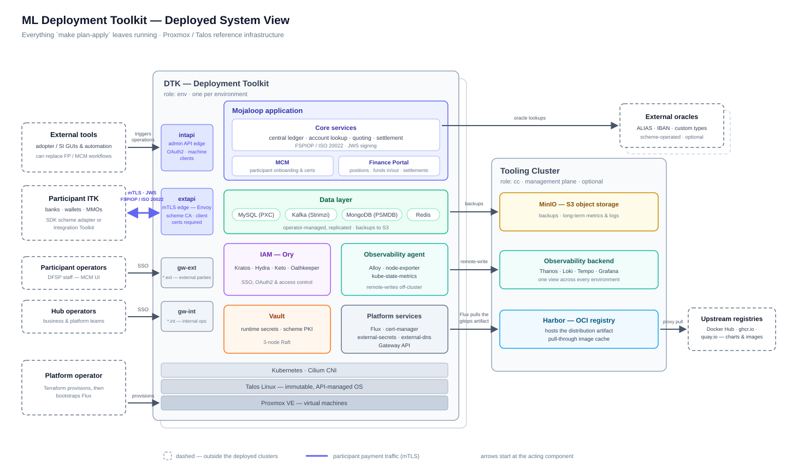
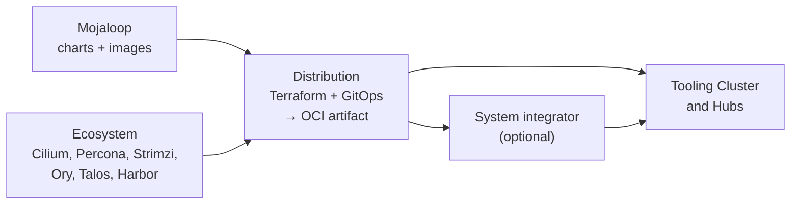
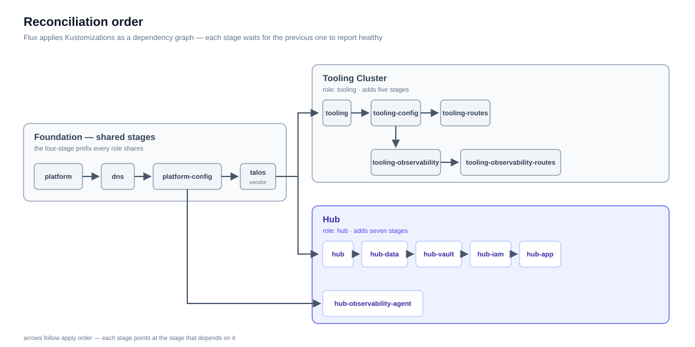

# System Overview

[doc](../index.md) / [architecture](index.md) / System overview

**Audiences:** all

How the distribution is assembled, what a cluster is made of, and how configuration reaches a running system. Every other guide references this page rather than restating it.

- [What this is](#what-this-is)
- [The deployed system](#the-deployed-system)
- [Delivery chain](#delivery-chain)
- [Cluster roles](#cluster-roles)
- [What a Tooling Cluster runs](#what-a-tooling-cluster-runs)
- [What a Hub runs](#what-a-hub-runs)
- [Reconciliation order](#reconciliation-order)
- [Configuration tiers](#configuration-tiers)
- [Configuration layers](#configuration-layers)
- [Provider independence](#provider-independence)

## What this is

ML Deployment Toolkit packages [Mojaloop](https://mojaloop.io/) into an infrastructure-agnostic distribution. It bundles Terraform modules and FluxCD GitOps manifests into OCI artifacts, consumed directly by adopters or customized and republished by system integrators.

The distribution owns everything below the application layer: Kubernetes provisioning, networking, secrets, TLS, observability, data services, and the Mojaloop deployment itself.

## The deployed system

Everything `make plan-apply` leaves running, in one picture:

The Hub carries the switch; the Tooling Cluster is the management plane serving every Hub — and is optional, as covered in [Cluster roles](#cluster-roles). The three entry points on the left of the Hub are separate load balancers by design ([Networking](networking.md#three-entry-points)); the arrows into the Tooling Cluster are the three standing relationships between the clusters — artifact pulls, backups, and telemetry.

## Delivery chain

Packaging multiple upstreams into one deployable artifact is what makes this a distribution rather than a chart collection. See [ADR-001](decisions/001-oci-over-git.md) for why the artifact is OCI rather than Git, and [ADR-007](decisions/007-single-oci-artifact.md) for why it is a single artifact.

## Cluster roles

A cluster's role determines which Flux Kustomizations are created. The value is set in `config.yaml` as `cluster.role` and validated against exactly three values.

| Role | Reader-facing name | Purpose |
|------|-------------------|---------|
| `cc` | **Tooling Cluster** | Management plane — registry, secrets, object storage, observability backend |
| `env` | **Hub** | The Mojaloop switch and its data layer |
| `base` | — | Platform layer only; no role-specific workloads |

A Tooling Cluster is optional. A single Hub can pull artifacts from any external OCI registry. The Tooling Cluster earns its place in multi-environment and air-gapped operation, where it provides a pull-through cache, shared object storage, and aggregated observability.

## What a Tooling Cluster runs

| Component | Namespace | Role |
|-----------|-----------|------|
| Vault | `vault` | Secrets and PKI |
| Harbor | `harbor` | OCI registry and pull-through proxy cache |
| MinIO | `minio` | S3-compatible object storage — backups, metrics, logs |
| Thanos | `observability` | Long-term metrics (receive, query, store, compact) |
| Loki | `observability` | Log aggregation |
| Tempo | `observability` | Trace storage |
| Grafana | `observability` | Dashboards and alerting |

## What a Hub runs

| Component | Namespace | Role |
|-----------|-----------|------|
| Mojaloop core | `mojaloop` | Central ledger, account lookup, quoting, settlements, transfers |
| Finance Portal | `mojaloop` | Operational UI |
| MCM | `mcm` | Connection manager — participant onboarding and certificates |
| Kratos | `ory` | Identity and sessions |
| Hydra | `ory` | OAuth2 / OIDC for machine clients |
| Keto | `ory` | Relationship-tuple authorization |
| Oathkeeper | `ory` | Identity-aware proxy |
| Vault | `vault` | Runtime secrets and the scheme PKI (3-node Raft) |
| MySQL, Kafka, MongoDB, Redis | `data` | Data layer |
| Alloy | `observability` | Metrics and log agent, remote-writing to the Tooling Cluster |

Authentication and authorization are Ory end to end. Keycloak is not deployed. See [Security](security.md#identity-and-access) for the identity model.

Note the namespace split: **the data layer lives in `data`, not `mojaloop`**, and **the auth stack lives in `ory`**. Commands that target the wrong namespace return nothing and look like a healthy empty result.

## Reconciliation order

Flux applies Kustomizations as a dependency graph, not a flat list. Each stage waits for the previous one to report healthy.

Every role shares the same four-stage prefix — `platform` → `dns` → `platform-config` → `talos`. `platform` gates on the cert-manager and external-secrets webhooks being live. The vendor stage is named for the infrastructure provider — `talos` on Proxmox — and is skipped on providers that need no vendor layer.

The **Tooling Cluster** adds five stages. `cc-config` gates on Harbor and MinIO. `cc-observability` gates on Thanos receive and query, plus Loki, Tempo, and Grafana.

The **Hub** adds a gated chain at every step: `env` waits for the PXC, PSMDB, and Strimzi operators; `env-data-common` fans out into one Kustomization per in-cluster store, each with its own health gate — `env-data-mysql` waits for the MySQL cluster to report `ready`, Kafka and MongoDB for their custom resources to be healthy; `env-auth` waits for Vault, Kratos, Keto, and Hydra; `env-app` waits for Mojaloop, MCM, and Finance Portal.

A store bound to `external-unmanaged` gets no Kustomization at all — the fan-out is built from the stores that are actually in-cluster, so `env-auth` and `env-app` gate only on what this deployment runs. See [Configuration → Data modes](../adopter/deploy/configuration.md#data-modes).

This is why a Hub takes time to converge and why an early failure blocks everything downstream — the ordering is deliberate, because migrations run against databases that must already exist. `env-observability-agent` is a parallel branch off `platform-config` and does not block the application chain.

## Configuration tiers

Configuration merges from three tiers at plan time.

| Tier | Owner | Contents | Location |
|------|-------|----------|----------|
| Environment | Adopter | Capability bindings, cluster name, domain, template name, external credentials | `environments/<env>/config.yaml` + `.env` |
| Platform definitions | Distribution team | Talos and Kubernetes versions, capacity templates, provider mappings, patches, schemas | `config/definitions/`, `config/templates/`, `config/patches/`, `config/schemas/` |
| Distribution artifact | Distribution team | GitOps manifests and Terraform modules | `gitops/`, `src/` |

The `config-loader` Terraform module merges them: it reads the environment config, loads the capacity template for the cluster's role and the mapping for its infrastructure provider, expands node groups into concrete machines, resolves each capability to concrete endpoints, and produces one unified configuration for downstream modules.

Adopters touch tier 1 only. Tiers 2 and 3 arrive in the artifact.

Terraform itself is two stacks with separate state ([ADR-015](decisions/015-two-stack-capability-config.md)): **infra** (`src/infra`) builds the cluster and installs Flux; **config** (`src/config`) writes everything Flux consumes. Both load the same merged configuration; only the second can be applied on its own, with `make apply-config`.

Values that must reach a running workload are injected two ways — a `cluster-config` ConfigMap for non-secret values and a `cluster-secrets` Secret for credentials, both written by the config stack and consumed by Flux `postBuild` substitution. That is how a manifest in the artifact ends up carrying the environment's domain name without the artifact being rebuilt per environment. The internal service passwords in `cluster-secrets` are generated there rather than authored.

## Configuration layers

The tiers above say who *owns* each input. This says how an input *reaches* a running workload, and which layer wins when more than one speaks to the same setting.

A value takes one of two routes.

**Route 1 — substitution, for anything the distribution templated.** The artifact's manifests carry `${...}` placeholders. Terraform resolves the environment config into `cluster-config` and `cluster-secrets`, and every Flux Kustomization substitutes from that pair, so the placeholder becomes this environment's value at reconcile time:

| Step | Where |
|------|-------|
| Capacity template tuning — replica counts, storage sizes, buffer pools | `config/templates/<role>/<name>.yaml`, sections `app:` / `data:` / `cc:` |
| Environment config — capability bindings, domain, cluster identity | `environments/<env>/config.yaml` |
| Supplied credentials | `environments/<env>/.env` |
| Generated credentials — the ~20 internal service passwords | created by the config stack, never authored |
| ↓ resolved by `config-loader`, written by the config stack | `cluster-config` ConfigMap + `cluster-secrets` Secret |
| ↓ Flux `postBuild.substituteFrom` | the rendered manifest |

Two things follow. A value only reaches a workload here if the distribution left a placeholder for it — substitution fills blanks, it does not introduce new settings. And because Flux re-reads both objects each reconcile, changing one is `make apply-config` (seconds, no infrastructure touched) rather than a redeploy.

**Route 2 — Helm values, for chart settings.** Each HelmRelease composes its values from several sources, and the merge order decides the winner:

| Order | Source | Owner |
|:---:|--------|-------|
| 1 | Upstream chart defaults | Chart author |
| 2 | `<release>-values` ConfigMap, generated from `<release>-values.yaml` beside the HelmRelease (itself substituted by route 1) | Distribution |
| 3 | `environments/<env>/values/<release>.yaml` → `<release>-values-override` ConfigMap | Adopter |

**Later wins, so the adopter's file beats the distribution's values.** Flux merges `valuesFrom` entries in the order listed, later overwriting earlier, and no HelmRelease uses inline `spec.values` — which would otherwise be merged after everything and take precedence over both. That constraint is what makes the layering work, so a new chart must follow the same pattern. See [Configuration → Helm value overrides](../adopter/deploy/configuration.md#helm-value-overrides).

Everything a workload consumes therefore arrives from one of: a chart default, a distribution decision in `gitops/`, a capacity template, the environment's config, a credential, or an adopter values file — in that order of increasing specificity, with the most specific winning.

See [Configuration](../adopter/deploy/configuration.md) for the schema, and [GitOps structure](gitops-structure.md) for how substitution works.

## Provider independence

Infrastructure provider and DNS provider are independent choices — Proxmox compute with Cloudflare DNS, or with Route53, are equally valid.

This holds because provider-specific behaviour is confined to two places: the Terraform module that provisions infrastructure, and a vendor Kustomization for provider-specific cluster resources. Everything above that layer is identical.

Proxmox with Talos is the supported deployment infrastructure today; the abstraction is what makes adding others contained work. See [Provider model](provider-model.md).

Adding a DNS provider touches no infrastructure code. Adding an infrastructure provider touches no DNS, TLS, or application code.

See [Provider model](provider-model.md) for the supported matrix and [Networking](networking.md#dns) for DNS behaviour.
