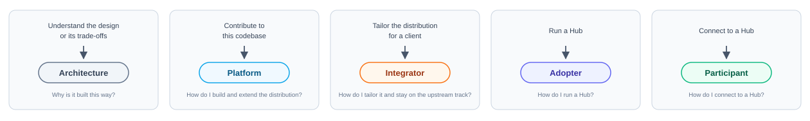
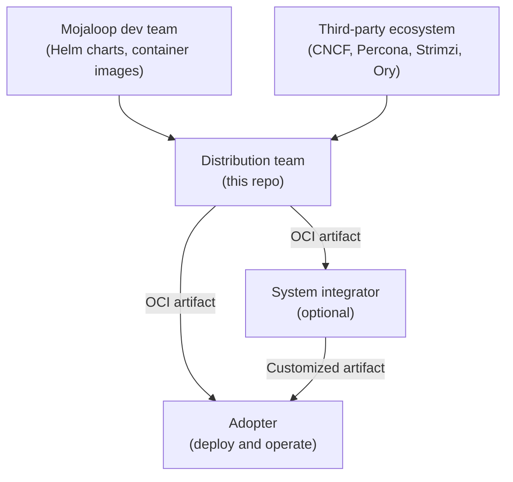

# ML Deployment Toolkit

An infrastructure-agnostic distribution of [Mojaloop](https://mojaloop.io/), the open-source real-time payment switch.

The toolkit packages Terraform modules and FluxCD GitOps manifests into OCI artifacts, so a full Mojaloop deployment becomes a single `make plan-apply`.

## Find the right guide



| Guide | Core question | Start here |
|-------|--------------|------------|
| [Architecture](architecture/index.md) | Why is it built this way? | [System overview](architecture/system-overview.md) |
| [Platform](platform/index.md) | How do I build and extend the distribution? | [Module pipeline](platform/module-pipeline.md) |
| [Integrator](integrator/index.md) | How do I tailor it and stay on the upstream track? | [Customization surface](integrator/customization-surface.md) |
| [Adopter](adopter/index.md) | How do I run a Hub? | [Prerequisites](adopter/deploy/prerequisites.md) |
| [Participant](participant/index.md) | How do I connect to a Hub? | [Prerequisites](participant/integrate/prerequisites.md) |

## What gets deployed

Two cluster kinds, each driven from its own environment config under `environments/<env>/`. One picture of the whole thing: [the deployed system](architecture/system-overview.md#the-deployed-system).

**Tooling Cluster** — the management plane. Harbor (OCI registry and pull-through cache), Vault, object storage, FluxCD, and the observability backend. Optional: a single Hub can pull artifacts directly from a public OCI registry. Recommended for multi-environment and air-gapped operation.

**Hub** — the Mojaloop switch. Central ledger, account lookup, quoting, settlements, MCM, the Ory auth stack, and the data layer (MySQL, Kafka, MongoDB, Redis). Participants connect over mTLS through the Cilium-based gateway.

> In configuration these are `role: cc` and `role: env`. See [vocabulary](adopter/deploy/configuration.md#vocabulary).

## Where this sits



The distribution team consumes from two sources — upstream Mojaloop application charts and images, and the broader ecosystem (Cilium, cert-manager, Flux, Percona, Strimzi, Ory, Talos, OpenEBS, Harbor, MinIO). Packaging those into one deployable artifact is what makes this a distribution.

A system integrator sits between distribution and adoption, forking to customize and publishing their own artifact. That step is optional — adopters can consume the distribution directly.

## Quick reference

```bash
make validate ENV=<env>      # Schema-check the config before anything runs
make plan-apply ENV=<env>    # Full deployment: infra stack, then config stack
make apply-config ENV=<env>  # Fast path: config changes only, seconds
make secrets ENV=<env>       # Show the generated internal service passwords
make push-gitops ENV=<env>   # Publish the gitops OCI artifact
make release TAG=<tag>       # Tag and publish a versioned artifact
```

`ENV` selects the environment under `environments/`. There is no default environment in the repository — always pass `ENV=`.

Full command reference: [Deployment commands](adopter/deploy/deployment.md#commands)

## How these docs work

Structure, vocabulary, and the rules they are held to: [DOCUMENTATION.md](DOCUMENTATION.md)

The most important one: **if a reader cannot execute it today, it is not in here.**
