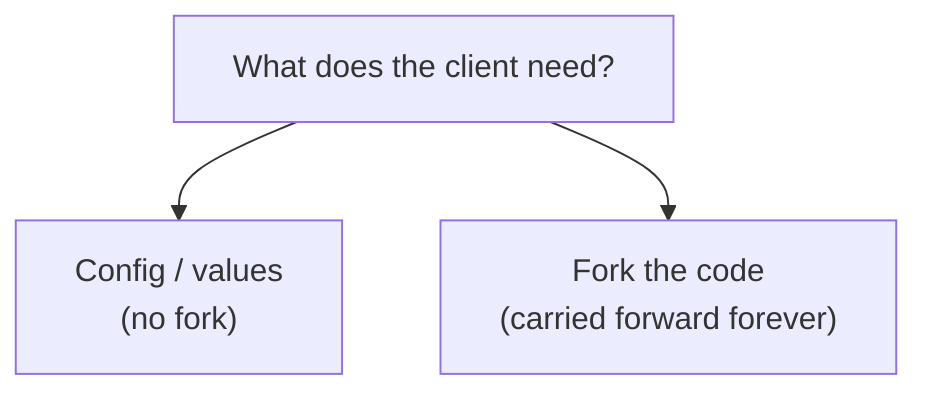

# Integrator Guide

[doc](../index.md) / Integrator

**Audiences:** system integrator

The integrator tailors the distribution for a client — public or private — and maintains that tailored version over time. The integrator forks, changes code, publishes a derivative OCI artifact, and keeps it current against upstream.

This guide is deliberately thin. The *mechanics* of building, extending, and publishing are the [Platform guide](../platform/index.md); this guide is only what is unique to running a **derivative**: what to change, what to leave alone, how to publish under the integrator's own identity, and how to stay rebaseable as upstream moves.

The distinction from a platform developer: a platform developer contributes changes back to this repository; the integrator maintains a divergence and ships it to a client. The goal is to diverge as little as possible while still meeting the client's needs — every change the integrator makes is a change the integrator carries forward at every upstream update.

## Contents

| Page | Covers |
|------|--------|
| [Customization surface](customization-surface.md) | Where the integrator can customize, and at what cost |
| [Publishing the derivative artifact](publishing.md) | Forking, publishing under the integrator's registry, provenance |
| [Staying upstream](staying-upstream.md) | Rebasing on upstream releases without drifting |

## The principle

> Customize at the highest layer that meets the need. The lower the layer, the more the integrator carries.

The toolkit is built to be personalized without forking — the adopter-owned environment layer (configuration, Helm value overrides, patches, placement) covers a great deal, and none of it touches the clone, which stays pristine at a release tag (`make check-pristine` verifies exactly that). Reach for a fork only when the environment layer genuinely cannot express what the client needs — and know that a fork is visible by design: editing the clone is forking public software, and the pristine check reports it.

Most needs land on the left. The [customization surface](customization-surface.md) is about knowing which side a given need falls on — because the cost difference is not code, it is every future upgrade.

## The honest state today

Two things worth knowing before committing to maintaining a derivative:

**There is no hosted CI, but there is a check suite.** The `tools/checks/` suite — wired as `make check` — validates substitution tokens, `valuesFrom` chains, values-file bindings, secret placement, node-role placement, hardcoded-literal hygiene, token resolution, substitution-engine parity, the provider interface, and tool versions; `make validate` schema-checks configuration; `make check-pristine` verifies the clone is clean and at an exact tag; and `tools/render.sh <env>` renders values chains, manifests, and Talos fragments offline with no cluster. All of it runs locally, on the integrator's discipline — nothing runs it automatically on a push. "Staying rebaseable" therefore rests on running `make check` at every step, plus real deployment verification: the more the integrator changes, the more the integrator verifies by hand at each upgrade.

**`make release` already stamps provenance.** A published artifact carries its git source and revision, so the derivative is traceable to the exact commit that built it. That is the one piece of derivative-maintenance infrastructure that already works well, and [publishing](publishing.md) builds on it.
