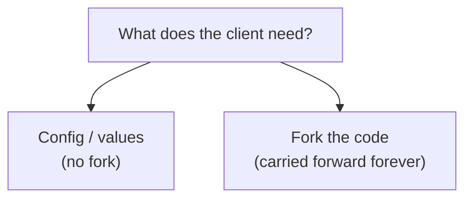

# Integrator Guide

[doc](../index.md) / Integrator

**Audiences:** system integrator

You tailor the distribution for a client — public or private — and maintain that tailored version over time. You fork, change code, publish your own OCI artifact, and keep it current against upstream.

This guide is deliberately thin. The *mechanics* of building, extending, and publishing are the [Platform guide](../platform/index.md); this guide is only what is unique to running a **derivative**: what to change, what to leave alone, how to publish under your own identity, and how to stay rebaseable as upstream moves.

The distinction from a platform developer: a platform developer contributes changes back to this repository; you maintain a divergence and ship it to a client. The goal is to diverge as little as possible while still meeting the client's needs — every change you make is a change you carry forward at every upstream update.

## Contents

| Page | Covers |
|------|--------|
| [Customization surface](customization-surface.md) | Where you can customize, and at what cost |
| [Publishing your artifact](publishing.md) | Forking, publishing under your own registry, provenance |
| [Staying upstream](staying-upstream.md) | Rebasing on upstream releases without drifting |

## The principle

> Customize at the highest layer that meets the need. The lower you go, the more you carry.

The toolkit is built to be personalized without forking — configuration and Helm value overrides cover a great deal, and neither requires touching the code. Reach for a fork only when configuration genuinely cannot express what the client needs.

Most needs land on the left. The [customization surface](customization-surface.md) is about knowing which side a given need falls on — because the cost difference is not code, it is every future upgrade.

## The honest state today

Two things worth knowing before you commit to maintaining a derivative:

**There is no CI, no test suite, and no contribution tooling in the repository.** "Staying rebaseable" currently rests on discipline and manual verification, not on an automated safety net. Factor that into how much you diverge — the more you change, the more you verify by hand at each upgrade.

**`make release` already stamps provenance.** A published artifact carries its git source and revision, so your derivative is traceable to the exact commit that built it. That is the one piece of derivative-maintenance infrastructure that already works well, and [publishing](publishing.md) builds on it.
