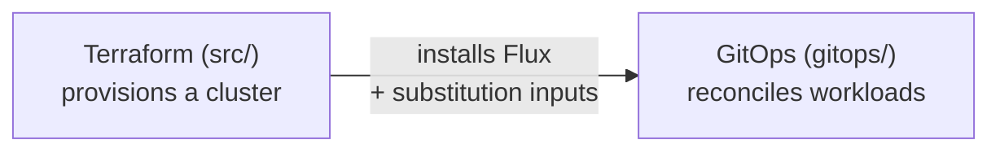

# Platform Guide

[doc](../index.md) / Platform

**Audiences:** platform developer

You contribute to this codebase — the Terraform modules in `src/`, the GitOps manifests in `gitops/`, and the OCI artifacts adopters consume. This guide is how the distribution is built and extended.

If instead you are maintaining a *derivative* of the distribution for a client — forking, customizing, publishing your own artifact — that is the [Integrator guide](../integrator/index.md). The line: a platform developer changes this repository; an integrator maintains their own.

For the design rationale behind everything here, see [Architecture](../architecture/index.md). This guide references it rather than restating it.

## Contents

| Page | Covers |
|------|--------|
| [Module pipeline](module-pipeline.md) | The Terraform module flow, from config to a running cluster |
| [Building artifacts](building-artifacts.md) | Rendering, publishing, versioning, and promoting OCI artifacts |
| [Adding a provider](adding-providers.md) | Adding an infrastructure provider |
| [Adding a service](adding-services.md) | Adding a platform service or DNS provider |
| [Known issues](known-issues.md) | Build, render, and Flux issues at the platform level |

## The two halves

The distribution has two layers you work in, and they meet at exactly one place.

**Terraform** (`src/`) provisions infrastructure and installs Flux. **GitOps** (`gitops/`) is everything Flux reconciles after that. They meet through the `cluster-config` ConfigMap and `cluster-secrets` Secret that Terraform writes and Flux substitutes — see [GitOps structure](../architecture/gitops-structure.md#substitution).

Keep that boundary clean. Provider-specific logic belongs in a Terraform module or a vendor Kustomization; nothing in the shared `gitops/` layers should know which provider it is running on. That separation is what lets one artifact deploy anywhere, and it is the main invariant to preserve when extending the toolkit.

## The invariant

The single rule that keeps the distribution a distribution:

> Nothing in `gitops/platform/`, `gitops/env*/`, or `gitops/cc*/` is provider-aware.

If a change would make a shared manifest depend on the infrastructure provider, it belongs somewhere else — a provider module, a vendor Kustomization, or a substituted variable. When in doubt, check that the same manifest would still be correct on a different provider.
