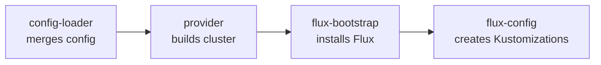

# Module Pipeline

[doc](../index.md) / [platform](index.md) / Module pipeline

**Audiences:** platform developer

The Terraform modules in `src/`, and how they hand off from configuration to a reconciling cluster.

- [The chain](#the-chain)
- [config-loader](#config-loader)
- [Provider modules](#provider-modules)
- [flux-bootstrap](#flux-bootstrap)
- [flux-config](#flux-config)
- [The Terraform–Flux boundary](#the-terraformflux-boundary)

## The chain

Each module produces what the next consumes.

Read the arrows as hand-offs: **config-loader** resolves configuration and feeds the **provider** module, which produces a kubeconfig for **flux-bootstrap**, which installs Flux so **flux-config** can create the Kustomization graph.

The modules, in `src/`:

| Module | Role |
|--------|------|
| `config-loader` | Merge environment config, profile, and patches into one object |
| `proxmox`, `aws`, `digitalocean` | Provision infrastructure, return a kubeconfig |
| `proxmox-vm`, `talos-bootstrap`, `talos-gen-config` | Sub-modules the Proxmox path composes |
| `flux-bootstrap` | Install Flux on the new cluster |
| `flux-config` | Create the OCIRepository and the Kustomization dependency graph |

## config-loader

The first module. It reads the environment's `config.yaml`, resolves the sizing profile from the provider's profile directory, applies Talos patches, and emits one merged configuration object that every downstream module reads.

This is where the three configuration tiers collapse into one — see [Configuration tiers](../architecture/system-overview.md#configuration-tiers). Downstream modules never read `config.yaml` directly; they read config-loader's output. When the platform developer adds a configuration field, it flows through here.

## Provider modules

Each provider module has one contract: **provision a cluster and return a kubeconfig.** Nothing downstream knows or cares which provider ran.

The Proxmox path is composite — it provisions VMs (`proxmox-vm`), generates Talos machine configuration (`talos-gen-config`), and bootstraps the cluster (`talos-bootstrap`). The managed paths are single modules that create a managed cluster and write its kubeconfig.

This narrow contract is the whole reason the toolkit is provider-agnostic. Everything above the kubeconfig is identical across providers, so a provider module never reaches up into DNS, TLS, or application concerns.

## flux-bootstrap

Installs Flux on the cluster the provider produced. It takes the kubeconfig and lays down the Flux controllers, so `flux-config` has something to create objects against.

## flux-config

The largest module, and the one that encodes the deployment's shape. It creates:

- The **OCIRepository** pointing at the artifact
- The **`cluster-config` ConfigMap** and **`cluster-secrets` Secret** — the substitution inputs
- The **Kustomization dependency graph** for the cluster's role, with `dependsOn` and health gates

The role (`cc`, `env`, `base`) determines which Kustomizations exist and how they are chained. The health gates — waiting on operators, on database readiness, on the Ory stack — live here. This is the module that makes a Hub converge in the right order; see [Reconciliation order](../architecture/system-overview.md#reconciliation-order).

## The Terraform–Flux boundary

The pipeline ends where Flux begins. After `flux-config` creates the Kustomizations, Terraform's job is done and Flux owns convergence.

The two communicate through exactly two objects — the `cluster-config` ConfigMap and `cluster-secrets` Secret. A value that must reach a workload gets added to one of them here, and referenced with `${...}` substitution in the manifest that needs it. That is the entire interface between the two halves of the system, and keeping it narrow is what keeps them decoupled.

When adding a value a workload needs, the path is always: config field → config-loader → flux-config writes it into `cluster-config`/`cluster-secrets` → the manifest substitutes it. The urge to have Terraform template a manifest directly is the boundary being crossed — put the value in the substitution inputs instead.
