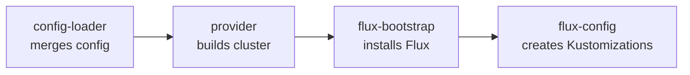

# Module Pipeline

[doc](../index.md) / [platform](index.md) / Module pipeline

**Audiences:** platform developer

The Terraform modules in `src/`, and how they hand off from configuration to a reconciling cluster.

- [Two stacks](#two-stacks)
- [The chain](#the-chain)
- [config-loader](#config-loader)
- [Provider modules](#provider-modules)
- [flux-bootstrap](#flux-bootstrap)
- [flux-config](#flux-config)
- [The Terraform–Flux boundary](#the-terraformflux-boundary)

## Two stacks

There are two Terraform roots, each with its own state ([ADR-015](../architecture/decisions/015-two-stack-capability-config.md)):

| Root | Modules it composes | State |
|------|--------------------|-------|
| `src/infra` | `config-loader`, one provider module, `flux-bootstrap` | `artifacts/<env>/terraform/infra.tfstate` |
| `src/config` | `config-loader`, `flux-config` | `artifacts/<env>/terraform/config.tfstate` |

Both instantiate `config-loader` from the same `environments/<env>/config.yaml`, so the resolved configuration is identical on either side. The config root declares no infrastructure provider, which is what makes `make apply-config` incapable of touching a VM.

Adding a value that only Flux consumes is a config-stack change; adding one that shapes machines is an infra-stack change. A value both need is read from the same `config-loader` output twice, not passed between stacks — there is no cross-stack `terraform_remote_state` dependency ([ADR-015](../architecture/decisions/015-two-stack-capability-config.md)).

### The kubeconfig hand-off, and how state stays per-environment

Two Makefile mechanisms carry the pipeline and are invisible in the module code:

- **The placeholder kubeconfig.** The config stack's providers read `artifacts/<env>/kubernetes/kubeconfig` at plan time — before any cluster exists. The Makefile seeds a placeholder pointing at `https://127.0.0.1:1` whenever the file is absent, which is the only reason a fresh `make plan` can evaluate the config stack at all. The real file, written by the provider module, replaces it during apply. A stray placeholder later shows up as `kubectl` dialing `127.0.0.1:1`.
- **Backend rebinding.** Both roots are shared by every environment; what separates environments is the state backend, and every Terraform-running target re-runs `terraform init -reconfigure` against `artifacts/<env>/terraform/` immediately before acting. Removing that rebinding makes `make destroy ENV=a` operate on whichever environment was initialised last — the mechanism is load-bearing, not ceremony.

## The chain

Each module produces what the next consumes.

Read the arrows as hand-offs: **config-loader** resolves configuration and feeds the **provider** module, which produces a kubeconfig for **flux-bootstrap**, which installs Flux so **flux-config** can create the Kustomization graph.

The modules, in `src/`:

| Module | Role |
|--------|------|
| `config-loader` | Merge environment config, capacity template, and provider mapping into one object |
| `proxmox`, `aws`, `digitalocean` | Provision infrastructure, return a kubeconfig |
| `proxmox-vm`, `talos-bootstrap`, `talos-gen-config` | Sub-modules the Proxmox path composes |
| `flux-bootstrap` | Install Flux on the new cluster |
| `flux-config` | Create the OCIRepository and the Kustomization dependency graph |

## config-loader

The first module in both stacks. It reads the environment's `config.yaml`, loads the capacity template for the cluster's role and the mapping for its infrastructure provider, expands node groups into per-node shapes, resolves each capability section into concrete endpoints, and emits one merged configuration object that every downstream module reads.

This is where the three configuration tiers collapse into one — see [Configuration tiers](../architecture/system-overview.md#configuration-tiers). Downstream modules never read `config.yaml` directly; they read config-loader's output. When the platform developer adds a configuration field, it flows through here.

It also carries the cross-field validation JSON Schema cannot express, as `terraform_data` preconditions — the config version, the required `cert` fields, the LB-pool shape per role, the data-mode rules, the bucket and robot constraints, and more. The adopter-facing list is [Configuration → Rules that fail at plan time](../adopter/deploy/configuration.md#rules-that-fail-at-plan-time). Add a new invariant here, next to the others, rather than in a consuming module.

## Provider modules

Each provider module has one contract: provision a cluster and return a kubeconfig at the agreed path ([ADR-024](../architecture/decisions/024-narrow-provider-boundary.md), [Provider model](../architecture/provider-model.md#what-the-provider-layer-owns)).

The Proxmox path is composite — it provisions VMs (`proxmox-vm`), generates Talos machine configuration (`talos-gen-config`), and bootstraps the cluster (`talos-bootstrap`). The managed paths are single modules that create a managed cluster and write its kubeconfig.

## flux-bootstrap

Installs Flux on the cluster the provider produced. It takes the kubeconfig and lays down the Flux controllers, so `flux-config` has something to create objects against.

## flux-config

The largest module, the whole of the config stack, and the one that encodes the deployment's shape. It creates:

- The **OCIRepository** pointing at the artifact
- The **`cluster-config` ConfigMap** and **`cluster-secrets` Secret** — the substitution inputs
- The **generated internal passwords** (`random_password`), one per name in the role's set, overridable by a matching UPPER_CASE entry in the supplied secrets map
- One **values-override ConfigMap** per `environments/<env>/values/<name>.yaml`, named `<name>-values-override`. The config root templates the file before passing it in — against the deliberately small override variable set (cluster identity, telemetry URLs, and the template's tuning keys), not the full substitution map; an unknown `${name}` fails the apply
- The **adopter's manifest patches** — each `environments/<env>/patches/<kustomization>.yaml` is appended to that Kustomization's `spec.patches`, after the distribution's own patch list
- The **Kustomization dependency graph** for the cluster's role, with `dependsOn` and health gates ([ADR-019](../architecture/decisions/019-health-gated-reconciliation.md))

The role (`tooling`, `hub`, `bare`) determines which Kustomizations exist and how they are chained; the data modes determine how many `hub-data-<store>` Kustomizations the fan-out has. The health gates — waiting on operators, on database readiness, on the Ory stack — live here. This is the module that makes a Hub converge in the right order; see [Reconciliation order](../architecture/system-overview.md#reconciliation-order).

## The Terraform–Flux boundary

The pipeline ends where Flux begins. After `flux-config` creates the Kustomizations, Terraform's job is done and Flux owns convergence.

The two communicate through two objects — the `cluster-config` ConfigMap and `cluster-secrets` Secret — plus the per-chart values-override ConfigMaps, which a HelmRelease reads directly rather than through substitution. A value that must reach a workload gets added to the ConfigMap or the Secret here, and referenced with `${...}` substitution in the manifest that needs it. That is the interface between the two halves of the system, and keeping it narrow is what keeps them decoupled.

When adding a value a workload needs, the path is always: config field → config-loader → flux-config writes it into `cluster-config`/`cluster-secrets` → the manifest substitutes it. The urge to have Terraform template a manifest directly is the boundary being crossed — put the value in the substitution inputs instead.
