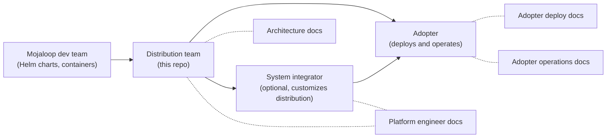

# Documentation Governance

This file governs how documentation in `docs/` is written, structured, and maintained.

`docs/` is the active documentation root. The legacy `doc/` directory is preserved as-is but is not maintained — content is being migrated and restructured here.

## Audiences

Four audiences, each with a distinct core question. Every document targets one or more of them explicitly.

| Audience | Core question | Typical role |
|----------|--------------|--------------|
| **Architect** | *Why is it built this way?* | Solution architect, product architect evaluating or extending the design |
| **Platform engineer** | *How do I build, extend, and publish?* | Engineer working on this repo — building modules, adding providers, publishing OCI artifacts. System integrators who customize the distribution also read this. |
| **Adopter (deploy)** | *How do I configure and deploy?* | Engineer consuming the distribution — configuring environments, running `make plan-apply`, upgrading |
| **Adopter (operate)** | *How do I monitor, troubleshoot, and recover?* | Engineer running Mojaloop in production — reading dashboards, handling incidents, restoring backups |

These map to the delivery pipeline:



System integrators sit between distribution and adoption. They read platform engineer docs to understand and extend the distribution, and adopter docs to understand the deployment they hand off. They do not have a separate guide — the platform guide explicitly addresses them.

## Document map

```
docs/
  DOCUMENTATION.md                      # You are here — governance and principles
  index.md                              # Entry point — role-based navigation

  # Shared foundations (all audiences, consulted as needed)
  architecture/
    index.md                            # Architecture landing page — topic map and navigation
    system-overview.md                  # Delivery pipeline, cluster roles, configuration system
    provider-model.md                   # Infrastructure providers, managed vs self-hosted, Cilium strategy
    gitops-structure.md                 # OCI artifact, kustomization hierarchy, Flux wiring
    networking.md                       # Gateway API, 3-LB architecture, DNS strategy
    dfsp-mtls.md                        # PKI model, inbound/outbound mTLS, Vault Agent, CA rotation
    security.md                         # Vault isolation model, security layers, recovery kit
    observability.md                    # Metrics (Thanos), logs (Loki), traces (Tempo), dashboards
    data-layer.md                       # Databases, backup architecture, disaster recovery
    decisions/
      NNN-short-title.md               # One decision record per non-obvious design choice (append-only)

  # Audience-specific guides (one folder per audience, multiple files)
  platform/
    index.md                            # Platform engineer landing page + table of contents
    building-artifacts.md               # OCI artifact build, publish, version, promote
    adding-providers.md                 # How to add an infrastructure provider
    adding-services.md                  # How to add platform services, DNS providers
    module-pipeline.md                  # Terraform module flow (config-loader → provider → flux)
    known-issues.md                     # Platform-level known issues (build, publish, Flux, CRDs)

  adopter/
    index.md                            # Adopter landing page + table of contents
    prerequisites.md                    # Required tools, provider accounts, credentials (the "what")
    provider-setup/                     # How to provision provider accounts, tokens, DNS zones (the "how")
      index.md                          # Router: infra and DNS provider tables
      proxmox.md                        # PVE token, SSH, storage, IP plan (covers CC and SW)
      dns-digitalocean.md               # API token + zone delegation via doctl
      dns-cloudflare.md                 # Scoped API token (Zone:DNS:Edit)
      dns-aws.md                        # Route53 hosted zone + IAM policy
    configuration.md                    # Environment config, secrets, named environments
    deployment.md                       # Shared workflow (init, plan, apply, commands, destroy)
    deployment-cc.md                    # Tooling Cluster: CC-specific config + verification + accessing services
    deployment-sw.md                    # Switch: SW-specific config + verification + Harbor proxy cache
    upgrading.md                        # Upgrade procedures (platform services, infrastructure)
    known-issues.md                     # Deployment-level known issues (migrations, bootstrap)

  operations/
    index.md                            # Operations landing page + table of contents
    monitoring.md                       # Dashboards, metrics, log queries, what to watch
    troubleshooting.md                  # Symptom-based diagnosis and resolution
    backup-restore.md                   # Backup schedules, restore procedures, DR
    known-issues.md                     # Runtime known issues (token expiry, metrics gaps)

  # Diagrams (complex visuals that exceed Mermaid's capabilities)
  diagrams/
    *.drawio.svg                        # Editable SVGs authored in draw.io
```

Each audience folder has its own `index.md` that serves as the table of contents for that audience. The top-level `docs/index.md` routes readers to the right folder.

### What goes where

| Content | Lives in | Other docs do |
|---------|----------|---------------|
| System architecture (stages, provider mapping, GitOps structure) | `architecture/` (one file per topic, `index.md` as landing page) | Link to specific sections |
| Design decisions with context | `architecture/decisions/NNN-*.md` | Reference by number |
| Terraform module pipeline detail | `platform/module-pipeline.md` | Architecture overview links for summary |
| How to add a provider, service, DNS provider | `platform/adding-providers.md`, `platform/adding-services.md` | — |
| OCI artifact build, publish, version, promote | `platform/building-artifacts.md` | — |
| Environment configuration, secrets | `adopter/configuration.md` | — |
| Deploy workflow | `adopter/deployment.md` | — |
| Upgrade procedures | `adopter/upgrading.md` | Operations links for rollback |
| Monitoring, dashboards, alerting | `operations/monitoring.md` | — |
| Troubleshooting, incident response | `operations/troubleshooting.md` | — |
| Backup and disaster recovery | `operations/backup-restore.md` | — |
| Known issues | `<audience>/known-issues.md` for the audience who encounters them | Cross-link if multiple audiences affected |

## Content principles

### Single source of truth

Every fact lives in exactly one place. Other documents **link**, never restate.

- Architecture facts live in `architecture/` (one file per topic)
- Decision rationale lives in `architecture/decisions/`
- Configuration examples live in `adopter/configuration.md`
- Operational procedures live in `operations/`

When two docs need the same information, one owns it and the other links:

```markdown
<!-- Good: link to the source -->
See [Provider independence](architecture/system-overview.md#provider-independence)
for which components are self-managed vs cloud-managed.

<!-- Bad: copy the table into this guide too -->
```

### Decision tracing

Every non-obvious design choice gets a decision record in `architecture/decisions/`. Records are append-only — a superseded decision gets a status update, not a deletion.

Decision record format:

```markdown
# NNN — Short title

**Date:** YYYY-MM-DD
**Status:** accepted | superseded by [NNN](NNN-title.md) | deprecated
**Audiences:** architect, platform engineer (list who cares)

## Context

What situation or constraint prompted this decision.

## Alternatives considered

| Option | Pros | Cons |
|--------|------|------|
| ... | ... | ... |

## Decision

What was chosen and why.

## Consequences

What this enables, what it costs, what it rules out.
```

Number decisions sequentially. Reference them from other docs by number: *"We use Thanos for metrics ([ADR-003](architecture/decisions/003-thanos-over-mimir.md))"*.

### Known issues belong with their audience

Known issues are not a single dumping ground. Each audience folder has its own `known-issues.md`, scoped to that audience's activities:

| Issue type | Lives in |
|-----------|----------|
| Cilium CRD ordering during upgrades | `platform/known-issues.md` |
| Migration race condition on fresh deploy | `adopter/known-issues.md` |
| Vault token expiry at runtime | `operations/known-issues.md` |
| Metrics gap on Receive pod crash | `operations/known-issues.md` |

If an issue spans audiences, the `known-issues.md` for the audience who **encounters** it first owns the entry. Other audience files cross-link.

Each known issue follows the same format:

```markdown
### Title (component, version)

**Symptoms:** What the operator/engineer sees.
**Root cause:** Why it happens.
**Fix/workaround:** What to do now.
**Prevention:** How to avoid it in future deployments.
**Decision record:** [ADR-NNN](architecture/decisions/NNN-title.md) if a permanent workaround was adopted.
```

### Current state only

Documentation describes what **is**, not what **will be**. Never mix planned features into guides as if they exist. A reader following a guide must be able to execute every step.

### Navigability

Every document includes:

1. **Breadcrumb links** as the first line after the title — back to the audience index and the top-level index:
   ```markdown
   [docs](../index.md) / [platform](index.md) / Adding providers
   ```

2. **A front matter block** declaring target audiences:
   ```markdown
   **Audiences:** platform engineer, system integrator
   ```

3. **A table of contents** (either manual or auto-generated via `[TOC]` if the renderer supports it) for documents longer than 5 sections.

4. **Deep-linkable headings** — use lowercase, hyphenated anchors. When linking from another doc, link to the specific section, not just the page.

The top-level `docs/index.md` is the single entry point. It routes readers to the right audience folder. Each audience folder has its own `index.md` acting as table of contents for that folder. Any document is reachable within two clicks from the top-level index.

## Diagram conventions

### Mermaid (default)

Use Mermaid for all diagrams that it handles well:

- Flowcharts (deployment flow, decision trees, navigation)
- Sequence diagrams (bootstrap sequence, mTLS handshake, DFSP onboarding)
- Component/C4 diagrams (system context, container-level architecture)

Mermaid renders natively in GitHub with no build step, and diffs are readable in PRs.

Guidelines:

- Keep diagrams under ~15 nodes. If it's bigger, split into multiple diagrams or use SVG.
- Use `flowchart` (not `graph`) for directional flows.
- Use descriptive node IDs: `vault["Vault"]` not `A["Vault"]`.
- Place the Mermaid source inline in the markdown (not in a separate file).

### SVG (complex layouts)

For diagrams where node positioning matters and Mermaid's auto-layout produces poor results (e.g., the full provider infrastructure mapping, the 4-stage deployment overview with many cross-links):

- Author in [draw.io](https://app.diagrams.net/) or Excalidraw.
- Export as `.drawio.svg` or `.excalidraw.svg` — these are text-based and render in GitHub.
- Store in `docs/diagrams/` and reference from markdown: ``
- Include the editable source file alongside the SVG so future editors don't need to recreate from scratch.

Prefer Mermaid unless you've tried it and the result is unreadable.

## Maintenance rules

### When to update docs

Documentation must be updated in the **same PR** as the code change when:

- A new provider, DNS provider, or platform service is added
- A configuration option is added, removed, or renamed
- A design decision is made or reversed
- A known issue is discovered or resolved
- The deployment procedure changes

### Who updates what

| Folder / file | Primary owner |
|---------------|---------------|
| `architecture/*.md` | Whoever makes the architectural change |
| `architecture/decisions/` | Whoever makes the decision |
| `platform/` | Platform team / distribution team |
| `adopter/` | Platform team (validated by adopter feedback) |
| `operations/` | Platform team + operators (from incident learnings) |

### Review checklist

When reviewing a docs PR:

- [ ] Facts live in one place only (no duplication across audience folders)
- [ ] Links point to specific sections, not just pages
- [ ] Known issues are in the right `known-issues.md` (by audience)
- [ ] Decision records exist for non-obvious choices
- [ ] Diagrams render correctly in GitHub preview
- [ ] No future/planned content presented as current
- [ ] Audiences are declared in front matter
- [ ] Breadcrumb navigation is present and correct

## Relationship to other documentation

| File | Role | Maintenance |
|------|------|-------------|
| `docs/` | Active documentation | Maintained with code changes |
| `doc/` (legacy) | Preserved as-is | Not maintained — content migrated to `docs/` |
| `CLAUDE.md` | AI assistant context | Updated independently — may reference `docs/` but serves a different purpose |
| `config/.env.sample` | Canonical secret variable reference | Maintained as part of config system |
