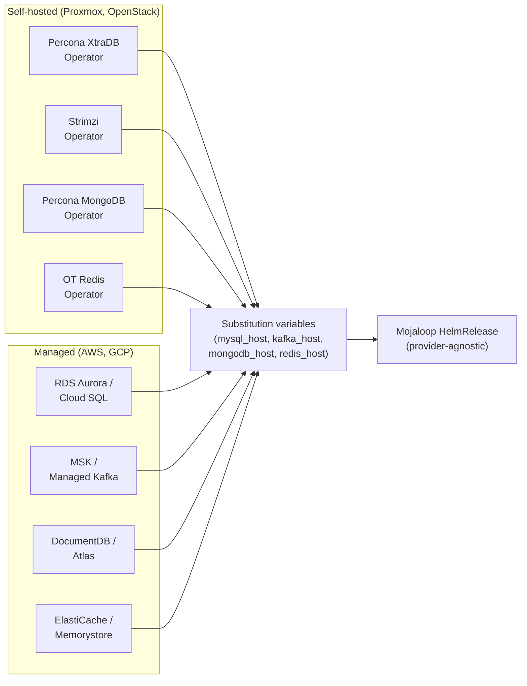
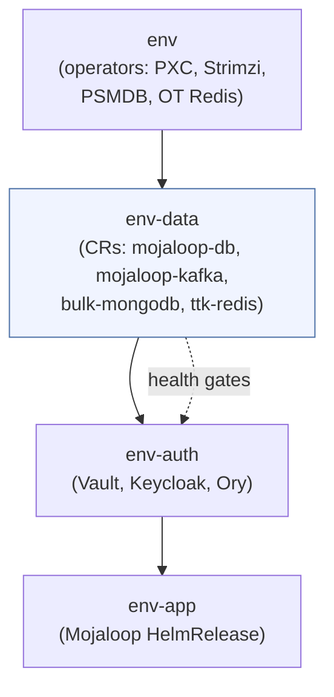
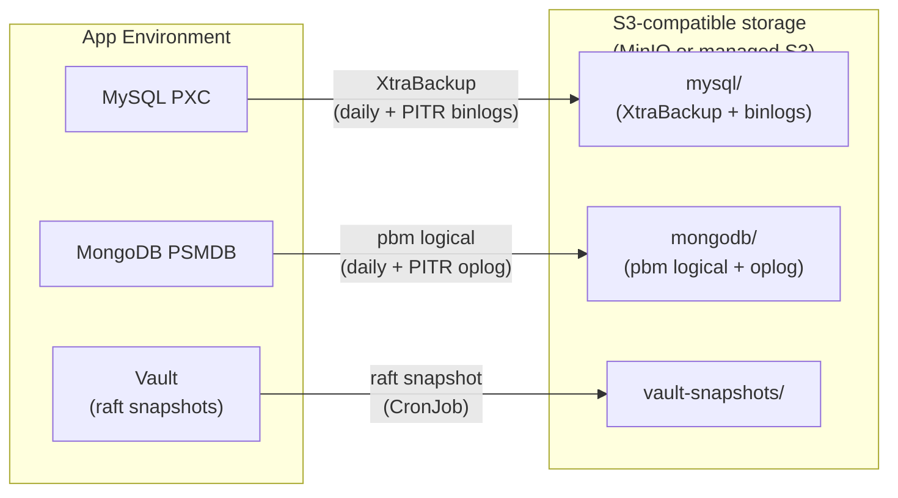
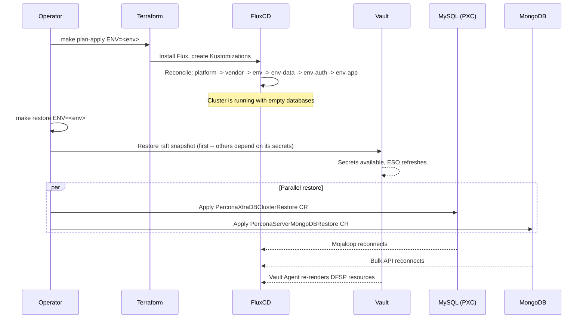
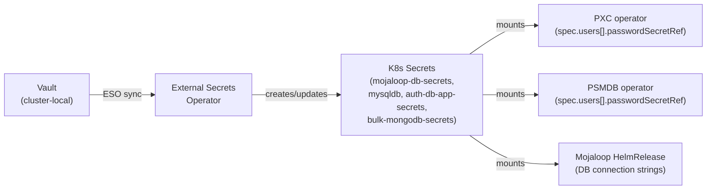

# Data Layer

[docs](../index.md) / [architecture](index.md) / Data Layer

**Audiences:** architect, platform engineer, adopter (operate)

---

## Overview

App Environments require four data services: MySQL, Kafka, MongoDB, and Redis. The deployment model depends on the provider profile:

- **Self-hosted** (Proxmox, OpenStack): in-cluster operators and CRs deployed by the `env-data/` kustomization
- **Managed** (AWS, GCP): cloud-managed services provisioned by Terraform, endpoints injected via Flux substitution

Both profiles present the same interface to Mojaloop services -- the same host/port substitution variables -- so the application layer has zero awareness of which model is running underneath. See [provider-model](provider-model.md#two-provider-profiles) for how the profile is selected.



---

## Data services

### MySQL -- Percona XtraDB Cluster

A single PXC cluster named `mojaloop-db` hosts all databases: `central_ledger`, `account_lookup`, `oracle_msisdn`, `keycloak`, `kratos`, `keto`, and `mcm` ([ADR-009](decisions/009-single-mysql-cluster.md)).

**Why a single cluster:** Mojaloop's MySQL databases are small and have complementary access patterns. Separate clusters would triple the operator overhead (3 PXC instances, 3 HAProxy sets, 3 backup schedules) without meaningful isolation benefit. The HAProxy sidecar routes connections to the correct node, and the PXC operator manages replication and failover.

**Declarative users:** Users and databases are provisioned via `spec.users[]` (PXC operator v1.16+). Each user entry references a `passwordSecretRef` pointing to a Kubernetes Secret populated by Vault through ESO. No init jobs or imperative scripts are needed -- the operator reconciles user state on every sync.

| Property | Value |
|----------|-------|
| **Operator** | Percona XtraDB Cluster Operator |
| **CR** | `PerconaXtraDBCluster/mojaloop-db` |
| **PXC nodes** | 3 |
| **HAProxy instances** | 3 |
| **Connection routing** | HAProxy sidecar (`mojaloop-db-haproxy:3306`) |
| **Backup** | XtraBackup to S3 (daily, keep 7) + PITR (continuous binlog upload) |
| **Managed equivalent** | RDS Aurora MySQL (AWS), Cloud SQL for MySQL (GCP) |

The PXC configuration sets `pxc_strict_mode=PERMISSIVE` and `wsrep_auto_increment_control=OFF` with `auto_increment_increment=1` to avoid Galera-specific auto-increment behavior that conflicts with Mojaloop's sequential ID expectations.

### Kafka -- Strimzi

Strimzi deploys Kafka in KRaft mode (no ZooKeeper). A single `KafkaNodePool` with dual-role nodes (controller + broker) simplifies the topology.

**Why no backup:** Kafka serves as a transient message queue for Mojaloop's event-driven processing (position handler, notification handler, transfer fulfil). Messages are consumed within seconds. No business state persists in Kafka that cannot be reconstructed by reprocessing -- topics are declarative via the Strimzi TopicOperator, and the data of record lives in MySQL.

| Property | Value |
|----------|-------|
| **Operator** | Strimzi |
| **CR** | `Kafka/mojaloop-kafka` + `KafkaNodePool/dual-role` |
| **Brokers** | 3 (dual-role: controller + broker) |
| **Replication factor** | 3 (offsets, transaction state, default) |
| **Min ISR** | 2 |
| **Partitions** | 6 (default) |
| **Topic management** | Strimzi TopicOperator (declarative) |
| **Metrics** | JMX Prometheus exporter + Kafka Exporter |
| **Backup** | None needed (transient queue) |
| **Managed equivalent** | MSK (AWS), Managed Kafka (GCP) |

### MongoDB -- Percona Server for MongoDB

A 3-member replica set named `bulk-mongodb` serves the bulk-api-adapter, TTK (Testing Toolkit), and reporting services.

**Declarative users:** Three application users are provisioned via `spec.users[]` (PSMDB operator v1.17+): `mlos` (bulk/MLOS data), `ttk` (Testing Toolkit), and `reporting` (reporting events). Like MySQL, passwords reference Kubernetes Secrets populated through ESO, and no init jobs are required.

| Property | Value |
|----------|-------|
| **Operator** | Percona Server for MongoDB Operator |
| **CR** | `PerconaServerMongoDB/bulk-mongodb` |
| **Replica set** | `rs0`, 3 members |
| **Sharding** | Disabled |
| **Backup** | Percona Backup for MongoDB (pbm) logical to S3 (daily, keep 7) + PITR |
| **Managed equivalent** | DocumentDB (AWS), MongoDB Atlas (GCP) |

### Redis -- OT Redis Operator

A single Redis instance named `ttk-redis` serves as an ephemeral cache for the Testing Toolkit. No business state persists in Redis.

| Property | Value |
|----------|-------|
| **Operator** | OT Redis Operator |
| **CR** | `Redis/ttk-redis` |
| **Instances** | 1 |
| **Persistence** | 1Gi PVC (crash recovery only, not backed up) |
| **Backup** | None needed (ephemeral cache) |
| **Managed equivalent** | ElastiCache (AWS), Memorystore (GCP) |

---

## Unified endpoint abstraction

The `flux-config` Terraform module computes data layer endpoints based on the provider profile. On self-hosted providers (`is_talos`), endpoints resolve to in-cluster service names. On managed providers, endpoints come from Terraform outputs or `config.yaml`, pointing to cloud-managed services. The GitOps layer never sees the difference.

| Variable | Self-hosted value | Managed value (example) |
|----------|-------------------|-------------------------|
| `mysql_host` | `mojaloop-db-haproxy.mojaloop.svc.cluster.local` | `ml-prod.xxx.rds.amazonaws.com` |
| `mysql_port` | `3306` | `3306` |
| `kafka_host` | `mojaloop-kafka-kafka-bootstrap` | `b-1.ml-msk.xxx.kafka.us-east-1.amazonaws.com` |
| `kafka_port` | `9092` | `9092` |
| `mongodb_host` | `bulk-mongodb-rs0` | `ml-docdb.cluster-xxx.docdb.amazonaws.com` |
| `mongodb_port` | `27017` | `27017` |
| `redis_host` | `ttk-redis` | `ml-redis.xxx.cache.amazonaws.com` |
| `redis_port` | `6379` | `6379` |

These variables flow into Mojaloop Helm values via Flux postBuild substitution. Adding a new data service means adding one variable pair -- no changes to HelmRelease templates.

See [provider-model](provider-model.md#substitution-variables-for-provider-abstraction) for the full substitution variable list.

---

## GitOps wiring

The `env-data/` kustomization is conditionally deployed: `is_talos && is_env`. On managed providers, it is skipped entirely because Terraform provisions the equivalent cloud services.



The `env` kustomization installs the operators (CRD providers). The `env-data` kustomization applies the CRs (instances). This ordering is enforced by Flux `dependsOn`. The `env-data` kustomization includes health check expressions that gate downstream kustomizations:

- **PXC:** CEL expression checks `status.state == 'ready'` -- all PXC nodes synced and HAProxy healthy before auth services attempt DDL migrations
- **Kafka:** Standard health check on the `Kafka` CR -- ready when all brokers are in the ISR
- **MongoDB:** Standard health check on the `PerconaServerMongoDB` CR -- ready when the replica set is initialized

On managed providers, `env-auth` depends directly on `env` (skipping `env-data`), and the cloud services are expected to be ready before Terraform completes.

---

## Metrics and observability

Every data service exports Prometheus metrics, scraped by the in-cluster Alloy agent and forwarded to the observability backend (Thanos). Each service deploys a dedicated metrics Service resource that Alloy discovers via label selectors.

| Service | Exporter | Metrics Service | Key metrics |
|---------|----------|-----------------|-------------|
| MySQL (PXC) | `mysqld-exporter` sidecar (port 9104) | `mysql-metrics-service` | `mysql_global_status_wsrep_*`, replication lag, connections, query rate |
| Kafka | JMX Prometheus exporter + Kafka Exporter | `kafka-metrics-service`, `kafka-exporter-metrics-service` | Under-replicated partitions, consumer lag, ISR shrink, bytes in/out |
| MongoDB | `mongodb_exporter` sidecar (port 9216) | `mongodb-metrics-service` | Replication lag, oplog window, connections, opcounters |
| Redis | `redis-exporter` sidecar | `redis-metrics-service` | Connected clients, memory usage, keyspace hits/misses |

See [observability](observability.md) for the full metrics pipeline and dashboard catalog.

---

## Backup architecture

Two of the four data services hold persistent business state and require backup. The other two do not.

| Service | Criticality | Backup needed | Reason |
|---------|-------------|---------------|--------|
| MySQL (PXC) | High | Yes | System of record for all Mojaloop and auth data |
| MongoDB | High | Yes | Bulk transfer state, TTK data, reporting events |
| Kafka | Low | No | Transient message queue -- topics are declarative, messages consumed in seconds |
| Redis | None | No | Ephemeral cache -- no business state |

### Backup flow



Backup configuration is declarative in the GitOps CRs -- it deploys automatically with no manual setup:

- **MySQL:** `spec.backup.schedule` in the `PerconaXtraDBCluster` CR defines daily XtraBackup to S3 (keep 7). PITR is enabled, continuously uploading binlogs to the same S3 bucket.
- **MongoDB:** `spec.backup.tasks` in the `PerconaServerMongoDB` CR defines daily pbm logical backups to S3 (keep 7). PITR is enabled, continuously uploading oplog slices.
- **Vault:** A CronJob takes raft snapshots and uploads to S3. This is separate from the operator-managed databases.

S3 credentials flow through the cluster's own Vault instance and ESO: Vault stores the S3 access key and secret, ESO syncs them to a `backup-s3-credentials` Secret in the mojaloop namespace, and both operators and the Vault CronJob mount that Secret.

### Stateful services summary

| Service | Operator | Replicas | Backup method | Restore method | PITR |
|---------|----------|----------|---------------|----------------|------|
| MySQL (PXC) | Percona XtraDB | 3 + 3 HAProxy | XtraBackup to S3 (scheduled) | `PerconaXtraDBClusterRestore` CR | Yes (binlog) |
| MongoDB | Percona Server MongoDB | 3 (replica set) | pbm logical to S3 (scheduled) | `PerconaServerMongoDBRestore` CR | Yes (oplog) |
| Vault | bank-vaults | 1 | Raft snapshot to S3 (CronJob) | `vault operator raft snapshot restore` | No |

### Additional state outside the data layer

| Component | Location | Backup | Criticality |
|-----------|----------|--------|-------------|
| Recovery kit | Offline safe | Manual (one-time at bootstrap) | Critical -- contains Vault root token, unseal keys |
| Terraform state | Object store (MinIO or managed S3) | Object storage versioning/replication | High |
| GitOps OCI artifact | OCI registry (Harbor/ECR) | Registry replication | Medium -- rebuildable from source |

---

## Disaster recovery

### Design principles

**Restore is a separate, manual operation.** It is never triggered automatically during deployment. A fresh `make plan-apply` produces a working cluster with empty databases -- declarative config (PXC `spec.users[]`, Strimzi topics, PSMDB `spec.users[]`) bootstraps the schema and users. Only runtime state (enrolled DFSPs, issued certificates, processed transfers) requires restore from backup.

**Why separate from deploy:** restore is a destructive operation that overwrites existing data. Different services may need different restore points. An operator must make a deliberate decision about which backup to restore and whether to restore at all.

### Restore workflow



Vault must be restored first because MySQL and MongoDB credential Secrets are sourced from Vault through ESO. Once Vault is restored, ESO refreshes the Secrets, and the database operators can authenticate with the restored data.

### Recovery scenarios

**Total loss of an App Environment:**

1. Retrieve Terraform state from object store (MinIO or managed S3)
2. `make plan-apply ENV=<env>` -- provisions new infrastructure, FluxCD reconciles all kustomizations
3. Wait for operators and CRs to become healthy (~5--10 minutes)
4. `make restore ENV=<env>` -- restores MySQL, MongoDB, and Vault from S3 backups
5. Verify: services reconnect, Vault Agent re-renders DFSP mTLS resources
6. DFSPs resume operations

**Total loss of a Tooling Cluster (if one exists):**

1. Retrieve recovery kit and Terraform state from offline storage
2. `make plan-apply ENV=cc` -- provisions new Tooling Cluster infrastructure
3. Restore MinIO/S3 data from external backup (or rely on managed S3 durability)
4. Unseal Vault with recovery kit keys
5. FluxCD reconciles -- Tooling Cluster services come back online
6. App Environments reconnect to shared services (OCI source from Harbor, observability backend)

**Selective restore (single service):**

```bash
make restore ENV=env-prod SVC=mysql                    # Restore only MySQL
make restore ENV=env-prod SVC=vault BACKUP=2026-02-20  # Restore Vault from a specific date
```

For restore procedures, see [operations/backup-restore](../operations/backup-restore.md).

---

## Credential flow

Data service credentials follow a chain from Vault through ESO to Kubernetes Secrets, referenced by both operators and application HelmReleases.



The PXC CR references three Secret sources:

- `mojaloop-db-secrets` -- operator system users (root, xtrabackup, monitor, operator, replication)
- `mysqldb` -- Mojaloop application users (central_ledger, account_lookup, oracle_msisdn)
- `auth-db-app-secrets` -- auth stack users (keycloak, kratos, keto, mcm)

The PSMDB CR references:

- `bulk-mongodb-secrets` -- operator system users (backup, clusterAdmin, clusterMonitor, userAdmin)
- `bulk-mongodb-app-secrets` -- application users (mlos, ttk, reporting)

Backup S3 credentials are stored separately in `backup-s3-credentials`, also populated by ESO from Vault.

---

## Node affinity and scheduling

All data services use a consistent scheduling strategy to colocate database workloads and separate them from application pods where the cluster topology permits:

- **Tolerations** for `node-role=db` (MySQL, MongoDB) and `node-role=kafka` (Kafka) taints, allowing scheduling on dedicated database nodes when available
- **Node affinity** (preferred, not required) for the corresponding `node-role` label, preferring dedicated nodes but falling back to general-purpose nodes in smaller topologies
- **Pod anti-affinity** (preferred) across hostnames, spreading replicas across nodes for fault tolerance

This strategy degrades gracefully: in single-node or minimal topologies, all tolerations and affinities are soft constraints, so workloads schedule wherever capacity exists.
