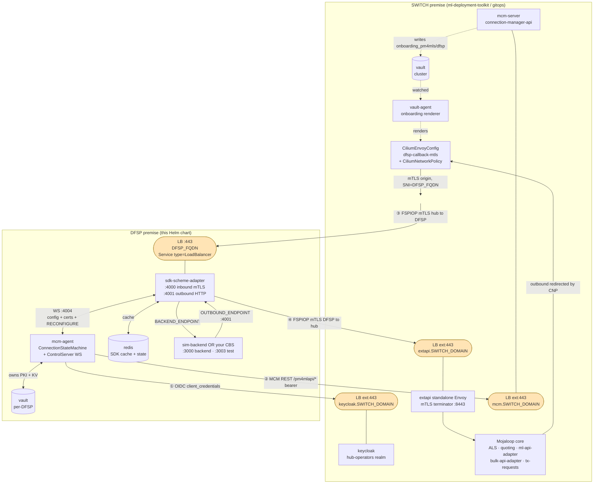
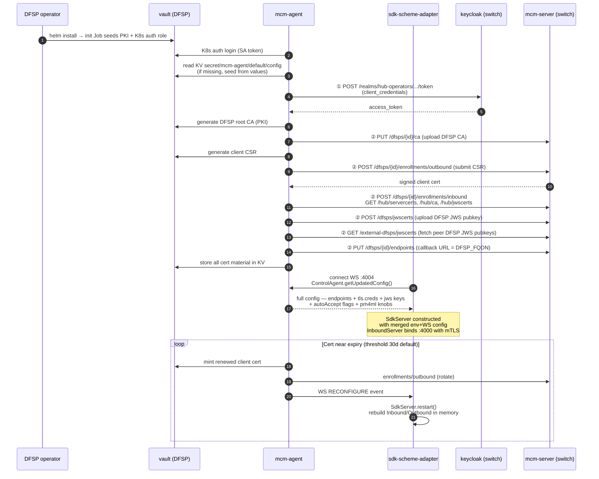
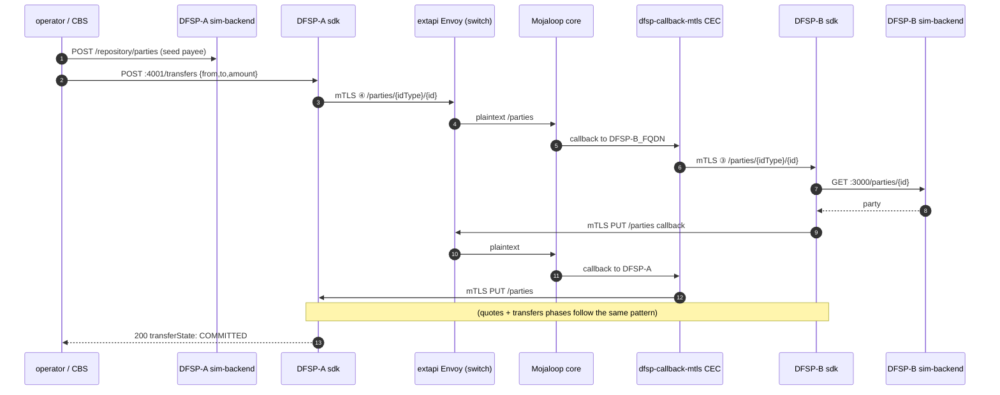

# DFSP Integration

[docs](../index.md) / [architecture](index.md) / DFSP Integration

**Audiences:** architect, DFSP operator, switch operator

## Overview

This document describes the tenancy boundary between a Mojaloop switch and a DFSP (Digital Financial Service Provider), and the DFSP-side stack that is packaged as a standalone Helm chart in [`dfsp/`](../../dfsp/).

The switch (this repo's `gitops/` stack) and the DFSP deployment are fully independent tenancies. They share no Kubernetes cluster, no Vault, no DNS zone, no secrets store. All interaction crosses the boundary over four authenticated TCP :443 interfaces.

For switch-internal mTLS plumbing (standalone Envoy, CiliumEnvoyConfig templates, Vault Agent rendering), see [DFSP mTLS](dfsp-mtls.md). This document is the outside-in view.

## Tenancy boundary contract

The switch operator and the DFSP operator are separate organisations with separate platform teams. Their systems meet only at the following wire interfaces:

| # | Direction | Protocol | Authentication | Purpose |
|---|-----------|----------|----------------|---------|
| ① | DFSP → Switch | HTTPS :443 (OIDC token endpoint) | `client_credentials` grant | Obtain bearer token for MCM REST API calls |
| ② | DFSP → Switch | HTTPS :443 (`/pm4mlapi/*`) | OIDC bearer | MCM REST API — CA/CSR exchange, JWS key exchange, endpoint registration, state reporting |
| ③ | Switch → DFSP | HTTPS :443 (FSPIOP) | mTLS (switch presents its client cert, DFSP verifies against shared CA) | FSPIOP callbacks — `PUT /parties`, `PUT /quotes`, `PUT /transfers`, etc. |
| ④ | DFSP → Switch | HTTPS :443 (FSPIOP) | mTLS (DFSP presents its client cert, switch verifies against shared CA) | FSPIOP requests — `GET /parties`, `POST /quotes`, `POST /transfers`, etc. |

**Consequences of the boundary:**

- Either side can run on any Kubernetes distribution. The switch uses Talos + Cilium; the DFSP chart has no such constraint.
- Credentials flow is one-way: the switch operator issues `AUTH_CLIENT_ID`/`AUTH_CLIENT_SECRET` to the DFSP operator out-of-band (the DFSP's `/auth/login` request in (①) uses them). The DFSP never holds any switch-internal credential.
- Cert chain of trust is bilateral: both sides' certs are signed by the scheme-level CA held inside the switch's Vault. The DFSP proves its identity inbound (④) by presenting a cert signed by that CA; the switch does the same outbound (③). See [DFSP mTLS](dfsp-mtls.md) for the PKI model.
- **DNS is each side's responsibility**. The switch operator publishes the `extapi` / `mcm` / `keycloak` FQDNs. The DFSP operator publishes `DFSP_FQDN`. Neither side touches the other's DNS.

## Component topology



### DFSP-side workloads

| Workload | Image | Purpose | Persistent state |
|----------|-------|---------|------------------|
| **vault** | `hashicorp/vault:1.20` | Per-DFSP Vault holding the DFSP root CA (PKI mount), the MCM agent's configuration (KV v2 mount), and the MCM state-machine state (KV v1 mount). Single replica with file storage. Auto-initialised and auto-unsealed by a bootstrap Job + unsealer sidecar. | `PersistentVolumeClaim` backing `/vault/data` |
| **mcm-agent** | DFSP-built image (Node.js) | Runs the MCM `ConnectionStateMachine` — logs into the switch's Keycloak, calls the MCM REST API for CA/CSR/JWS/endpoint lifecycle, owns the DFSP's PKI in Vault. Serves a ControlServer WebSocket on `:4004` that feeds live config + cert material to the SDK adapter. | none (all state in Vault) |
| **sdk-scheme-adapter** | `mojaloop/sdk-scheme-adapter` | The FSPIOP HTTP adapter. `:4000` inbound (mTLS terminated in-process, exposed via `Service type=LoadBalancer` as `DFSP_FQDN:443`). `:4001` outbound (plain HTTP, consumed by the backend). In PM4ML mode, pulls config + certs from the mcm-agent WS at startup and accepts RECONFIGURE events for rotation. | none (all state in Redis) |
| **redis** | `bitnami/redis` | Cache required by the SDK adapter — distributed state, pub/sub, session data. | ephemeral |
| **sim-backend** *(optional)* | `mojaloop/mojaloop-simulator` | Rendered only when `backend.useSimulator: true`. DFSP "core banking" simulator. `:3000` backend API (called by SDK when hub sends a callback). `:3003` test API (used by operators to initiate transfers). In production, replace with your own CBS connector by setting `backend.useSimulator: false` + `backend.endpoint`. | in-memory SQLite (`MODEL_DATABASE=:memory:`) |

Operator-facing endpoints (mcm-agent API, simulator test API, SDK metrics) are ClusterIP Services only. The chart does not provision ingress for them — reach them via `kubectl port-forward` during operations, or add your cluster's native ingress (Ingress / Gateway / Route / mesh) in your fork if you need external access.

### Why inbound mTLS is not behind a Gateway API Gateway

FSPIOP inbound traffic (switch → DFSP, path ③ in the diagram) reaches the SDK adapter via a plain `Service type=LoadBalancer`, **not** through a Gateway API Gateway. Two reasons:

1. The SDK adapter terminates TLS in-process. A Gateway cannot terminate TLS on the DFSP's behalf (it doesn't have the server cert — the mcm-agent delivers it to the SDK over the control WS as in-memory material).
2. L4 passthrough through a Gateway requires either TCPRoute or TLSRoute. Cilium, the most common Gateway controller paired with Mojaloop, [does not implement TCPRoute](https://github.com/cilium/cilium/issues/42016) and its TLSRoute support is [experimental with known routing bugs](https://github.com/cilium/cilium/issues/37609).

The switch side uses the same pragmatic pattern for its extapi mTLS path (`gitops/env-app/routes/extapi-service.yaml` — a `Service type=LoadBalancer` fronting a standalone Envoy). The DFSP chart mirrors that approach.

## Configuration and certificate bootstrap



### What the SDK adapter needs at boot

The SDK adapter in PM4ML mode **does not read cert files at startup**. Verified in the upstream source ([`_ext-rs/sdk-scheme-adapter/modules/api-svc/src/index.js:48-57`](../../_ext-rs/sdk-scheme-adapter/modules/api-svc/src/index.js)):

```js
if (conf.pm4mlEnabled) {
    const controlClient = await ControlAgent.createConnectedControlAgentWs(conf, logger);
    const updatedConfigFromMgmtAPI = await controlClient.getUpdatedConfig();
    merge(conf, updatedConfigFromMgmtAPI);
    controlClient.terminate();
}
const svr = new SdkServer(conf, logger);
```

The WS config fetch happens **before** `SdkServer` is constructed. Inbound and outbound TLS creds arrive as in-memory buffers via the WS message — they never pass through the filesystem. The SDK chart therefore mounts no cert files and sets `INBOUND_MUTUAL_TLS_ENABLED=false`, `OUTBOUND_MUTUAL_TLS_ENABLED=false`, `JWS_SIGN=false` at boot. The WS push flips these to `true` with cert material attached, and `SdkServer` constructs the InboundServer with HTTPS+mTLS from that merged config.

Runtime rotation uses the same mechanism: the mcm-agent fires a `RECONFIGURE` event, `SdkServer.restart()` tears down and rebuilds the Inbound/Outbound servers in memory with the new creds ([`SdkServer.js:316-506`](../../_ext-rs/sdk-scheme-adapter/modules/api-svc/src/SdkServer.js)). No pod restarts.

## Data plane: one transfer



Each FSPIOP phase (discovery / agreement / transfer) traverses the same path. All phases go through the same `extapi` Envoy on the switch side and the same per-DFSP CEC on the outbound path — no per-phase routing changes.

## What the DFSP operator must obtain from the switch operator

Before `helm install`:

| Value | Description | Example |
|-------|-------------|---------|
| `DFSP_ID` | Unique identifier issued by the switch operator, matching the participant registered in the switch's central-ledger | `dfsp-201` |
| `AUTH_CLIENT_ID` | Keycloak `hub-operators` realm client id | `dfsp-201` |
| `AUTH_CLIENT_SECRET` | Keycloak client secret (delivered out-of-band, e.g. encrypted email) | — |
| `MCM_SERVER_ENDPOINT` | MCM REST API base URL | `https://mcm.switch.example.com/pm4mlapi` |
| `HUB_IAM_PROVIDER_URL` | Keycloak base URL | `https://keycloak.switch.example.com` |
| `HUB_EXTAPI_FQDN` | FSPIOP mTLS endpoint | `extapi.switch.example.com` |

## What the DFSP operator must publish externally

Before transfers can work:

| Item | Description |
|------|-------------|
| `DFSP_FQDN` | Public DNS name resolvable from the switch's egress network, pointing at the SDK adapter's LoadBalancer IP |
| LoadBalancer :443 | The chart creates a `type: LoadBalancer` Service for the SDK adapter; DNS must point at its external IP |
| Firewall allow-list | Switch's egress IPs must reach `DFSP_FQDN:443` |

## Certificate lifecycle

The mcm-agent owns all DFSP cert lifecycle events without operator intervention:

| Cert | Lifetime | Renewal trigger | Source of truth |
|------|----------|-----------------|-----------------|
| DFSP root CA | 10 years | Manual (rare) | DFSP Vault PKI mount |
| DFSP client cert (outbound mTLS) | 2 years | 30 days before expiry | Minted from DFSP root CA, signed by switch's scheme CA via MCM |
| DFSP server cert (inbound mTLS) | 2 years | 30 days before expiry | Minted from DFSP root CA, signed by switch's scheme CA via MCM |
| JWS signing key | rotates with client cert | with client cert | DFSP Vault KV |
| Switch CA | 10 years | synced from MCM on each state-machine tick | Cached in DFSP Vault KV |

Rotation flow: state machine detects expiry → mints new cert in DFSP Vault → pushes CSR to MCM → receives signed cert → writes to Vault KV → fires `RECONFIGURE` event on WS → SDK adapter rebuilds Inbound/Outbound servers in memory. No pod restart, no connection interruption beyond the sub-second TLS-listener swap.

For the switch-side view (Envoy validation, combined CA bundle, Cilium wiring), see [DFSP mTLS](dfsp-mtls.md).

## Failure modes

| Failure | DFSP stack behavior |
|---------|-----|
| Switch MCM API unreachable | `ConnectionStateMachine` retries indefinitely with backoff ([`mcm-client-wrapper.ts:142`](../../_ext-rs/ml-mcm-agent/src/services/mcm-client-wrapper.ts) — `retries: Infinity`). No cert operations succeed; existing certs continue to serve traffic until expiry. |
| Switch Keycloak unreachable | Auth retry loop with 5-second backoff ([`mcm-client-wrapper.ts:65-99`](../../_ext-rs/ml-mcm-agent/src/services/mcm-client-wrapper.ts)). State machine pauses pending successful auth. |
| mcm-agent pod restart | Recovers state from Vault KV on boot. SDK adapter's WS connection drops; SDK reconnects with backoff and fetches fresh config. |
| SDK adapter pod restart | Re-reads env vars, reconnects to mcm-agent WS, receives full config+certs, binds :4000 with mTLS. |
| Vault pod restart | Auto-unseal sidecar reads unseal key from the recovery Secret and unseals on boot. mcm-agent retries Vault ops during the sealed window. |
| Management WS drops | SDK adapter's ControlAgent ping/close handler schedules a restart after 10s ([`SdkServer.js:286-299`](../../_ext-rs/sdk-scheme-adapter/modules/api-svc/src/SdkServer.js)). Failsafe polling (if configured) re-fetches config. |

## What is NOT in this chart

To keep the chart minimal and the DFSP attack surface small:

- **No Kafka or ZooKeeper.** The chart omits the SDK adapter's event-handler modules (`outbound-command-event-handler`, `outbound-domain-event-handler`, `BackendEventHandler`, `FSPIOPEventHandler`) which require Kafka. Standard point-to-point FSPIOP works without them.
- **No testing-toolkit (TTK).** The TTK is a switch operator concern; DFSPs don't need it.
- **No bulk transfer TypeScript modules.** Can be added by the DFSP operator via a separate release if bulk transfers are in scope.
- **No Finance Portal or MCM UI.** Those are switch-side tools.
- **No Prometheus/Grafana/Loki.** The chart exposes `/metrics` endpoints and logs to stdout; the DFSP operator wires those into whatever observability stack they already run.

A production DFSP will typically replace `sim-backend` with their own core-banking connector (exposing the same SDK backend API contract) and keep the other four workloads verbatim. The rest of the chart is production-ready as-is.
