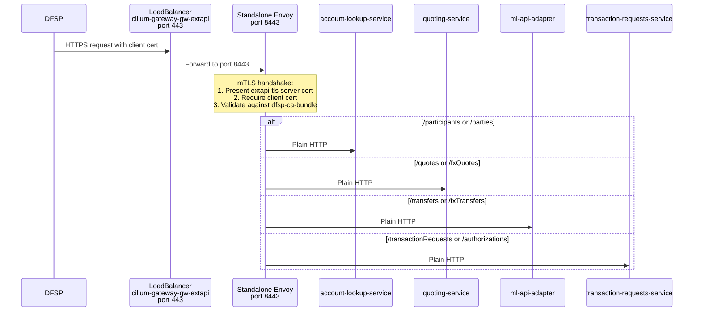
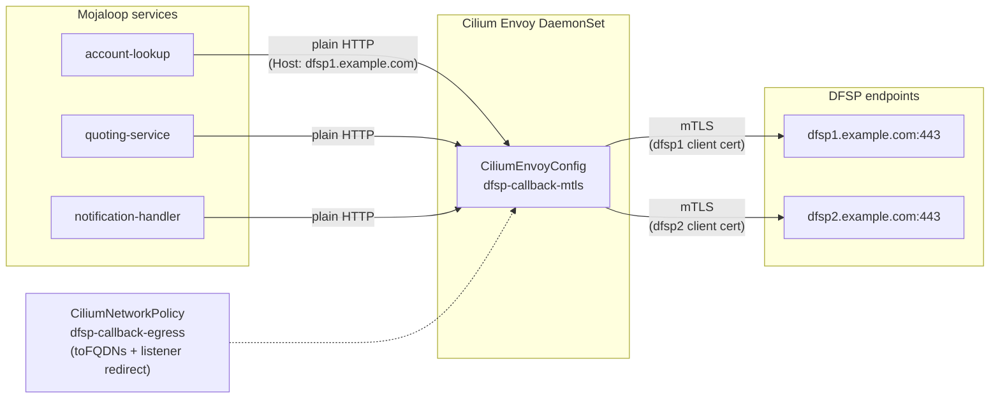
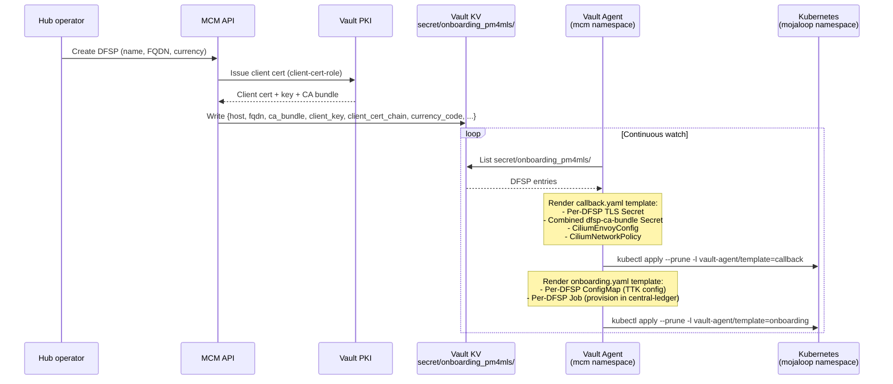
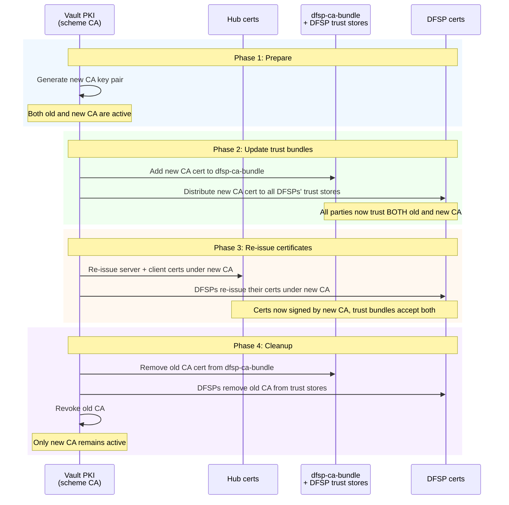

# DFSP mTLS

[docs](../index.md) / [architecture](index.md) / DFSP mTLS

**Audiences:** architect, platform engineer

## Overview

App Environments expose the Mojaloop FSPIOP API to DFSPs (Digital Financial Service Providers) via mutual TLS. The mTLS infrastructure is DFSP-centric, not service-centric: all three transfer phases share the same inbound and outbound mTLS paths. A DFSP connects once to the extapi endpoint with its client certificate; the path prefix determines which Mojaloop service handles the request.

| Phase | Operation | Inbound (DFSP to Hub) | Outbound (Hub to DFSP callback) |
|-------|-----------|----------------------|---------------------------------|
| Discovery | Party lookup | `GET /parties` to account-lookup-service | `PUT /parties` from account-lookup-service |
| Agreement | Quote | `POST /quotes` to quoting-service | `PUT /quotes` from quoting-service |
| Transfer | Fund movement | `POST /transfers` to ml-api-adapter | `PUT /transfers` from notification-handler |

The inbound and outbound paths use completely different mechanisms. Inbound uses a standalone Envoy Deployment. Outbound uses CiliumEnvoyConfig on Cilium's existing Envoy DaemonSet. Both paths are infrastructure-managed -- Mojaloop application code has zero TLS awareness.

## PKI model

Mojaloop mandates a single scheme-level Certificate Authority shared by all participants in a payment scheme. The Hub and every enrolled DFSP hold certificates issued by this CA.

| Aspect | Value |
|--------|-------|
| CA model | Single scheme-level CA for all participants |
| CA key | RSA 4096, SHA-512, 10-year validity |
| Platform certs | RSA 2048, SHA-256, 2-year validity |
| Certificate types | TLS (server/client), JWS (message signing), JWE (encryption) |
| CA management | Vault PKI secrets engine, administered via MCM |

### Vault PKI roles

Two Vault PKI roles control certificate issuance:

| Role | Purpose | Key flags |
|------|---------|-----------|
| `server-cert-role` | Hub server certificate for the extapi endpoint | `serverFlag: true` |
| `client-cert-role` | Hub client certificates for outbound callbacks to DFSPs | `clientFlag: true` |

cert-manager's `vault-pki-issuer` ClusterIssuer uses the `server-cert-role` to issue the `extapi-tls` certificate. MCM uses the Vault PKI API directly (via the `client-cert-role`) to issue per-DFSP client certificates during onboarding.

## Inbound flow (DFSP to Hub)

A standalone Envoy Deployment (2 replicas) sits behind a LoadBalancer Service and terminates mutual TLS for all inbound FSPIOP traffic.



### Envoy TLS configuration

The standalone Envoy uses a `DownstreamTlsContext` with:

- **`require_client_certificate: true`** -- every connection must present a valid client certificate
- **Server identity** -- the `extapi-tls` Secret (cert-manager, Vault PKI via `server-cert-role`)
- **Client CA validation** -- the `dfsp-ca-bundle` Secret (concatenation of all enrolled DFSP CAs, rendered by Vault Agent)
- **Certificate hot-reload** -- both the server cert and CA bundle use Envoy's `watched_directory` mechanism, so certificate changes take effect without pod restarts

### Route table

| Path prefix | Backend cluster | Kubernetes service |
|-------------|----------------|--------------------|
| `/participants` | account-lookup-service | `moja-account-lookup-service.mojaloop.svc:80` |
| `/parties` | account-lookup-service | `moja-account-lookup-service.mojaloop.svc:80` |
| `/quotes` | quoting-service | `moja-quoting-service.mojaloop.svc:80` |
| `/fxQuotes` | quoting-service | `moja-quoting-service.mojaloop.svc:80` |
| `/transfers` | ml-api-adapter-service | `moja-ml-api-adapter-service.mojaloop.svc:80` |
| `/fxTransfers` | ml-api-adapter-service | `moja-ml-api-adapter-service.mojaloop.svc:80` |
| `/transactionRequests` | transaction-requests-service | `moja-transaction-requests-service.mojaloop.svc:80` |
| `/authorizations` | transaction-requests-service | `moja-transaction-requests-service.mojaloop.svc:80` |

### Why standalone Envoy, not CiliumEnvoyConfig

A standalone Envoy Deployment is used for inbound mTLS because CiliumEnvoyConfig classifies external traffic as east-west in the BPF datapath, rejecting it without a pod identity. See [ADR-004](decisions/004-standalone-envoy-inbound-mtls.md) for the full rationale.

## Outbound flow (Hub to DFSP)

When Mojaloop services send callbacks to DFSPs (e.g., `PUT /parties/{id}` after a party lookup), the traffic must be wrapped in mTLS using per-DFSP client certificates. This is handled entirely by Cilium's existing Envoy DaemonSet via CiliumEnvoyConfig -- zero additional pods.



### How it works

1. Mojaloop handler services (account-lookup, quoting, notification-handler) send plain HTTP to the DFSP's FQDN. They have zero awareness of TLS -- the callback URL is simply `http://dfsp1.example.com`.

2. A **CiliumNetworkPolicy** with `toFQDNs` matching enrolled DFSP FQDNs and a `listener` field intercepts the egress traffic and redirects it through the CiliumEnvoyConfig's Envoy listener.

3. The **CiliumEnvoyConfig** (`dfsp-callback-mtls`) routes by `Host` header to a per-DFSP upstream cluster. Each cluster has an `UpstreamTlsContext` that originates mTLS using the DFSP's client certificate (loaded via SDS from a per-DFSP Kubernetes TLS Secret).

4. The mTLS-wrapped request reaches the DFSP's endpoint on port 443.

This design means the entire outbound mTLS layer is transparent to the application. Adding or removing a DFSP changes only the Cilium resources, not any Mojaloop configuration.

## Dynamic resource generation (Vault Agent)

DFSPs are onboarded via MCM (Mojaloop Connection Manager). When MCM enrolls a DFSP, it writes the DFSP's connection details and certificates to Vault KV at `secret/onboarding_pm4mls/{dfsp_name}`. A Vault Agent Deployment in the `mcm` namespace continuously watches this path and renders Kubernetes resources.



### Template 1: callback.yaml (mTLS resources)

Iterates all DFSPs in Vault KV and renders:

| Resource | Per-DFSP? | Purpose |
|----------|-----------|---------|
| `{host}-clientcert-tls` Secret | Yes | Client certificate bundle for outbound mTLS (consumed by CEC via SDS) |
| `dfsp-ca-bundle` Secret | No (combined) | Concatenation of all DFSP CA certificates (consumed by inbound Envoy for client cert verification) |
| `dfsp-callback-mtls` CiliumEnvoyConfig | No (combined) | Per-DFSP upstream clusters with mTLS origination, routed by Host header |
| `dfsp-callback-egress` CiliumNetworkPolicy | No (combined) | Redirects egress to enrolled DFSP FQDNs through the CEC listener |

### Template 2: onboarding.yaml (provisioning resources)

Iterates all DFSPs in Vault KV and renders:

| Resource | Per-DFSP? | Purpose |
|----------|-----------|---------|
| `{host}-ml-ttk-add-dfsp-conf` ConfigMap | Yes | TTK CLI configuration for provisioning (callback URL, currency, limits) |
| `{host}-onboard-dfsp-{timestamp}` Job | Yes | Runs TTK CLI to provision the DFSP in central-ledger (create participant, set limits, fund accounts, register endpoints) |

For FXP DFSPs (those with `fxpCurrencies` set), the Job runs the `new_fxp.json` collection once per currency instead of the standard `new_dfsp.json` collection.

### Prune strategy

Both templates use `kubectl apply --prune` with label selectors:

- `vault-agent/template=callback` -- prunes TLS Secrets, CiliumEnvoyConfig, and CiliumNetworkPolicy
- `vault-agent/template=onboarding` -- prunes ConfigMaps

When a DFSP is removed from Vault KV, the next template render omits its resources, and `--prune` deletes the orphans. When no DFSPs exist, the template renders empty, the apply fails, and the fallback deletes all labeled resources (correct behavior: nothing should exist).

A cleanup script (`clean-jobs.sh`) runs after each onboarding apply, retaining only the 5 most recent Jobs per DFSP prefix to prevent unbounded accumulation.

## Certificate lifecycle

| Certificate | Issued by | Stored in | Synced via | Consumed by | Rotation |
|-------------|-----------|-----------|------------|-------------|----------|
| Hub server cert (`extapi-tls`) | cert-manager via Vault PKI (`server-cert-role`) | K8s Secret `extapi-tls` | cert-manager (auto-renew 15 days before 30-day expiry) | Standalone Envoy (volume mount + `watched_directory`) | Automatic, zero-downtime |
| Hub client cert (per-DFSP) | MCM via Vault PKI (`client-cert-role`) stored in Vault KV | Vault KV `secret/onboarding_pm4mls/{dfsp}` | Vault Agent (kubectl apply) | CiliumEnvoyConfig (SDS from per-DFSP TLS Secret) | On Vault KV change |
| DFSP CA bundle | Concatenation of per-DFSP `ca_bundle` fields | Vault KV (individual) to K8s Secret `dfsp-ca-bundle` (combined) | Vault Agent (kubectl apply) | Standalone Envoy (volume mount + `watched_directory`) | On DFSP enrollment/removal |

All certificate changes propagate without pod restarts:

- The standalone Envoy uses `watched_directory` to detect file changes in mounted Secrets
- CiliumEnvoyConfig references per-DFSP TLS Secrets via SDS (Secret Discovery Service), which Cilium's xDS server updates automatically when the underlying Secret changes

## CA rotation (zero-downtime)

Rotating the scheme CA requires a careful four-phase process. The critical invariant: trust bundles must be updated BEFORE any certificates are re-issued.



The ordering constraint between Phase 2 and Phase 3 prevents a window where a newly-issued certificate is not yet trusted. If certificates were re-issued before trust bundles were updated, connections would fail during the transition.

## Security layers

DFSP connections are protected by five security layers. Each addresses a different threat.

| Layer | Mechanism | What it prevents |
|-------|-----------|-----------------|
| **1. mTLS** | X.509 mutual certificate authentication | Unauthorized access, impersonation |
| **2. JWS** | FSPIOP-Signature header (message-level signing) | Message tampering, non-repudiation |
| **3. IP whitelisting** | Per-DFSP source IP restrictions | Credential theft exploitation (deferred -- see below) |
| **4. OAuth 2.0** | Keycloak OIDC tokens | Authorization, token-based access control |
| **5. ILP** | Interledger Protocol cryptographic proof | Transfer integrity, end-to-end cryptographic guarantee |

mTLS (layer 1) and JWS (layer 2) are always active. IP whitelisting (layer 3) is deferred pending CiliumEgressGatewayPolicy for consistent source IP presentation. OAuth 2.0 (layer 4) operates at the application level via Keycloak. ILP (layer 5) is an application-layer protocol within Mojaloop itself.

## What is NOT deployed

Choices that were explicitly evaluated and rejected or deferred:

| Approach | Status | Why not |
|----------|--------|---------|
| Istio / service mesh | Rejected | Cilium provides all needed L7 capabilities without a second proxy layer |
| Envoy Gateway controller | Rejected | Would need a separate control plane; standalone Envoy with static config is simpler for the inbound case |
| Custom xDS control plane | Rejected | Vault Agent + kubectl apply is simpler than building a control plane for dynamic DFSP config |
| Per-DFSP Gateway listeners | Rejected | Would require one listener per DFSP on the Gateway; does not scale and still cannot do mTLS |
| External Secrets Operator for per-DFSP secrets | Rejected | Vault Agent handles dynamic DFSP cardinality natively without per-resource CRDs |
| Separate egress proxy pod | Rejected | CiliumEnvoyConfig on the existing DaemonSet adds zero pods |
| CiliumEnvoyConfig for inbound mTLS | Rejected | CEC BPF path rejects external traffic without pod identity. See [ADR-004](decisions/004-standalone-envoy-inbound-mtls.md) |
| CiliumEgressGatewayPolicy | Deferred | Would provide consistent source IP for IP whitelisting; requires dedicated egress node |
| IP whitelisting | Deferred | Depends on CiliumEgressGatewayPolicy for consistent source IP |

## GitOps placement

### Static resources (deployed by Flux)

```
gitops/env-app/routes/
  extapi-envoy-config.yaml       # Envoy bootstrap ConfigMap (listener, routes, clusters)
  extapi-envoy-deployment.yaml   # Envoy Deployment (2 replicas, security hardened)
  extapi-service.yaml            # LoadBalancer Service (port 443 → 8443)
  extapi-cert.yaml               # cert-manager Certificate (Vault PKI, server-cert-role)
  intapi-httproute.yaml          # Internal FSPIOP mirror on gw-int
  mcm-ext-httproute.yaml         # MCM external HTTPRoute on gw-ext
  keycloak-ext-httproute.yaml    # Keycloak external HTTPRoute on gw-ext
  ...
```

### Dynamic resources (managed by Vault Agent)

```
gitops/env-app/mcm/
  vault-agent-configmap.yaml     # Vault Agent HCL config (two templates + cleanup script)
  vault-agent-deployment.yaml    # Vault Agent Deployment (init containers + main agent)
  vault-agent-rbac.yaml          # RBAC for vault-agent SA to manage mojaloop namespace resources
  ...
```

### Resource lifecycle summary

| Resource | Managed by | Created when | Updated when | Deleted when |
|----------|-----------|--------------|--------------|--------------|
| Envoy Deployment + ConfigMap | Flux | Kustomization deployed | GitOps artifact updated | Kustomization removed |
| `extapi-tls` Secret | cert-manager | Certificate CR applied | Auto-renewed 15 days before expiry | Certificate CR deleted |
| Per-DFSP TLS Secret | Vault Agent | DFSP enrolled in MCM | DFSP cert rotated in Vault | DFSP removed from Vault (`--prune`) |
| `dfsp-ca-bundle` Secret | Vault Agent | First DFSP enrolled | Any DFSP enrollment/removal | All DFSPs removed |
| `dfsp-callback-mtls` CEC | Vault Agent | First DFSP enrolled | Any DFSP enrollment/removal | All DFSPs removed |
| `dfsp-callback-egress` CNP | Vault Agent | First DFSP enrolled | Any DFSP enrollment/removal | All DFSPs removed |
| Onboarding Job (per-DFSP) | Vault Agent | DFSP enrolled | Never (new Job on re-enrollment) | `clean-jobs.sh` (retain 5 most recent) |
