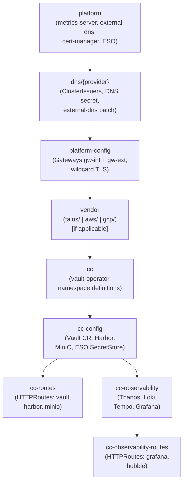
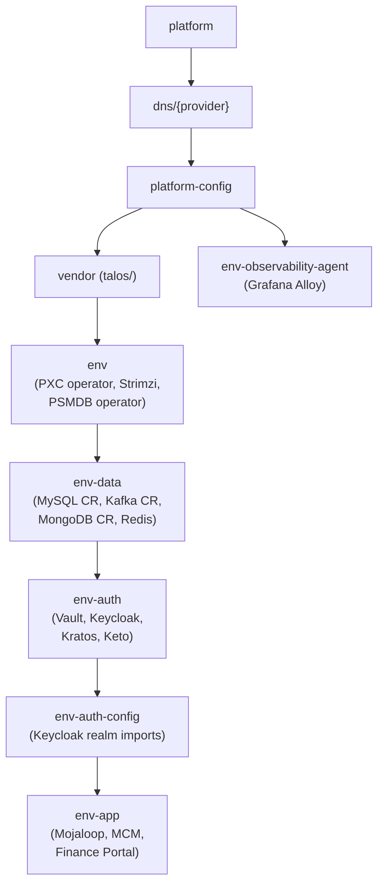
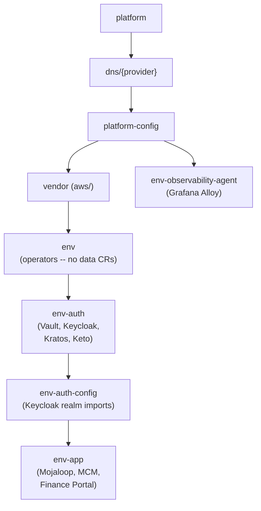
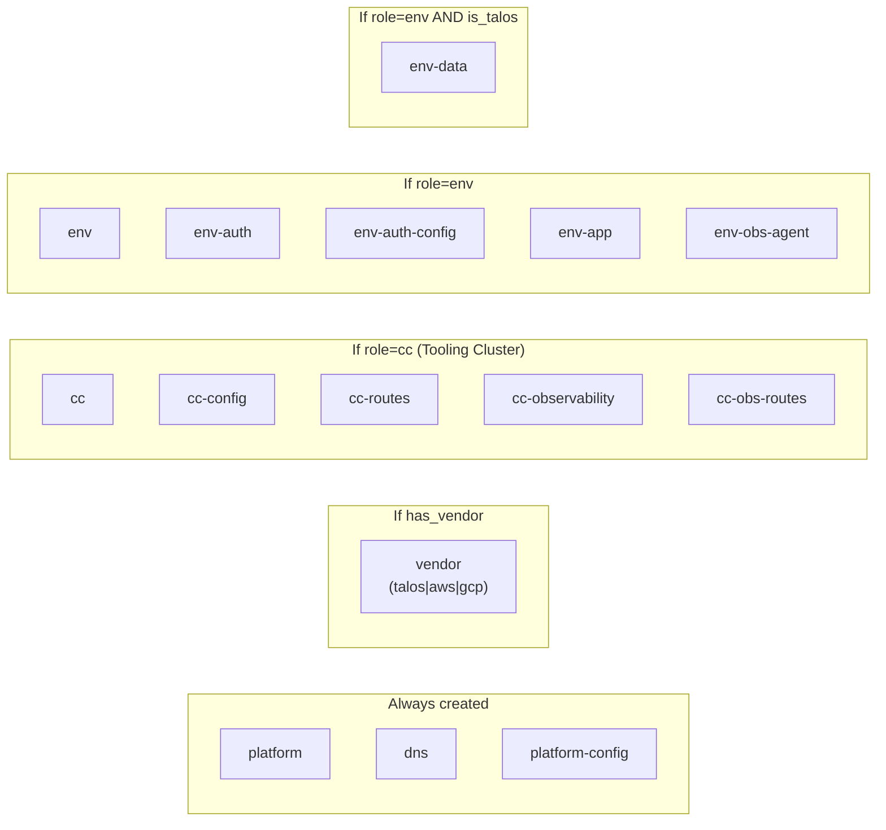
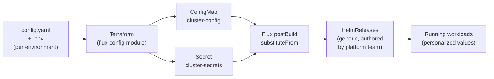

# GitOps Structure

[docs](../index.md) / [architecture](index.md) / GitOps Structure

**Audiences:** architect, platform engineer

The GitOps layer is how the platform reaches its desired state after Terraform hands off a bare Kubernetes cluster. A single OCI artifact contains every Kustomize root needed for any cluster role and provider combination. FluxCD reconciles the subset relevant to each cluster, personalized entirely through substitution variables. No Git repository is required inside the cluster.

---

## OCI-based distribution

The core design decision ([ADR-001](decisions/001-oci-over-git.md)) is to distribute the GitOps artifact as an OCI image rather than pointing Flux at a Git repository. This has three consequences:

1. **Air-gap capability.** Clusters pull from an OCI registry (Harbor, ECR, GHCR). The registry can be pre-loaded in disconnected environments. Git connectivity is never required at runtime.
2. **Version coherence.** A single OCI tag covers the entire stack. When a cluster reconciles tag `v1.2.3`, every kustomization it deploys comes from the same artifact build. There is no risk of partial updates from independent Git commits.
3. **Registry as source of truth.** The OCI registry (Harbor on a Tooling Cluster, or a managed cloud registry) is the authoritative source. The Git repository is a build input, not a runtime dependency.

The artifact is built by `make push-gitops`, which packages the `gitops/` directory into an OCI image tagged with the Git SHA and `latest`.

---

## Artifact contents

The OCI artifact contains the full `gitops/` directory. Each subdirectory is a Kustomize root that Flux can independently reconcile. Not every directory is deployed to every cluster -- the `flux-config` Terraform module selects the appropriate subset.

```
gitops/
  platform/                 # Always -- metrics-server, external-dns (base), cert-manager, ESO
  platform-config/          # Always -- Gateways (gw-int, gw-ext), wildcard TLS certs
  dns/{provider}/           # One selected -- ClusterIssuers, DNS Secret, external-dns values patch
  talos/                    # If vendor=talos -- Cilium HelmRelease, LB-IPAM, OpenEBS
  aws/                      # If vendor=aws -- Cilium BYOCNI HelmRelease
  gcp/                      # If vendor=gcp -- minimal (GKE manages most)
  cc/                       # If role=cc -- vault-operator, namespace definitions
  cc-config/                # If role=cc -- Vault CR, Harbor, MinIO, ESO SecretStore
  cc-routes/                # If role=cc -- HTTPRoutes for Vault, Harbor, MinIO
  cc-observability/         # If role=cc -- Thanos, Loki, Tempo, Grafana
  cc-observability-routes/  # If role=cc -- HTTPRoutes for observability services
  env/                      # If role=env -- data layer operators (PXC, Strimzi, PSMDB)
  env-data/                 # If role=env AND self-hosted -- operator CRs (MySQL, Kafka, MongoDB, Redis)
  env-auth/                 # If role=env -- Vault, Keycloak, Ory stack (Kratos, Keto, Oathkeeper)
  env-auth-config/          # If role=env -- Keycloak realm imports
  env-app/                  # If role=env -- Mojaloop core, MCM, Finance Portal, DFSP mTLS edge
  env-observability-agent/  # If role=env -- Grafana Alloy (log/metric collection agent)
```

The directory naming convention encodes the dependency order: `cc` before `cc-config` before `cc-routes`; `env` before `env-data` before `env-auth` before `env-app`. The directory names `cc/`, `cc-config/`, `cc-routes/` are historical -- they deploy when `cluster.role` is set to the tooling role.

---

## Two independent provider dimensions

Infrastructure provider and DNS provider are independent choices. Any combination works because they occupy separate positions in the kustomization chain.

| Dimension | Options | Selects |
|---|---|---|
| **Infrastructure provider** (`infra.provider`) | `proxmox`, `openstack`, `aws`, `gcp`, `digitalocean` | Vendor kustomization (`talos/`, `aws/`, `gcp/`, or none) |
| **DNS provider** (`dns.provider`) | `digitalocean`, `cloudflare`, `route53`, `clouddns`, `rfc2136`, `designate` | DNS kustomization (`dns/digitalocean/`, `dns/cloudflare/`, etc.) |

This means a Proxmox cluster can use Cloudflare DNS, an AWS cluster can use DigitalOcean DNS, or any other pairing. The infrastructure provider determines what runs inside the cluster (CNI, storage, data layer). The DNS provider determines how TLS certificates are validated (ACME DNS-01 solver) and how DNS records are created (external-dns).

---

## Dependency chain

Kustomizations are deployed in a strict dependency order. Each kustomization declares `dependsOn` references to its prerequisites, ensuring operators install CRDs before CRs are applied and services start before routes are created.

### Tooling Cluster (role=cc)



### App Environment (role=env, self-hosted)



### App Environment (role=env, managed cloud)

On managed providers, the `env-data` kustomization is skipped (no in-cluster operators needed) and `env-auth` depends directly on `env`.



Key ordering constraints:

- **platform before dns:** external-dns base must exist before provider-specific patches are applied.
- **dns before platform-config:** ClusterIssuers must exist before Gateways request wildcard TLS certificates.
- **vendor before role:** Cilium and LB-IPAM must be healthy before services that need LoadBalancer IPs or Gateway listeners.
- **env before env-data:** Operators (PXC, Strimzi, PSMDB) must install CRDs before CRs can be applied.
- **env-data before env-auth:** Databases must be ready before Keycloak and Kratos run migrations.
- **env-auth before env-auth-config:** Keycloak instance must be running before realm imports are applied.
- **env-auth-config before env-app:** Realms and OIDC clients must exist before Mojaloop and MCM start.

---

## Deployment matrix

Concrete examples showing which kustomizations are deployed for different cluster configurations.

| Cluster | Infra | DNS | Kustomizations (in order) |
|---|---|---|---|
| Tooling on Proxmox | proxmox | digitalocean | platform -> dns/digitalocean -> platform-config -> talos -> cc -> cc-config -> cc-routes, cc-observability -> cc-observability-routes |
| Tooling on AWS | aws | route53 | platform -> dns/route53 -> platform-config -> aws -> cc -> cc-config -> cc-routes, cc-observability -> cc-observability-routes |
| Env on Proxmox | proxmox | digitalocean | platform -> dns/digitalocean -> platform-config -> talos -> env -> env-data -> env-auth -> env-auth-config -> env-app, env-observability-agent |
| Env on AWS | aws | route53 | platform -> dns/route53 -> platform-config -> aws -> env -> env-auth -> env-auth-config -> env-app, env-observability-agent |
| Env on GCP | gcp | clouddns | platform -> dns/clouddns -> platform-config -> gcp -> env -> env-auth -> env-auth-config -> env-app, env-observability-agent |
| Env on DOKS | digitalocean | digitalocean | platform -> dns/digitalocean -> platform-config -> env -> env-auth -> env-auth-config -> env-app, env-observability-agent |

Note: DOKS has no vendor kustomization, so `env` depends directly on `platform-config`. The `env-observability-agent` kustomization also depends on `platform-config` (not the main chain), since it only needs Gateway/DNS for remote write.

---

## Flux wiring

The `flux-config` Terraform module (in `src/modules/flux-config/`) translates the cluster's configuration into Flux resources. It creates the following Kubernetes objects:

### OCIRepository

A single `OCIRepository` named `ml-gitops` points to the OCI artifact URL and tag. All kustomizations reference this one source. If the registry requires authentication, the module creates a `kubernetes.io/dockerconfigjson` Secret and attaches it via `secretRef`.

### Kustomizations

Each kustomization is a `Kustomization` CR with:

- **`path`** -- the subdirectory within the artifact (e.g., `./platform`, `./dns/digitalocean`, `./env-app`).
- **`dependsOn`** -- references to prerequisite kustomizations, encoding the dependency chain.
- **`sourceRef`** -- always points to the `ml-gitops` OCIRepository.
- **`postBuild.substituteFrom`** -- references both `cluster-config` (ConfigMap) and `cluster-secrets` (Secret) for variable substitution.
- **`healthChecks`** / **`healthCheckExprs`** -- optional readiness gates that prevent downstream kustomizations from starting until critical resources are healthy (e.g., PXC cluster state is `ready`, Keycloak instance is running).

The module conditionally creates kustomizations based on cluster role and provider:



### ConfigMap (cluster-config)

Non-sensitive configuration values injected into every kustomization via `postBuild.substituteFrom`. Contains the cluster name, domain, DNS provider, gateway class name, LB IPAM range, data layer endpoints, backup configuration, and observability endpoints.

### Secret (cluster-secrets)

Sensitive credentials injected alongside the ConfigMap. Contains OCI credentials, DNS provider tokens, database passwords, OIDC client secrets, SMTP credentials, and backup S3 keys. The Secret type is `Opaque`.

---

## Personalization model

The adopter never forks or modifies the platform OCI artifact. All environment-specific configuration flows through a single mechanism: Flux postBuild variable substitution.



The flow works as follows:

1. **Platform team** authors generic HelmReleases and Kustomize manifests with `${variable}` placeholders. These are published as the OCI artifact.
2. **Adopter** configures `config/environments/<env>/config.yaml` (non-sensitive) and `.env` (sensitive) with their specific values -- domain, credentials, IP ranges, cloud endpoints.
3. **Terraform** reads the config, computes derived values (e.g., in-cluster vs. cloud data endpoints), and writes them into the ConfigMap and Secret.
4. **Flux** substitutes `${variable}` references in every kustomization at reconciliation time, producing fully resolved manifests.

This means a HelmRelease like Mojaloop's can contain `host: ${mysql_host}` and it works identically whether the value resolves to `mojaloop-db-haproxy.mojaloop.svc.cluster.local` (Proxmox, self-hosted Percona) or `mydb.xxxxx.rds.amazonaws.com` (AWS, managed RDS). The HelmRelease author does not need to know the provider.

Variables that bridge the provider gap are documented in the [Provider Model](provider-model.md#substitution-variables-for-provider-abstraction).

---

## Version coherence

A single OCI tag covers the entire GitOps stack. When an artifact is built at Git SHA `abc123`, it is tagged with both `abc123` and `latest`. Every kustomization in that artifact -- platform, vendor, role-specific, observability -- was tested together as a unit.

This eliminates a class of problems common in multi-repo GitOps:

- **No partial updates.** It is impossible for `env-app` to reconcile a newer Mojaloop HelmRelease while `env-data` still runs an older database schema. Both come from the same artifact.
- **Atomic rollback.** Changing the OCIRepository tag to a previous SHA rolls back the entire stack, not individual components.
- **Reproducible state.** Given a tag, the exact cluster state is deterministic. There is no drift from independent Git branches or Helm chart version ranges.

The artifact version is set in `config.yaml` under `oci.repo.version` (defaults to `latest`). For production environments, pinning to a specific Git SHA is recommended.
