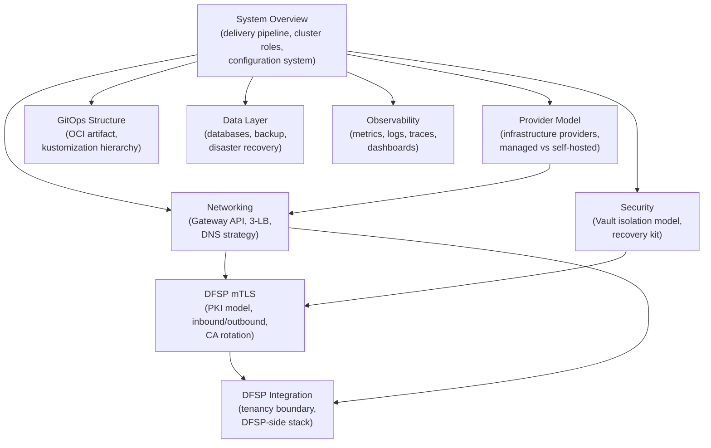

# Architecture

[docs](../index.md) / Architecture

**Audiences:** all

System architecture and design decisions for ML Deployment Toolkit -- an infrastructure-agnostic Mojaloop distribution. The platform uses an optional Tooling Cluster for shared services (OCI registry, secrets, object storage) and one or more App Environment clusters for Mojaloop workloads.

## How these documents fit together

## Documents

| Document | Description |
|----------|-------------|
| [System Overview](system-overview.md) | Delivery pipeline, cluster roles, deployment stages |
| [Provider Model](provider-model.md) | Infrastructure providers, managed vs self-hosted, Cilium strategy |
| [GitOps Structure](gitops-structure.md) | OCI artifact, kustomization hierarchy, Flux wiring |
| [Networking](networking.md) | Gateway API, 3-LB architecture, DNS strategy |
| [DFSP mTLS](dfsp-mtls.md) | PKI model, inbound/outbound mTLS, Vault Agent, CA rotation |
| [DFSP Integration](dfsp-integration.md) | Tenancy boundary, DFSP-side Helm chart topology, config and cert bootstrap |
| [Security](security.md) | Vault isolation model, security layers, recovery kit |
| [Observability](observability.md) | Metrics (Thanos), logs (Loki), traces (Tempo), dashboards |
| [Data Layer](data-layer.md) | Databases, backup architecture, disaster recovery |

## Decision records

Design decisions are recorded as individual ADRs in [decisions/](decisions/). Each record captures the context, alternatives considered, and consequences of a non-obvious design choice. Records are append-only -- a superseded decision gets a status update, not a deletion.

## Looking for procedures?

For procedures (how to build, deploy, operate), see the audience-specific guides linked from the [docs index](../index.md).
