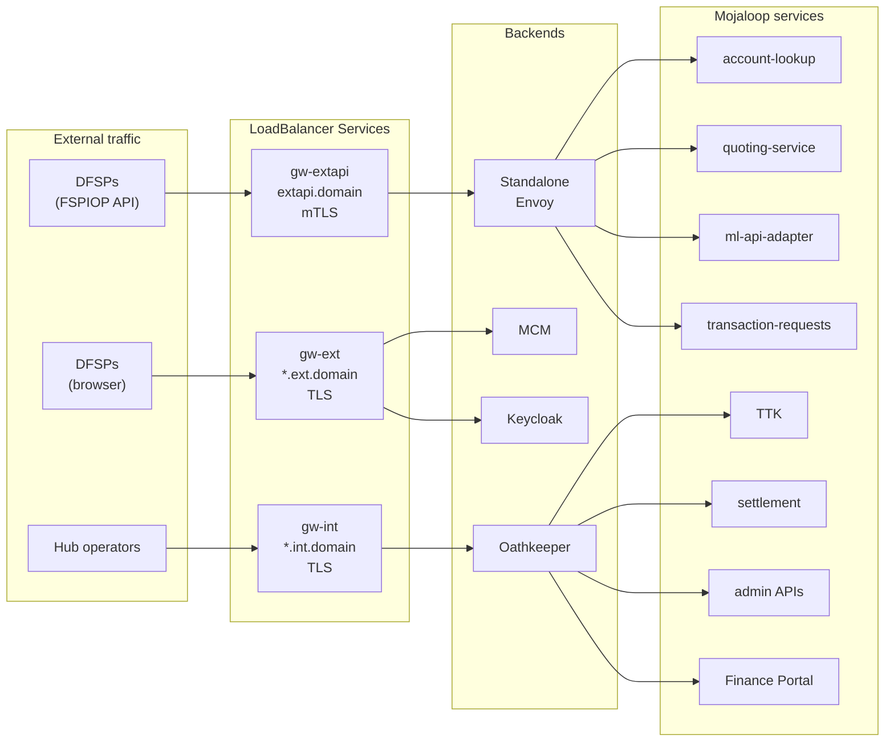
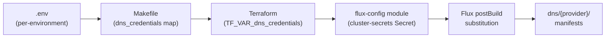

# Networking

[docs](../index.md) / [architecture](index.md) / Networking

**Audiences:** architect, platform engineer

## Gateway API architecture

ML Deployment Toolkit uses Kubernetes [Gateway API](https://gateway-api.sigs.k8s.io/) as its ingress layer. The deprecated Ingress resource is not used anywhere in the distribution.

Two shared Gateways live in the `platform-system` namespace, deployed by the `platform-config/` kustomization:

- **gw-int** (`*.int.${domain}`) -- internal operations only. TTK, settlement API, admin APIs, Finance Portal, internal FSPIOP mirror (intapi), simulator. Traffic passes through Oathkeeper for session-based auth. Core FSPIOP services (account-lookup, quoting, ml-api-adapter, transaction-requests) are NOT on this gateway -- they are accessed via gw-extapi with mTLS.
- **gw-ext** (`*.ext.${domain}`) -- DFSP-facing services that do not require mTLS. MCM Connection Manager and Keycloak OIDC. Simple TLS termination only.

Both Gateways use `gatewayClassName: ${gateway_class_name}`, a Flux postBuild substitution variable. On most providers this resolves to `cilium`; on GKE it resolves to `gke-l7-regional-external-managed`. The GatewayClass itself is never deployed by the gitops artifact -- it is a byproduct of Cilium installation (or the managed Kubernetes platform). See [provider-model](provider-model.md) for the full mapping.

### HTTPRoute model

Each service owns its own HTTPRoute in its own namespace. Routes attach to the shared Gateways via `parentRefs` with cross-namespace references:

```yaml
parentRefs:
  - name: gw-ext
    namespace: platform-system
```

Where a service lives in a different namespace from the Gateway, a ReferenceGrant in the service namespace authorizes the cross-namespace attachment.

### Wildcard TLS

Both Gateways terminate TLS using wildcard certificates:

- `wildcard-int-tls` covers `*.int.${domain}`
- `wildcard-ext-tls` covers `*.ext.${domain}`

cert-manager provisions these certificates via DNS-01 challenges against Let's Encrypt (see [DNS strategy](#dns-strategy) below). Individual HTTPRoutes do not manage their own TLS -- they inherit the Gateway's wildcard certificate.

## Three-LB architecture

Each App Environment uses three LoadBalancer IPs. This is not a convenience choice -- it is forced by a gap in the Gateway API specification.



| LB Service | Audience | Hostname | TLS mode | Backend |
|------------|----------|----------|----------|---------|
| `cilium-gateway-gw-int` | Hub operators | `*.int.${domain}` | SIMPLE (Let's Encrypt wildcard) | Oathkeeper (session auth) then ops services (TTK, settlement API, admin APIs, Finance Portal, simulator) |
| `cilium-gateway-gw-ext` | DFSPs (browser) | `*.ext.${domain}` | SIMPLE (Let's Encrypt wildcard) | MCM, Keycloak |
| `cilium-gateway-gw-extapi` | DFSPs (FSPIOP) | `extapi.${domain}` | Mutual TLS (Vault PKI certs) | Standalone Envoy then account-lookup, quoting, ml-api-adapter, transaction-requests |

### Why three LBs

Gateway API does not support `tls.mode: Mutual`, so the FSPIOP mTLS endpoint requires a standalone Envoy with its own LoadBalancer Service. See [ADR-008](decisions/008-three-lb-architecture.md) for the full rationale.

The extapi endpoint uses a standalone Envoy Deployment completely outside the Gateway API model. See [DFSP mTLS](dfsp-mtls.md) for the full inbound and outbound mTLS architecture.

On-prem (Proxmox), these three IPs are allocated from a Cilium LB-IPAM pool. On cloud providers, each LoadBalancer Service gets a cloud-managed load balancer automatically.

### Internal FSPIOP mirror

For hub operators and testing, the same FSPIOP routes (participants, parties, quotes, transfers, etc.) are also exposed on `gw-int` via the `intapi` HTTPRoute at `intapi.int.${domain}`. This mirror uses simple TLS (not mTLS) and is protected by Oathkeeper session auth instead. It exists so that TTK and hub operators can exercise the same API paths without needing DFSP client certificates.

## DNS strategy

DNS provider is an independent dimension from infrastructure provider. Any combination works: Proxmox + Cloudflare, AWS + DigitalOcean, EKS + Route53. This independence is a deliberate design choice that keeps the DNS layer portable.

Two platform components depend on DNS:

1. **external-dns** -- watches Gateway HTTPRoute resources and creates DNS A records for their hostnames
2. **cert-manager** -- uses DNS-01 ACME challenges to prove domain ownership for TLS certificate issuance

### Why DNS-01 over HTTP-01

DNS-01 is used uniformly across all providers because on-prem LB IPs are private and unreachable by ACME servers, and DNS-01 also enables wildcard certificates. See [ADR-011](decisions/011-dns01-over-http01.md) for the full rationale.

### DNS kustomization paths

DNS-specific resources live in `gitops/dns/{provider}/`. Each provider directory contains:

| File | Purpose |
|------|---------|
| `letsencrypt.yaml` | ClusterIssuer resources (prod + staging) with provider-specific solver config |
| `dns-secret.yaml` | Kubernetes Secret holding the DNS provider API credentials |
| `kustomization.yaml` | Kustomize manifest listing the above resources |

Each provider's ClusterIssuer has structurally different YAML -- not just different credential values. For example, DigitalOcean uses `dns01.digitalocean.tokenSecretRef`, Cloudflare uses `dns01.cloudflare.apiTokenSecretRef`, and Route53 uses IAM roles. This structural difference is why each DNS provider has its own kustomization directory rather than a shared template with variable substitution.

### Credential flow

DNS credentials flow from the adopter's environment secrets through Terraform into the Kubernetes cluster where Flux makes them available to the DNS manifests:



The `.env` file contains the raw credential (e.g., `DIGITALOCEAN_TOKEN`). The Makefile maps it into the `dns_credentials` Terraform variable. The `flux-config` module writes it into the `cluster-secrets` Kubernetes Secret. Flux postBuild substitution injects the value into the DNS provider manifests at reconciliation time.

### external-dns sources

external-dns is configured to watch two source types:

- **gateway-httproute** -- creates A records for hostnames declared in HTTPRoute resources (used by gw-int and gw-ext services)
- **service** -- creates A records for LoadBalancer Services with `external-dns.alpha.kubernetes.io/hostname` annotations (used by gw-extapi, which is not a Gateway API resource)

The base external-dns deployment lives in `gitops/platform/`. DNS provider-specific configuration (API credentials, zone filters) is patched in via the `dns/{provider}/` kustomization.

## Adding a DNS provider

Adding a new DNS provider requires changes in the gitops layer only. Zero Terraform modifications are needed.

1. **Create `gitops/dns/{new_provider}/`** with three or four files:
   - `letsencrypt.yaml` -- ClusterIssuer with the provider's DNS-01 solver configuration (prod + staging)
   - `dns-secret.yaml` -- Secret template referencing the credential via `${variable_name}` substitution
   - `kustomization.yaml` -- Kustomize manifest listing the resources
   - (optional) external-dns values patch if the provider needs custom configuration beyond the base

2. **Add the credential variable** to the Makefile's `dns_credentials` map so it flows from `.env` through Terraform into `cluster-secrets`.

3. **Set `dns.provider: new_provider`** in the environment's `config.yaml`.

The `flux-config` module already deploys the `dns/{dns_provider}` kustomization based on the `dns.provider` value in config -- no conditional logic needs to be added.

## Provider-specific networking

### On-prem (Proxmox / Talos)

Cilium is the CNI, Gateway API controller, and load balancer:

- **CNI** -- pod networking with eBPF datapath
- **Gateway API** -- GatewayClass `cilium` auto-created by the Cilium Helm chart (`gatewayAPI.enabled: true`)
- **Load balancing** -- Cilium LB-IPAM with L2 announcements. IP pools are defined in `gitops/talos/` and configured via the `lb_ipam_range` variable in `config.yaml`

Gateway API CRDs are installed via Talos `extraManifests` during node boot (before Cilium starts) so that Cilium can register its GatewayClass on first startup.

### Cloud (AWS EKS, DigitalOcean DOKS)

Cilium is still the CNI and Gateway API controller, but load balancing is handled by the cloud provider:

- LoadBalancer Services get cloud-managed load balancers (NLB on AWS, DO LB on DigitalOcean) automatically
- No LB-IPAM configuration is needed
- Gateway API CRDs are installed before the Cilium Helm chart via a provider-specific kustomization

See [provider-model](provider-model.md) for the full infrastructure mapping across providers.

## GitOps placement

| Resource | Path | Scope |
|----------|------|-------|
| Shared Gateways (gw-int, gw-ext) | `gitops/platform-config/gateway/` | All clusters |
| DNS ClusterIssuers + Secret | `gitops/dns/{provider}/` | Selected by `dns.provider` |
| external-dns base | `gitops/platform/` | All clusters |
| Internal HTTPRoutes (TTK, settlement, intapi) | `gitops/env-app/routes/` | App Environments |
| External HTTPRoutes (MCM, Keycloak) | `gitops/env-app/routes/` | App Environments |
| Extapi standalone Envoy + Service + cert | `gitops/env-app/routes/` | App Environments |
| Cilium LB-IPAM pools | `gitops/talos/` | On-prem only |
