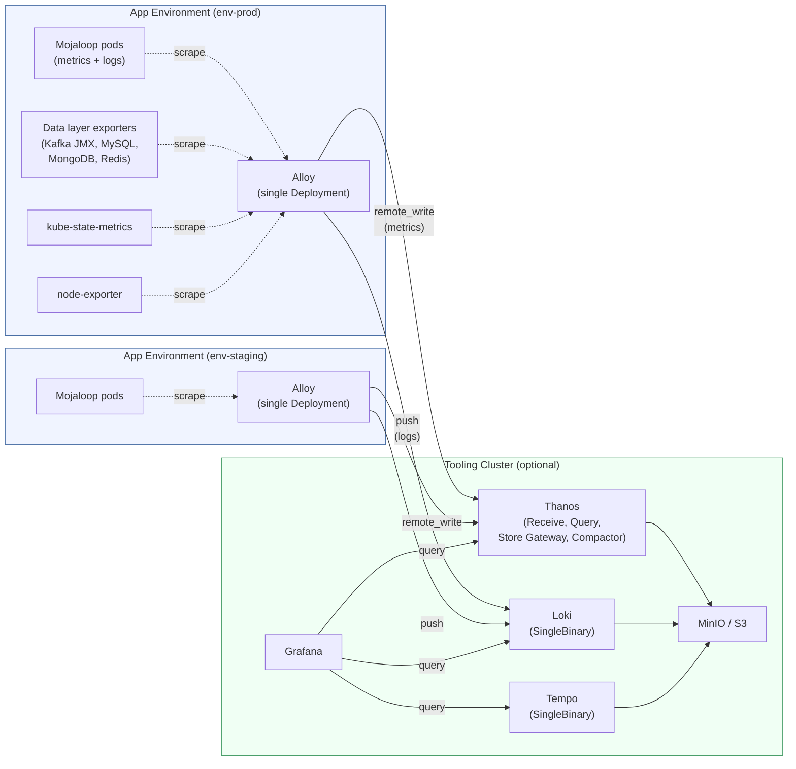
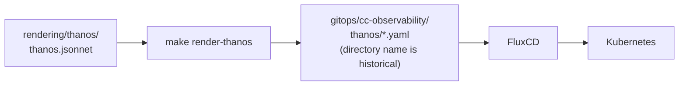
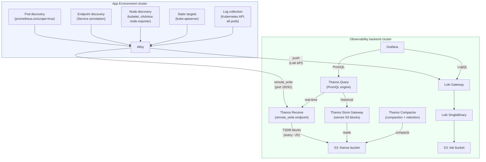

# Observability

[docs](../index.md) / [architecture](index.md) / Observability

**Audiences:** architect, platform engineer, adopter (operate)

## Hub-and-spoke model

Observability follows a hub-and-spoke topology. A dedicated observability cluster (typically the Tooling Cluster, if one exists) runs the full backend stack (storage, querying, dashboards). Each App Environment cluster runs a lightweight collection agent that pushes telemetry data to the backend. No environment cluster stores its own metrics or logs persistently.

This model keeps environment clusters stateless for observability -- if an env cluster is destroyed and rebuilt, historical metrics and logs are preserved on the observability backend cluster. It also means a single Grafana instance provides a unified view across all environments.

## Stack components

| Signal | Backend | Env Agent | Protocol | License | Governance |
|--------|---------|-----------|----------|---------|------------|
| **Metrics** | Thanos (Receive + Query + Store Gateway + Compactor) | Grafana Alloy | Prometheus remote_write | Apache 2.0 | CNCF Incubating |
| **Logs** | Loki (SingleBinary) | Grafana Alloy | Loki push API | AGPL 3.0 | -- |
| **Traces** | Tempo (SingleBinary) | Phase 3 -- not yet active | OTLP | AGPL 3.0 | -- |
| **Dashboards** | Grafana | -- | -- | AGPL 3.0 | -- |

All backends store data in MinIO S3 on the Tooling Cluster (self-hosted) or native S3 (cloud deployments).

## Why Thanos

Thanos was selected as the metrics backend. See [ADR-003](decisions/003-thanos-over-mimir.md) for the evaluation of alternatives (Mimir, VictoriaMetrics, Cortex, Prometheus).

Thanos operates in **receive mode** (push-based via `remote_write`), not sidecar mode. Alloy on each env cluster pushes metrics directly to Thanos Receive on the backend cluster. This avoids running Prometheus on env clusters entirely.

**Backwards compatibility note:** the Flux substitution variable is still named `${mimir_url}` in Alloy's configuration. It points to Thanos Receive's remote-write endpoint. Renaming would require coordinated changes across all environment configs.

## Deployment model

### Thanos (Jsonnet rendering)

Thanos has no official Helm chart. The project maintains kube-thanos, a Jsonnet library for generating Kubernetes manifests. The distribution renders Jsonnet to YAML at build time, commits the output to the gitops directory, and FluxCD deploys it as raw Kustomize resources.

The four Thanos components (Receive, Query, Store Gateway, Compactor) are each configured in `rendering/thanos/thanos.jsonnet` with resource requests, replica counts, and retention settings. Changes to Thanos configuration require re-rendering and committing the updated YAML.

### Loki, Tempo, Grafana (Helm)

Loki, Tempo, and Grafana are deployed via FluxCD HelmReleases from the Grafana Helm repository. Both Loki and Tempo run in single-binary mode (one pod each) to minimize resource usage.

## Data flow

### Write path (metrics)

1. Alloy scrapes metrics from annotated pods, services, and infrastructure targets every 30 seconds.
2. Alloy batches and pushes metrics via Prometheus `remote_write` to Thanos Receive on the backend cluster.
3. Thanos Receive writes incoming data to a local WAL (write-ahead log) and TSDB blocks on disk.
4. Every ~2 hours, Receive ships completed TSDB blocks to the S3 bucket (`thanos`).
5. Thanos Compactor periodically compacts blocks in S3 and enforces the retention policy.

### Read path (metrics)

1. Grafana sends PromQL queries to Thanos Query.
2. Query fans out to both Thanos Receive (real-time data in WAL/TSDB) and Store Gateway (historical data in S3).
3. Query merges and deduplicates the results transparently.

### Write path (logs)

1. Alloy collects logs from all pods using the Kubernetes API (not filesystem -- works from any node, not just the node the pod runs on).
2. Alloy pushes log entries to the Loki Gateway on the backend cluster.
3. Loki writes to S3 (`loki` bucket) using the TSDB index format.

## Metrics collection

### Scraping architecture

Alloy runs as a **single Deployment** (not DaemonSet) on each env cluster, with clustering enabled so that if scaled to multiple replicas, scrape targets are sharded across pods to avoid duplicate metrics.

Two discovery mechanisms target different workload types:

| Discovery | Role | Annotation | Granularity | Typical targets |
|-----------|------|------------|-------------|-----------------|
| **Pod discovery** | Application metrics | `prometheus.io/scrape=true` on pod | Per-pod | Mojaloop services |
| **Endpoint discovery** | Data layer and infrastructure metrics | `prometheus.io/scrape=true` on Service | Per-pod behind Service | MySQL exporter, Kafka JMX, MongoDB exporter, Redis exporter, kube-state-metrics |

Endpoint discovery provides per-pod granularity for clustered services (e.g., each PXC node gets its own `instance` label) while using the Service annotation as the opt-in signal.

### Infrastructure metrics

| Target | Port | Metrics path | Key signals |
|--------|------|-------------|-------------|
| kubelet | 10250 | `/metrics` | Pod lifecycle, volume operations |
| cAdvisor | 10250 | `/metrics/cadvisor` | Container CPU, memory, I/O |
| node-exporter | 9100 | `/metrics` | Node CPU, memory, disk, network |
| kube-state-metrics | 8080 | `/metrics` | Desired vs actual state (deployments, pods, PVCs) |
| kube-apiserver | 443 | `/metrics` | API request rate, latency, error rate |

kube-apiserver is a static target (`kubernetes.default.svc:443`) because it is a Talos static pod, not discoverable via annotations.

### Data layer metrics

| Service | Exporter | Port | Key metrics |
|---------|----------|------|-------------|
| Kafka brokers | JMX exporter (Strimzi built-in) | 9404 | Request rate, under-replicated partitions, ISR shrink |
| Kafka consumers | Kafka Exporter | 9404 | Consumer group lag |
| MySQL (PXC) | mysqld-exporter sidecar | 9104 | Active connections, queries/sec, wsrep cluster state |
| MongoDB (PSMDB) | mongodb_exporter sidecar | 9216 | Operations/sec, replication lag, connections |
| Redis | redis-exporter | 9121 | Connected clients, memory usage, keyspace hits |

### Mojaloop application metrics

Mojaloop services expose native Prometheus metrics on `/metrics`. Metric prefixes:

- `moja_*` -- most services (central-ledger, account-lookup, quoting, etc.)
- `moja_ml_*` -- ml-api-adapter

These are collected via pod discovery (each Mojaloop pod has `prometheus.io/scrape=true`).

## S3 storage layout

All observability backends share the same S3-compatible storage (MinIO on the Tooling Cluster, or native S3 on cloud deployments), each with a dedicated bucket.

| Bucket | Backend | Contents | Write frequency |
|--------|---------|----------|-----------------|
| `thanos` | Thanos | TSDB blocks (compacted time-series data) | Every ~2 hours (block shipping) |
| `loki` | Loki | Log chunks + TSDB index | Continuous |
| `tempo` | Tempo | Trace data | Continuous (when active) |

Thanos Receive writes to S3 only when a TSDB block is complete (~2 hours of data). Until then, data lives in the local WAL. This means an unclean Receive pod termination could lose up to ~2 hours of metrics data, though WAL replay on restart mitigates most scenarios.

S3 credentials for all three backends are pulled from the cluster's own independent Vault instance via ExternalSecret CRs (see [Security -- ESO](security.md#external-secrets-operator-eso)).

## Grafana dashboards

23 dashboards are provisioned via ConfigMap sidecar. Grafana's sidecar watches for ConfigMaps with the label `grafana_dashboard: "1"` in the `observability` namespace and hot-reloads them without pod restart. Folder assignment uses the `grafana_folder` annotation on each ConfigMap.

### Infrastructure (9 dashboards)

Kubernetes Cluster, Node Overview, Pod Resources, Namespace Resources, CoreDNS, Cilium Network, Kube API Server, Kubelet, Persistent Volumes.

### Data Layer (4 dashboards)

MySQL Overview, PXC/Galera Cluster, Kafka Overview, Redis Overview.

### Platform (5 dashboards)

Cert-Manager, External DNS, Vault, Keycloak, Ory Auth.

### Mojaloop (5 dashboards)

Transfer Pipeline, Account Lookup Service, Quoting Service, Node.js Runtime, DFSP mTLS Gateway.

Dashboard JSON definitions live in `gitops/cc-observability/grafana/dashboards/{infrastructure,data-layer,platform,mojaloop}/` (the `cc-observability` directory name is historical) -- one ConfigMap YAML per dashboard. For operational guidance on reading these dashboards, see [operations/monitoring](../operations/monitoring.md).

## Retention

All signals use a 7-day (168h) retention period.

| Signal | Enforcement mechanism |
|--------|----------------------|
| Metrics | Thanos Compactor (`retentionResolutionRaw: 168h`); Receive local retention: 6h |
| Logs | Loki `limits_config.retention_period: 168h` + compactor `retention_enabled: true` |
| Traces | Tempo `retention: 168h` |

Downsampling is disabled (`disableDownsampling: true` on Compactor) -- raw resolution is retained for the full 7 days. This keeps queries accurate at the cost of slightly more S3 storage.

## Known constraints

- **Tooling Cluster node memory pressure** -- the full observability stack (Thanos + Loki + Tempo + Grafana) runs on the Tooling Cluster alongside Vault, Harbor, and MinIO. On the default node sizing (~7 GB), memory is tight. Production deployments should consider larger nodes.
- **~2 hour data loss window** -- Thanos Receive ships TSDB blocks every ~2 hours. An unclean pod crash can lose the incomplete block. WAL replay recovers most data, but the window exists.
- **No Tooling Cluster self-monitoring** -- the Tooling Cluster's own metrics and logs are not collected (Alloy only runs on env clusters). Future work.
- **No alerting** -- no alerting rules are configured. Thanos Ruler or an external alerting pipeline (e.g., Alertmanager) is future work.
- **`mimir_url` variable name** -- the Flux substitution variable for the Thanos Receive endpoint is still named `mimir_url` for backwards compatibility with existing environment configs.
- **Traces not yet active** -- Tempo is deployed and configured but no application-level trace instrumentation is in place. This is Phase 3 work.
