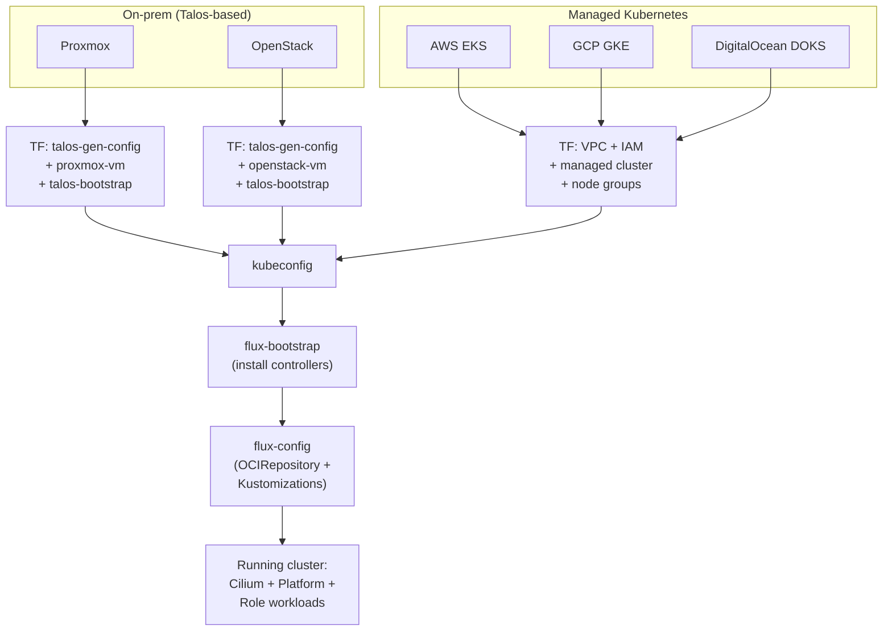

# Provider Model

[docs](../index.md) / [architecture](index.md) / Provider Model

**Audiences:** architect, platform engineer

The provider model abstracts infrastructure differences so that a single GitOps artifact works on any supported platform. Terraform modules handle provisioning; Flux kustomizations fill the gaps left by each provider. The result is always the same: a Kubernetes cluster running Cilium, FluxCD, and the Mojaloop stack.

---

## Provider categories

Two categories of provider converge to the same output -- a kubeconfig and a running Flux instance:

- **On-prem (Talos-based):** Terraform provisions VMs on a hypervisor, Talos Linux bootstraps an immutable Kubernetes cluster. The platform self-manages CNI, load balancing, storage, and stateful services. Providers: Proxmox, OpenStack.
- **Managed Kubernetes:** Terraform provisions a managed cluster via the cloud provider API. The cloud manages the control plane, node lifecycle, and (optionally) data services. Providers: AWS EKS, GCP GKE, DigitalOcean DOKS.

Both paths feed a kubeconfig into `flux-bootstrap` (installs Flux controllers via Helm) and `flux-config` (creates the OCIRepository, Kustomizations, ConfigMap, and Secret that drive all subsequent reconciliation).

---

## Provider infrastructure mapping

Each provider maps platform functions to either self-managed (GitOps) or managed (cloud-native) implementations. The table below shows the concrete technology for each function.

| Function | Proxmox | AWS EKS | GCP GKE | OpenStack | DigitalOcean DOKS |
|---|---|---|---|---|---|
| **TF provider(s)** | `bpg/proxmox` + `siderolabs/talos` | `hashicorp/aws` | `hashicorp/google` | `openstack` + `siderolabs/talos` | `digitalocean/digitalocean` |
| **K8s provisioning** | Talos on VMs | EKS managed | GKE managed (Dataplane V2) | Talos on VMs | DOKS managed |
| **Network** | Physical network + VIP | VPC + subnets + IGW | VPC + subnet (VPC-native) | Neutron + floating IP | VPC (managed) |
| **CNI bootstrap** | Cilium via Talos `extraManifests` | VPC-CNI replaced by Cilium via GitOps | Dataplane V2 (= Cilium, managed) | Cilium via Talos `extraManifests` | Cilium (managed) |
| **Storage CSI** | N/A -- GitOps OpenEBS hostpath | EBS CSI add-on (managed) | PD CSI (managed, auto) | Cinder CSI or GitOps OpenEBS | N/A (managed) |
| **Object storage** | N/A -- GitOps MinIO | S3 bucket (native) | GCS + HMAC (native) | Swift or GitOps MinIO | Spaces (native) |
| **OCI registry** | N/A -- GitOps Harbor | ECR | Artifact Registry | GitOps Harbor | DOCR |
| **DNS zone** | External (any DNS provider) | Route53 (natural fit) | Cloud DNS (natural fit) | Designate or external | DigitalOcean DNS |
| **MySQL** | N/A -- GitOps Percona XtraDB | RDS Aurora MySQL | Cloud SQL for MySQL | Percona XtraDB or Trove | Managed MySQL |
| **Kafka** | N/A -- GitOps Strimzi | MSK | Managed Kafka | Strimzi | Self-hosted Strimzi |
| **MongoDB** | N/A -- GitOps Percona Server MongoDB | DocumentDB | MongoDB Atlas | Percona Server MongoDB | Self-hosted PSMDB |
| **Redis** | N/A -- GitOps Redis | ElastiCache | Memorystore | In-cluster Redis | Managed Redis |
| **Kubeconfig method** | Talos API (`talosctl kubeconfig`) | `aws eks get-token` | `gcloud container clusters get-credentials` | Talos API | `doctl kubernetes cluster kubeconfig` |
| **Outputs to GitOps** | `gateway_class_name=cilium`, in-cluster data endpoints | `gateway_class_name=cilium`, managed data endpoints | `gateway_class_name=gke-l7-*`, managed data endpoints | `gateway_class_name=cilium`, in-cluster data endpoints | `gateway_class_name=cilium`, managed data endpoints |

"N/A -- GitOps X" means Terraform does not provision the service; instead, a Flux kustomization deploys the operator and CR via the GitOps artifact.

---

## Two provider profiles

Providers fall into two profiles that determine how the data layer and supporting infrastructure are provisioned.

### Self-hosted (Proxmox, OpenStack)

Everything runs in-cluster. Kubernetes operators manage stateful services declaratively:

- **Data layer:** Percona XtraDB Cluster (MySQL), Strimzi (Kafka), Percona Server MongoDB, Redis -- all deployed via GitOps `env-data/` kustomization.
- **Object storage:** MinIO deployed via GitOps `cc-config/`.
- **OCI registry:** Harbor deployed via GitOps `cc-config/`.
- **Block storage:** OpenEBS hostpath deployed via GitOps `talos/`.
- **CNI:** Self-managed Cilium (two-phase deployment).
- **Load balancing:** Cilium LB-IPAM with L2 announcement.

The `flux-config` module detects `is_talos` (provider is `proxmox` or `openstack`) and sets data layer endpoints to in-cluster service names (e.g., `mojaloop-db-haproxy.mojaloop.svc.cluster.local`).

### Managed (AWS, GCP, DigitalOcean)

The cloud provides managed equivalents. Terraform provisions them alongside the cluster:

- **Data layer:** RDS/Cloud SQL (MySQL), MSK/Managed Kafka, DocumentDB/Atlas (MongoDB), ElastiCache/Memorystore (Redis) -- provisioned by Terraform, endpoints passed to GitOps via substitution variables.
- **Object storage:** S3/GCS (native).
- **OCI registry:** ECR/Artifact Registry (native).
- **Block storage:** EBS CSI/PD CSI (managed add-on).
- **CNI:** BYOCNI (EKS) or fully managed (GKE Dataplane V2, DOKS).
- **Load balancing:** Cloud Load Balancer (automatic for Service type:LoadBalancer).

The `env-data/` kustomization is skipped entirely on managed providers (condition: `is_talos && is_env`). Application HelmReleases receive cloud endpoint URLs through Flux postBuild substitution.

---

## Vendor kustomizations (GitOps layer)

Each provider that requires self-managed infrastructure components has a corresponding vendor kustomization directory under `gitops/`. The `flux-config` module deploys at most one vendor kustomization per cluster, selected by `infra_provider`.

| Vendor kustomization | Condition | Contents |
|---|---|---|
| `talos/` | `infra_provider` is `proxmox` or `openstack` | Cilium HelmRelease (full, steady-state), LB-IPAM (CiliumLoadBalancerIPPool + CiliumL2AnnouncementPolicy), OpenEBS hostpath |
| `aws/` | `infra_provider` is `aws` | Cilium BYOCNI HelmRelease (replaces VPC-CNI) |
| `gcp/` | `infra_provider` is `gcp` | Minimal -- GKE manages CNI, storage, LB natively |
| *(none)* | `infra_provider` is `digitalocean` | DOKS manages Cilium natively; no vendor kustomization needed |

The vendor kustomization sits in the dependency chain between `platform-config` and the role-specific kustomizations (`cc` for the Tooling Cluster, or `env` for App Environments). On providers without a vendor kustomization (e.g., DigitalOcean), the role kustomization depends directly on `platform-config`.

---

## Cilium deployment strategy

Cilium is the CNI on every provider. The installation method varies because Cilium must be running before any pods -- including Flux itself -- can schedule ([ADR-002](decisions/002-cilium-over-istio.md)).

### Two-phase (Talos -- Proxmox, OpenStack)

Talos Linux is a minimal, immutable OS with no package manager and no ability to run Helm during node boot. Yet Cilium must be present before kubelet can schedule any pod.

**Phase 1 -- Bootstrap:** A pre-rendered Cilium manifest is hosted on private storage and applied via the Talos machine config `extraManifests` field. This runs during node boot, before the Kubernetes API is fully available to external controllers. The manifest is a point-in-time snapshot -- sufficient to bring the cluster online.

**Phase 2 -- Steady-state:** Once Flux is running, the `talos/cilium/` HelmRelease adopts the existing Cilium installation. From this point forward, Flux manages upgrades, configuration changes, and Gateway API enablement through the standard Helm lifecycle.

The two-phase approach exists because Talos cannot run Helm, but Cilium's only official distribution is a Helm chart. Phase 1 solves the bootstrap chicken-and-egg problem; Phase 2 provides ongoing lifecycle management.

### BYOCNI (AWS EKS)

EKS ships with the VPC-CNI add-on by default. To use Cilium, the cluster is provisioned with BYOCNI mode (the VPC-CNI add-on is removed), and the `aws/` vendor kustomization deploys Cilium via a Flux HelmRelease. Because EKS manages the control plane, there is no Talos-style bootstrap problem -- Flux installs Cilium as a normal Helm release after the cluster is ready.

### Managed (GCP GKE)

GKE Dataplane V2 is Cilium, managed entirely by Google. No GitOps Cilium deployment is needed. The `gcp/` vendor kustomization is minimal or empty.

### Managed (DigitalOcean DOKS)

DOKS uses Cilium as its default managed CNI. No vendor kustomization is deployed. Cilium features like Gateway API are available through the managed installation.

---

## GatewayClass strategy

The `GatewayClass` resource is never created by the GitOps artifact. It is always a byproduct of Cilium installation (whether self-managed or cloud-managed). The shared Gateway in `platform-config/` references `gatewayClassName: ${gateway_class_name}` -- a substitution variable set per environment.

| Provider | Cilium installation | `gateway_class_name` | GatewayClass creation | Gateway API CRDs |
|---|---|---|---|---|
| Proxmox | Self-managed (Talos extraManifests + Flux HelmRelease) | `cilium` | Auto-created by Cilium Helm (`gatewayAPI.enabled: true`) | Talos `extraManifests` |
| OpenStack | Self-managed (Talos extraManifests + Flux HelmRelease) | `cilium` | Auto-created by Cilium Helm (`gatewayAPI.enabled: true`) | Talos `extraManifests` |
| AWS EKS | BYOCNI Flux HelmRelease | `cilium` | Auto-created by Cilium Helm (`gatewayAPI.enabled: true`) | Installed before Cilium |
| GCP GKE | Managed (Dataplane V2) | `gke-l7-regional-external-managed` | Auto-created by GKE | Pre-installed by GKE |
| DigitalOcean DOKS | Managed (default CNI) | `cilium` | Auto-created by managed Cilium | Pre-installed |

This design means `platform-config/` is entirely provider-agnostic. The Gateway YAML is identical across all providers; only the substitution variable changes.

---

## Managed vs self-hosted decision matrix

For each service, the table shows whether the provider uses a managed cloud service or a self-hosted in-cluster operator. "Self-hosted" means deployed and managed by the GitOps artifact. "Managed" means provisioned by Terraform or provided by the cloud platform.

| Service | Proxmox | OpenStack | AWS EKS | GCP GKE |
|---|---|---|---|---|
| **Cilium (CNI)** | Self-hosted (two-phase) | Self-hosted (two-phase) | Self-hosted (BYOCNI) | Managed (Dataplane V2) |
| **GatewayClass** | Self-hosted (Cilium Helm) | Self-hosted (Cilium Helm) | Self-hosted (Cilium Helm) | Managed (GKE) |
| **Load balancer** | Self-hosted (Cilium LB-IPAM, L2) | Self-hosted (Cilium LB-IPAM, L2) | Managed (AWS NLB) | Managed (GCP Cloud LB) |
| **Block storage** | Self-hosted (OpenEBS hostpath) | Self-hosted (OpenEBS or Cinder CSI) | Managed (EBS CSI) | Managed (PD CSI) |
| **Object storage** | Self-hosted (MinIO) | Self-hosted (MinIO or Swift) | Managed (S3) | Managed (GCS) |
| **OCI registry** | Self-hosted (Harbor) | Self-hosted (Harbor) | Managed (ECR) | Managed (Artifact Registry) |
| **MySQL** | Self-hosted (Percona XtraDB) | Self-hosted (Percona XtraDB) | Managed (RDS Aurora) | Managed (Cloud SQL) |
| **Kafka** | Self-hosted (Strimzi) | Self-hosted (Strimzi) | Managed (MSK) | Managed (Managed Kafka) |
| **MongoDB** | Self-hosted (Percona Server MongoDB) | Self-hosted (Percona Server MongoDB) | Managed (DocumentDB) | Managed (MongoDB Atlas) |
| **Redis** | Self-hosted (Redis in-cluster) | Self-hosted (Redis in-cluster) | Managed (ElastiCache) | Managed (Memorystore) |
| **DNS** | External (any DNS provider) | External (any DNS provider) | Route53 (natural fit) | Cloud DNS (natural fit) |
| **Secrets (Vault)** | Self-hosted (bank-vaults, K8s unseal) | Self-hosted (bank-vaults, K8s unseal) | Self-hosted (bank-vaults, KMS possible) | Self-hosted (bank-vaults, KMS possible) |

Vault is always self-hosted because it is the root of the secrets hierarchy and must remain under operator control regardless of provider.

---

## Substitution variables for provider abstraction

The bridge between Terraform (IaC) and Flux (GitOps) is a set of substitution variables stored in a ConfigMap (`cluster-config`) and Secret (`cluster-secrets`). These variables allow HelmReleases and Kustomize patches in the GitOps artifact to remain provider-agnostic.

| Variable | Source | Purpose | Example (Proxmox) | Example (AWS) |
|---|---|---|---|---|
| `gateway_class_name` | `config.yaml` | GatewayClass for shared Gateways | `cilium` | `cilium` |
| `dns_provider` | `config.yaml` | Selects `dns/{provider}` kustomization | `digitalocean` | `route53` |
| `domain` | `config.yaml` | Base domain for all services | `example.com` | `example.com` |
| `lb_ipam_range` | `config.yaml` | Cilium LB-IPAM IP pool (on-prem only) | `10.0.0.100-10.0.0.110` | `0.0.0.0-0.0.0.0` |
| `mysql_host` | Computed by `flux-config` | MySQL endpoint | `mojaloop-db-haproxy.mojaloop.svc.cluster.local` | `mydb.xxxxx.us-east-1.rds.amazonaws.com` |
| `mysql_port` | Computed by `flux-config` | MySQL port | `3306` | `3306` |
| `kafka_host` | Computed by `flux-config` | Kafka bootstrap server | `mojaloop-kafka-kafka-bootstrap` | `b-1.msk-cluster.xxxxx.kafka.us-east-1.amazonaws.com` |
| `kafka_port` | Computed by `flux-config` | Kafka port | `9092` | `9092` |
| `mongodb_host` | Computed by `flux-config` | MongoDB endpoint | `bulk-mongodb-rs0` | `docdb-cluster.xxxxx.us-east-1.docdb.amazonaws.com` |
| `mongodb_port` | Computed by `flux-config` | MongoDB port | `27017` | `27017` |
| `redis_host` | Computed by `flux-config` | Redis endpoint | `ttk-redis` | `redis.xxxxx.cache.amazonaws.com` |
| `redis_port` | Computed by `flux-config` | Redis port | `6379` | `6379` |
| `backup_s3_endpoint` | `config.yaml` | S3-compatible backup target | `https://minio.int.example.com` | `https://s3.us-east-1.amazonaws.com` |
| `loki_url` | `config.yaml` | Log aggregation endpoint (cross-cluster) | `https://loki.int.cc.example.com/loki/api/v1/push` | *(same pattern)* |
| `mimir_url` | `config.yaml` | Metrics remote-write endpoint (cross-cluster) | `https://mimir.int.cc.example.com/api/v1/push` | *(same pattern)* |

On self-hosted providers (`is_talos`), the `flux-config` module hardcodes data layer endpoints to in-cluster service names. On managed providers, the endpoints are passed through from Terraform outputs (or `config.yaml`), pointing to cloud-managed services. The GitOps HelmReleases reference only `${mysql_host}`, `${kafka_host}`, etc. -- they never know which provider is running underneath.

---

## Adding a new provider

A new provider must supply the following. The pattern is consistent: one Terraform module, one config directory, one optional GitOps directory.

| Requirement | What to implement | Reference |
|---|---|---|
| TF module (`src/modules/<provider>/`) | Provision K8s cluster, output `kubeconfig_path` | `src/modules/proxmox/`, `src/modules/aws/` |
| Config (`config/providers/<provider>/`) | `config.yaml` (defaults) + `deployment-templates.yaml` (topologies) | `config/providers/proxmox/` |
| GitOps vendor dir (`gitops/<provider>/`) | CNI, LB, storage -- only what the cloud does not provide | `gitops/talos/` (full), `gitops/aws/` (Cilium only) |
| `gateway_class_name` | Set in Flux substitution vars | `cilium` or provider-specific |
| Conditional in `src/modules/flux-config/main.tf` | Enable vendor kustomization + set data endpoints | `is_talos` / `has_vendor` flags |
| Conditional in `src/main.tf` | Wire up the TF module + provider outputs map | `module.proxmox` / `module.aws` blocks |

Shared infrastructure (platform, platform-config, dns, tooling/env stacks, Flux bootstrap/config) requires no changes when adding a provider.
