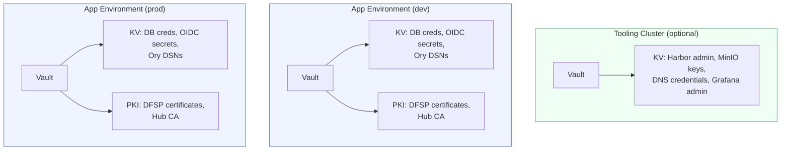
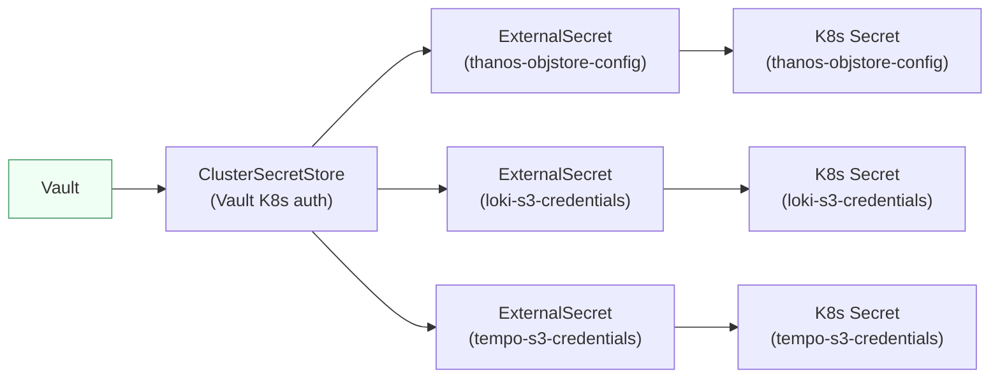
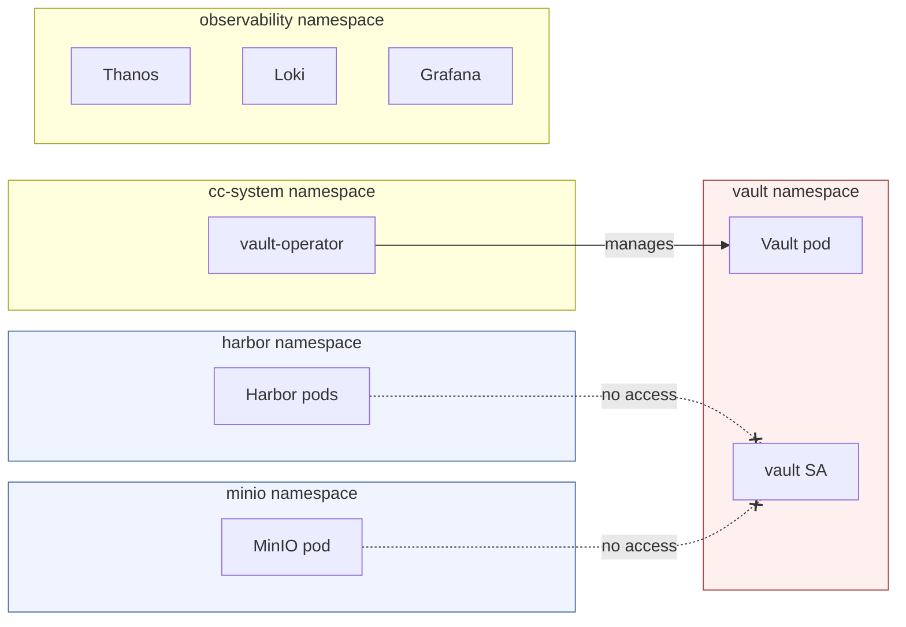

# Security

[docs](../index.md) / [architecture](index.md) / Security

**Audiences:** architect, platform engineer, adopter (operate)

## Vault isolation model

Each cluster that needs secrets management deploys its own independent Vault instance via the bank-vaults operator. There is no root/leaf hierarchy, no cross-cluster trust relationship, and no transit auto-unseal between clusters. Each Vault is self-contained: bootstrapped, unsealed, and configured entirely within its own cluster.

**Key property:** each Vault is completely independent. Compromising one cluster's Vault has zero impact on any other cluster's Vault. An attacker with full access to the dev environment's Vault gains database credentials and DFSP certificates for dev only -- not prod secrets, not the Tooling Cluster's credentials, and not the provider credentials that could provision new infrastructure.

### Vault lifecycle (all clusters)

Every Vault instance uses bank-vaults (operator + sidecar) for lifecycle management. The operator handles auto-unseal using a Kubernetes Secret in the `vault` namespace (no dependency on any external Vault). The sidecar applies declarative configuration on startup via `externalConfig` in the Vault CR -- policies, auth methods, secret engines, and startup secrets.

### Tooling Cluster Vault (optional)

The Tooling Cluster is optional. When deployed, its Vault stores credentials for shared infrastructure services:

| Path | Contents | Consumers |
|------|----------|-----------|
| `secret/data/minio` | MinIO root credentials | ESO (Thanos, Loki, Tempo) |
| `secret/data/harbor` | Harbor admin password | ESO (Harbor HelmRelease) |
| `secret/data/dns-provider` | DNS provider API credentials | ESO (cert-manager, external-dns) |
| `secret/data/observability` | Grafana admin password | ESO (Grafana HelmRelease) |

The Tooling Cluster Vault is a single replica with file-based storage (not Raft) -- the Tooling Cluster is a management plane, not a HA workload target. It uses KV-v2.

### App Environment Vault

App Environment Vaults run as 3-replica Raft clusters for high availability. Each has its own PKI engine with a self-signed Hub CA for DFSP mTLS certificate issuance, and a KV-v1 secret engine for runtime secrets.

App Environment Vault stores:

| Path | Contents | Consumers |
|------|----------|-----------|
| `secret/kratos` | Kratos DSN, cipher/cookie/CSRF secrets | ESO (Kratos deployment) |
| `secret/keto` | Keto DSN | ESO (Keto deployment) |
| `secret/finance-portal` | Role assignment secret, MongoDB password | ESO (Finance Portal) |
| `secret/mcm/*` | DFSP enrollment data (dynamic) | MCM API (direct Vault client) |
| `pki/` | Hub CA, DFSP client/server certificates | cert-manager (VaultIssuer), MCM API, Vault Agent |

**KV version note:** App Environment Vaults use KV-v1 (not KV-v2) because MCM's node-vault client writes to `secret/mcm/...` paths directly -- KV-v2 requires `secret/data/...` paths that MCM does not generate.

## External Secrets Operator (ESO)

ESO bridges each cluster's own Vault and Kubernetes. A ClusterSecretStore CR points to the local Vault via Kubernetes auth; ExternalSecret CRs pull specific paths into native Kubernetes Secrets.

ESO is used for secrets where the consumer list is static and known at manifest-authoring time:

- Database credentials (Kratos, Keto, Finance Portal DSNs)
- OIDC secrets (Keycloak client secrets)
- S3 credentials (Thanos, Loki, Tempo object store configs)
- Harbor admin credentials
- Grafana admin credentials

ESO is **not** used for per-DFSP secrets. The list of DFSPs is dynamic (partners are onboarded at runtime), which is incompatible with static ExternalSecret manifests. Vault Agent handles those instead -- see [DFSP mTLS](dfsp-mtls.md#dynamic-resource-generation-vault-agent) for the dynamic secret rendering model.

## Recovery kit

Bootstrap produces a `recovery-kit/` directory (git-ignored) for each cluster, containing everything needed to recover that cluster from scratch:

| Item | Purpose |
|------|---------|
| Vault root token | Emergency Vault access (break-glass) |
| Vault unseal keys | Manual unseal if operator auto-unseal fails |
| Harbor admin password | Harbor registry access (Tooling Cluster only) |
| Kubeconfig | Cluster API access |
| Talosconfig | Node-level access (on-prem only) |

Each cluster's recovery kit contains that cluster's own Vault credentials. This kit must be stored offline -- physical safe, air-gapped USB, or equivalent. It is the single point of recovery for the cluster. Without it, a destroyed cluster requires full re-bootstrap.

The recovery kit is generated once during initial deployment. If the cluster's Vault is re-keyed or Harbor's admin password is rotated, the kit must be regenerated.

## Namespace isolation

### Tooling Cluster (self-hosted)

Vault, Harbor, and MinIO each run in separate namespaces (`vault`, `harbor`, `minio`). The vault-operator runs in `cc-system`. This separation prevents lateral movement -- a compromised Harbor pod cannot access Vault's ServiceAccount tokens. Each namespace has its own RBAC boundaries.

### App Environment

App Environments use a similar isolation model. Vault runs in the `vault` namespace. Data services (MySQL, Kafka, MongoDB, Redis) run in `data`. Auth services (Keycloak, Kratos, Oathkeeper, Keto) run in `auth`. MCM runs in `mcm`. Mojaloop core services run in `mojaloop`.

## Secrets strategy

Secrets enter the system through three channels, depending on when they are needed.

| Category | Examples | Where they live | How they reach workloads |
|----------|----------|----------------|--------------------------|
| **Provider credentials** | `PROXMOX_VE_*`, `AWS_*` | Native env vars (read directly by Terraform providers) | Terraform only -- never enter K8s |
| **Service credentials** | `OCI_REPO_*`, `OCI_PROXY_*` | `config/environments/<env>/.env` | Makefile maps to `TF_VAR_*` then Terraform writes to K8s Secret (`cluster-secrets`) then Flux postBuild substitution |
| **DNS credentials** | `DIGITALOCEAN_TOKEN`, `CLOUDFLARE_API_TOKEN`, `AWS_ACCESS_KEY_ID` | `config/environments/<env>/.env` | Mapped to `TF_VAR_dns_credentials` map then seeded into Vault via startupSecrets then ESO pulls into K8s |
| **OIDC secrets** | `HUBOP_OIDC_SECRET`, `MCM_OIDC_CLIENT_SECRET`, `DFSP_OIDC_CLIENT_SECRET` | `config/environments/<env>/.env` | Flux postBuild substitution into Keycloak realm imports and ESO-managed secrets |
| **SMTP credentials** | `SMTP_HOST`, `SMTP_PORT`, `SMTP_USER`, `SMTP_PASSWORD` | `config/environments/<env>/.env` | Flux postBuild substitution into Keycloak dfsps realm config |

All secrets live in `config/environments/<env>/.env` (git-ignored). The Makefile sources this file and maps clean variable names to `TF_VAR_*` prefixes automatically -- no `TF_VAR_` prefixes are needed in the `.env` file itself.

**No secrets in Git.** The `.env` file is git-ignored. The `.env.sample` file in `config/` documents all required variables without values.

## Network security

### Cilium network policies

Cilium enforces network segmentation at the pod level. Policies are defined as CiliumNetworkPolicy CRs.

- **Default deny** is not imposed globally (it would break platform services), but security-sensitive namespaces have explicit policies restricting ingress and egress.
- **DFSP egress** is intercepted by CiliumEnvoyConfig for mTLS origination -- see [DFSP mTLS](dfsp-mtls.md).
- **Cross-namespace access** (e.g., Mojaloop pods reaching MySQL in the `data` namespace) is explicitly permitted via policy.

### TLS everywhere

- **External traffic:** TLS terminated at Gateway API Gateways using wildcard certificates from Let's Encrypt (cert-manager, DNS-01 challenge).
- **DFSP traffic:** Mutual TLS via CiliumEnvoyConfig on a dedicated LoadBalancer (`cilium-gateway-gw-extapi`). See [DFSP mTLS](dfsp-mtls.md) for the full model.
- **Internal cluster traffic:** Not encrypted by default (Cilium WireGuard transparent encryption is available but not enabled -- the performance cost is not justified for same-network traffic in current deployments).

## DFSP communication security

The full DFSP security model is documented separately in [DFSP mTLS](dfsp-mtls.md). In summary, DFSP partner connections are protected by five layers:

1. **Mutual TLS** -- Client certificate verification on inbound, client certificate origination on outbound
2. **JWS signatures** -- Message integrity verification (Mojaloop protocol layer)
3. **IP whitelisting** -- Source IP restriction per DFSP (CiliumEnvoyConfig filter)
4. **OAuth 2.0** -- Token-based API authorization
5. **ILP** -- Interledger Protocol cryptographic proofs (end-to-end transaction integrity)

The first three layers are enforced at the network edge by CiliumEnvoyConfig; the last two are enforced by the Mojaloop application.
