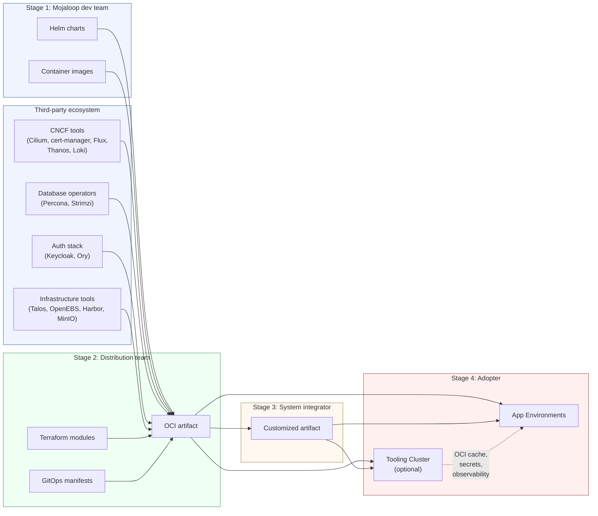
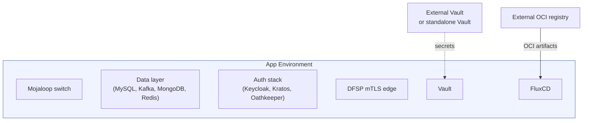
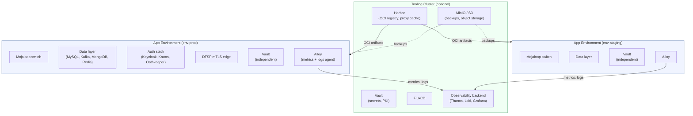
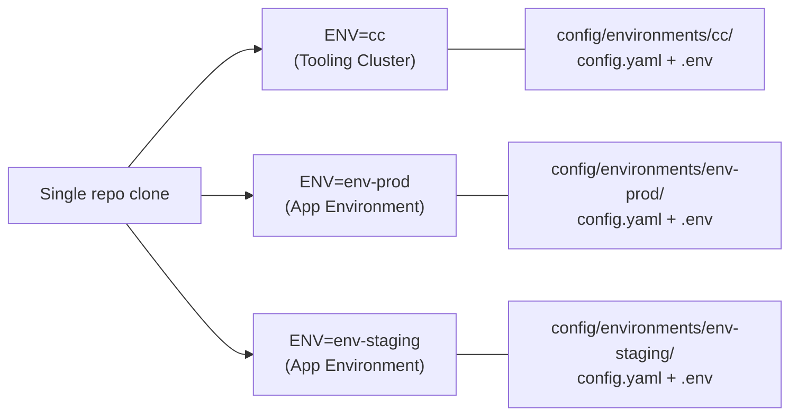

# System Overview

[docs](../index.md) / [architecture](index.md) / System Overview

**Audiences:** all

## What is ML Deployment Toolkit

ML Deployment Toolkit packages [Mojaloop](https://mojaloop.io/) -- the open-source real-time payment switch -- into a deployable, infrastructure-agnostic distribution. It bundles Terraform IaC modules and FluxCD GitOps manifests into OCI artifacts that can be consumed directly by adopters or customized and redistributed by system integrators. The distribution handles everything below the application layer: Kubernetes provisioning, networking, secrets, TLS, observability, data services, and the Mojaloop deployment itself.

## Delivery pipeline

ML Deployment Toolkit sits in the middle of a four-stage delivery chain. Each stage produces artifacts consumed by the next.

| Stage | Who | Produces | Consumes |
|-------|-----|----------|----------|
| **1. Mojaloop dev team** | Upstream Mojaloop contributors | Helm charts, container images (published to public OCI registry) | Application source code |
| **Third-party ecosystem** | CNCF, Percona, Strimzi, Keycloak, Ory, Talos, etc. | Helm charts, operators, infrastructure tools | Open-source projects |
| **2. Distribution team** | Maintainers of this repo | OCI artifact containing Terraform modules + GitOps manifests | Upstream Mojaloop charts/images + third-party ecosystem tools |
| **3. System integrator** (optional) | Consulting or integration partners | Customized OCI artifact tailored to a specific adopter | Distribution artifact |
| **4. Adopter** | The organization deploying Mojaloop | Running clusters (optionally a Tooling Cluster + App Environments) | Distribution or customized artifact |

Stage 3 is optional. Adopters can consume the distribution artifact directly without a system integrator. The Tooling Cluster is also optional -- a minimal deployment is a single App Environment cluster pulling artifacts from an external OCI registry.

## Deployment topology

A ML Deployment Toolkit deployment requires at least one **App Environment** cluster running the Mojaloop switch. An optional **Tooling Cluster** adds centralized management services for multi-environment deployments.

### Minimal deployment (env cluster only)

The simplest deployment is a single App Environment cluster that pulls OCI artifacts from an external registry (e.g., a public OCI registry or a managed container registry) and uses either a standalone Vault instance or an external secrets provider.

### Full deployment (Tooling Cluster + App Environments)

For multi-environment management, a Tooling Cluster provides centralized OCI caching (Harbor), object storage (MinIO/S3 for backups), and an observability backend (Thanos, Loki, Grafana). Each cluster (including the Tooling Cluster) runs its own independent Vault instance. The Tooling Cluster is deployed first; App Environments then consume its shared services.

**Tooling Cluster** (optional) -- the management plane:

- **Vault** -- secrets management, PKI (independent instance, same as every other cluster)
- **Harbor** -- OCI registry and pull-through proxy cache (self-hosted deployments only; cloud deployments may use managed registries)
- **MinIO / S3** -- S3-compatible object storage for backups, Thanos metrics, Loki logs
- **FluxCD** -- reconciles GitOps manifests from the OCI artifact
- **Observability backend** -- Thanos (metrics), Loki (logs), Grafana (dashboards)

Without a Tooling Cluster, App Environments pull OCI artifacts from an external registry, use standalone or external Vault, and have no centralized observability aggregation.

**App Environment** -- the workload plane:

- **Mojaloop** -- the payment switch (central ledger, account lookup, quoting, settlements, etc.)
- **Data layer** -- Percona XtraDB Cluster (MySQL), Strimzi (Kafka), Percona Server for MongoDB, Redis
- **Auth stack** -- Keycloak (identity provider, dual-realm), Ory Kratos (identity management), Ory Oathkeeper (API gateway)
- **DFSP mTLS edge** -- standalone Envoy (inbound) + CiliumEnvoyConfig (outbound) for DFSP partner connections
- **Vault** -- runtime secrets and PKI (independent instance, no dependency on Tooling Cluster Vault)
- **Alloy** -- Grafana Alloy agent shipping metrics and logs to the observability backend (Tooling Cluster or external)

## Cluster roles

Each Kubernetes cluster is assigned a role that determines which GitOps kustomizations are deployed.

| Role | Purpose | Key services deployed |
|------|---------|----------------------|
| **tooling** | Optional management plane | Vault (root), Harbor, MinIO/S3, observability backend (Thanos, Loki, Grafana), FluxCD. Not required for basic deployments -- an adopter can deploy just an env cluster pointing at external OCI registries and Vault. |
| **env** | Workload plane | Mojaloop, data layer (MySQL, Kafka, MongoDB, Redis), auth stack (Keycloak, Kratos, Oathkeeper), DFSP mTLS edge, Vault (leaf or standalone), Alloy |
| **base** | Minimal platform | Platform services only (metrics-server, external-dns, cert-manager, Gateway API) -- no role-specific workloads |

All roles share a common platform layer: metrics-server, external-dns, cert-manager, External Secrets Operator, and Gateway API. The role determines which additional kustomizations are layered on top.

## Named environments

A single clone of this repository manages multiple independent deployments through the `ENV=` variable. Each named environment has its own:

- **Configuration** -- `config/environments/<env>/config.yaml`
- **Secrets** -- `config/environments/<env>/.env` (git-ignored)
- **Terraform state** -- `artifacts/<env>/`

Environments are fully independent. A Tooling Cluster and its App Environments are separate named environments, each provisioned with its own `make plan-apply ENV=<name>` invocation. (`cc` is the default environment name for the Tooling Cluster.)

## Configuration system

Configuration is organized in three tiers, from most specific to most general.

| Tier | Owner | Contents | Location |
|------|-------|----------|----------|
| **Environment config** | Adopter | Provider selection, cluster name, domain, secrets | `config/environments/<env>/config.yaml` + `.env` |
| **Platform definitions** | Distribution team | Talos/K8s versions, deployment templates, patches, provider defaults | `config/definitions/`, `config/patches/`, `config/providers/` |
| **Distribution artifact** | Distribution team | GitOps manifests (Kustomize + Helm), Terraform modules | `gitops/`, `src/` |

The **config-loader** Terraform module merges these tiers at plan time: it loads the environment's `config.yaml`, resolves the deployment template from the provider's `deployment-templates.yaml`, applies patches from `config/patches/`, and produces a unified configuration consumed by downstream modules.

Adopters only need to touch tier 1. Tiers 2 and 3 are maintained by the distribution team and delivered as part of the OCI artifact.

See [provider-model](provider-model.md) for provider-specific configuration and [gitops-structure](gitops-structure.md) for the artifact layout.

## Provider independence

Infrastructure provider and DNS provider are two independent dimensions. Any combination works -- for example, Proxmox for compute with Cloudflare for DNS, or AWS EKS with Route53.

This separation means:

- Adding a new infrastructure provider does not require changes to DNS, TLS, or application layers
- Adding a new DNS provider does not require changes to infrastructure or application layers
- The same GitOps manifests deploy on any supported provider, with provider-specific components conditionally included

See [provider-model](provider-model.md) for the full provider matrix and [networking](networking.md#dns-strategy) for DNS provider details.
