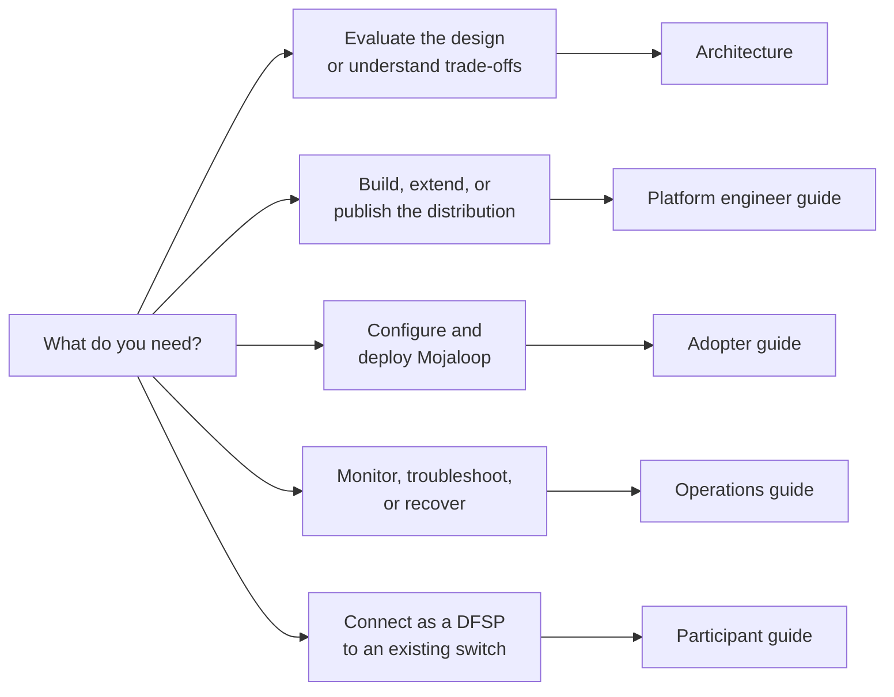
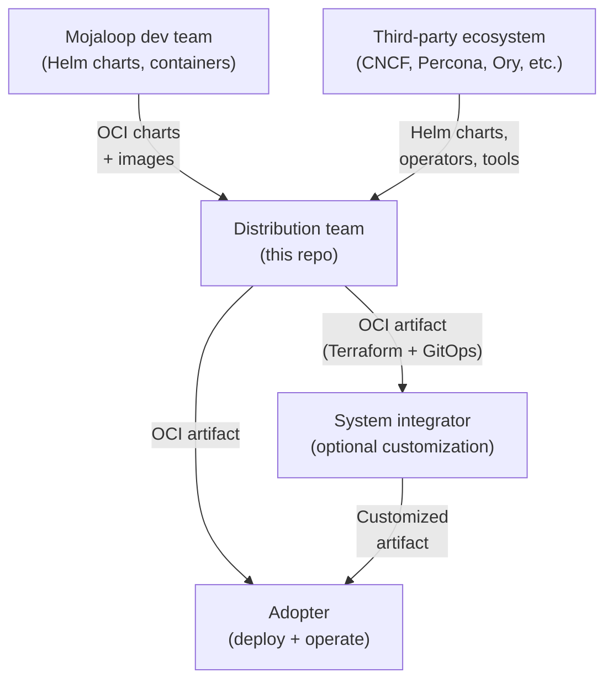

# ML Deployment Toolkit Documentation

ML Deployment Toolkit is an infrastructure-agnostic distribution of [Mojaloop](https://mojaloop.io/) — an open-source real-time payment switch. It packages infrastructure-as-code, GitOps manifests, and operational tooling into a deployable OCI-based distribution that adopters consume and system integrators can build on.

This documentation covers the full lifecycle: architecture decisions, building the distribution, deploying it, and operating it in production.

## Start here



| I want to... | Go to |
|--------------|-------|
| Understand why the system is designed this way | [Architecture](architecture/index.md) |
| See what alternatives were considered for a design choice | [Decision records](architecture/decisions/) |
| Add a provider, service, or DNS integration | [Platform guide](platform/index.md) |
| Build and publish an OCI artifact | [Building artifacts](platform/building-artifacts.md) |
| Understand the Terraform module flow | [Module pipeline](platform/module-pipeline.md) |
| Set up a new environment from scratch | [Prerequisites](adopter/prerequisites.md) then [Provider setup](adopter/provider-setup/index.md) |
| Deploy a Tooling Cluster (CC) | [Deploy a Tooling Cluster](adopter/deployment-cc.md) |
| Deploy a Switch (SW) | [Deploy a Switch](adopter/deployment-sw.md) |
| Configure environments, secrets, named environments | [Configuration](adopter/configuration.md) |
| Upgrade an existing deployment | [Upgrading](adopter/upgrading.md) |
| Read Grafana dashboards or investigate alerts | [Monitoring](operations/monitoring.md) |
| Diagnose a failing deployment or runtime error | [Troubleshooting](operations/troubleshooting.md) |
| Restore from backup or handle disaster recovery | [Backup and restore](operations/backup-restore.md) |
| Connect my DFSP to an existing Mojaloop switch | [Participant guide](participant/index.md) |
| Install the DFSP Helm chart on my own Kubernetes | [Participant install](participant/installation.md) |

## Delivery pipeline

This repo sits in the middle of the Mojaloop delivery chain:



The distribution team consumes from two sources: upstream Mojaloop (application Helm charts and container images) and the broader third-party ecosystem (CNCF tools like Cilium, cert-manager, Flux; database operators like Percona, Strimzi; auth stack like Keycloak, Ory; infrastructure tools like Talos, OpenEBS, Harbor, MinIO). This is what makes it a distribution — packaging multiple sources into a single deployable artifact.

A deployment can be as simple as a single env cluster pulling artifacts from an external OCI registry. The optional Tooling Cluster adds centralized services (Harbor, Vault, observability) for multi-environment management.

| Role | Reads | Writes |
|------|-------|--------|
| **Architect** | [Architecture](architecture/index.md), [Decisions](architecture/decisions/) | Decision records |
| **Platform engineer** | [Architecture](architecture/index.md), [Platform guide](platform/index.md) | Code, artifacts, platform docs |
| **System integrator** | [Platform guide](platform/index.md), [Adopter guide](adopter/index.md) | Customized artifacts, adopter docs for their customers |
| **Adopter (deploy)** | [Adopter guide](adopter/index.md) | Environment config |
| **Adopter (operate)** | [Operations guide](operations/index.md) | Incident learnings, runbook feedback |
| **Participant (DFSP)** | [Participant guide](participant/index.md), [DFSP Integration](architecture/dfsp-integration.md) | DFSP chart values, local runbooks |

## Quick reference

```bash
make plan ENV=cc          # Plan Tooling Cluster deployment (cc is the default environment name)
make apply ENV=cc         # Apply the plan
make plan-apply ENV=cc    # Plan + apply in one step
make push-gitops ENV=cc   # Publish gitops OCI artifact
make restore ENV=cc       # Restore stateful services from backup
```

Full command reference: [Deployment](adopter/deployment.md#commands)

## Documentation governance

How these docs are structured, maintained, and reviewed: [DOCUMENTATION.md](DOCUMENTATION.md)
