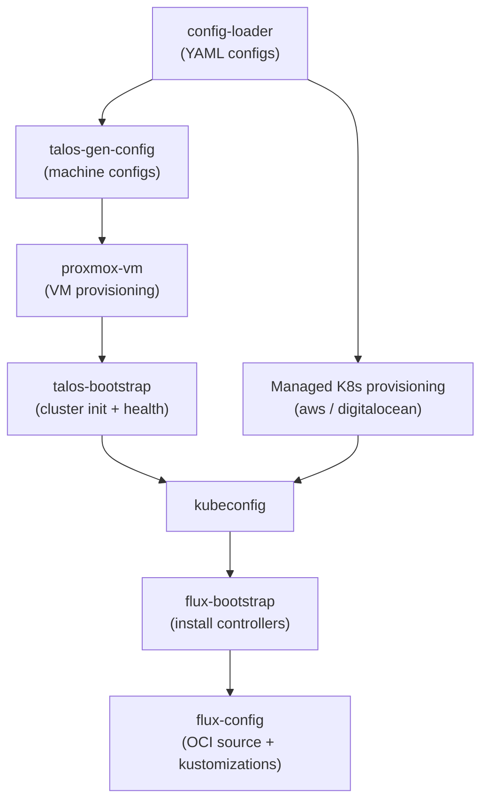
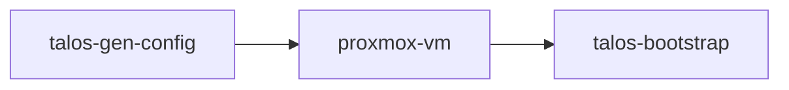
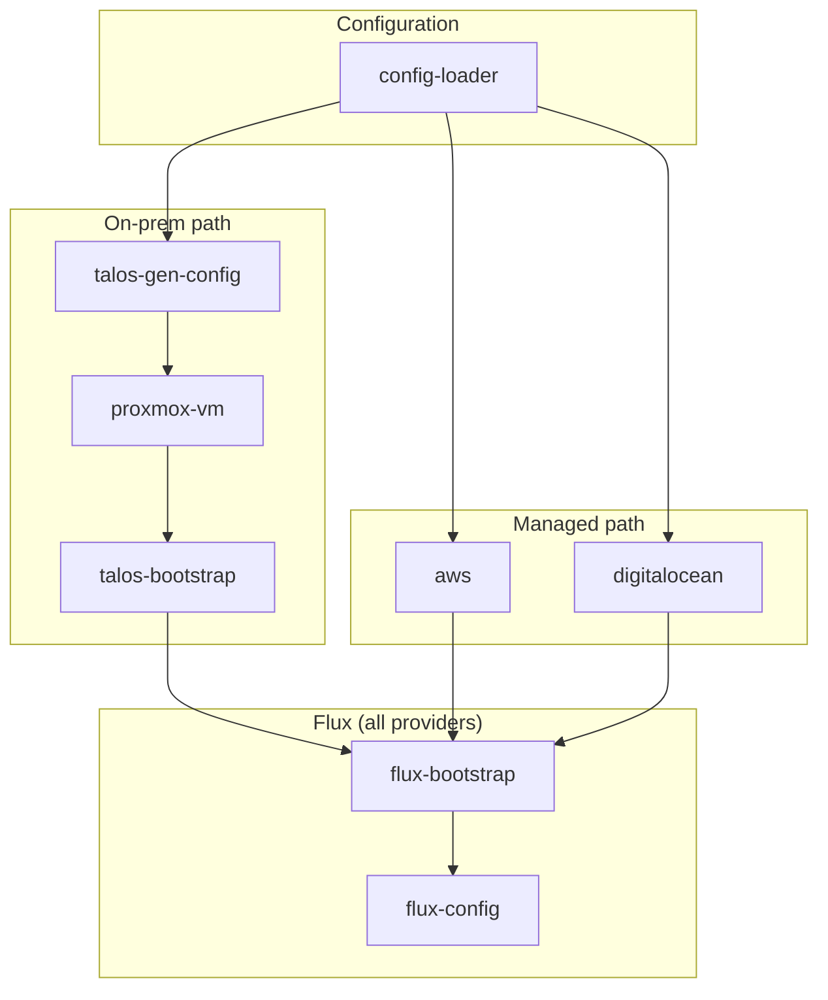

# Module Pipeline

[docs](../index.md) / [platform](index.md) / Module Pipeline

**Audiences:** platform engineer

This is the procedural counterpart to the [architecture overview](../architecture/system-overview.md). It documents the Terraform module flow in `src/` -- what each module does, its inputs and outputs, and how the modules connect. For the architectural rationale behind the pipeline design, see [system overview](../architecture/system-overview.md) and [provider model](../architecture/provider-model.md).

## Pipeline overview

Two provider paths converge to the same outcome: a healthy Kubernetes cluster with FluxCD reconciling an OCI artifact.



**On-prem path:** config-loader --> talos-gen-config --> proxmox-vm --> talos-bootstrap --> flux-bootstrap --> flux-config

**Managed path:** config-loader --> aws/digitalocean --> flux-bootstrap --> flux-config

Both paths produce a `kubeconfig` file in `artifacts/<env>/kubernetes/kubeconfig`. Everything downstream of the provider module is provider-agnostic.

## config-loader

**Source:** `src/modules/config-loader/`

Loads YAML configuration files and resolves environment-specific settings into structured outputs consumed by all downstream modules.

**Inputs:**

| Input | Source |
|-------|--------|
| `config_path` | `config/environments/<env>/config.yaml` |
| `workload_classes_path` | `config/definitions/workload-classes.yaml` |

**Processing:**

1. Loads environment config (`config.yaml`) and workload class definitions (`workload-classes.yaml`)
2. Reads provider-specific config from `config/providers/<provider>/config.yaml`
3. Loads the sizing profile from `config/providers/<provider>/profiles/<role>/<profile>.yaml` — bundles infrastructure topology, application scaling, and data layer tuning ([ADR-012](../architecture/decisions/012-tps-sizing-profiles.md))
4. Resolves instance placement (on-prem only) -- maps logical placement group names to physical hosts via `infra.<provider>.placement`
5. Separates instances by role: control-plane/mixed-plane vs worker
6. Constructs Talos image URLs from schematic, version, platform, and architecture (on-prem only)
7. Generates label/taint patches per workload class for Talos machine configs

**Outputs:**

| Output | Description |
|--------|-------------|
| `config` | Complete environment configuration object |
| `instances` | List of instances with resolved placement |
| `control_plane_instances` | Filtered: control-plane and mixed-plane instances |
| `worker_instances` | Filtered: worker instances |
| `workload_classes` | Workload class definitions (CPU, memory, disk, Talos patches, labels, taints) |
| `talos_version` | Talos version from workload-classes.yaml |
| `kubernetes_version` | Kubernetes version from workload-classes.yaml |
| `talos_image` | Constructed image URL and filename |
| `label_taint_patches` | Per-class YAML patches for node labels and taints |
| `deployment_template` | Infrastructure topology from profile (provider-specific structure) |
| `profile_app` | Application scaling variables from profile (empty map for cc/base roles) |
| `profile_data` | Data layer tuning variables from profile (empty map for cc/base roles) |
| `profile_cc` | CC services scaling variables from profile (empty map for env/base roles) |
| `paths` | Standard paths for shared resources (patches directory) |

## Provider modules

### proxmox (composite)

**Source:** `src/modules/proxmox/`

Composite module that orchestrates three sub-modules in sequence. Only instantiated when `infra.provider = proxmox`.



#### talos-gen-config

**Source:** `src/modules/talos-gen-config/`

Generates Talos machine secrets and per-instance machine configurations using the `siderolabs/talos` provider.

**Inputs:** cluster name, Kubernetes version, Talos version, load balancer IP (VIP), instance list with workload patches

**Patch layering** (applied per instance via `config_patches`):

1. Workload class patches -- from `config/patches/talos/` (e.g., `patch-cilium-install.yaml`, `patch-openebs.yaml`, `patch-allow-scheduling-on-cp.yaml`)
2. Provider patches -- from provider config (e.g., VIP patch for control-plane and mixed-plane)
3. Label/taint patches -- dynamic, generated by config-loader from workload class definitions
4. Registry mirror patch -- conditional, only when `oci.proxy.active` is true

**Outputs:**

| Output | Description |
|--------|-------------|
| `instance_configs` | Per-instance machine configuration YAML |
| `instance_config_paths` | File paths for written configs |
| `client_configuration` | Talos client config (for API access) |

**Artifacts written:** `artifacts/<env>/talos-config/<instance-name>.yaml`, `artifacts/<env>/talos-config/talosconfig`, `artifacts/<env>/talos-secrets/secrets.yaml`

#### proxmox-vm

**Source:** `src/modules/proxmox-vm/`

Provisions VMs on Proxmox from deployment template specs. Uses the `bpg/proxmox` provider.

**Key behaviors:**
- Deduplicates OS image downloads -- multiple VMs on the same host share one image
- Delivers Talos machine config via cloud-init (userdata)
- VM specs (CPU, memory, disk) come from the deployment template, resolved through workload classes

**Inputs:** instances, provider config path, Talos image, Talos configs from talos-gen-config

**Outputs:**

| Output | Description |
|--------|-------------|
| `instance_ips` | Map of instance name to assigned IP |
| `control_plane_ips` | List of control-plane node IPs |
| `worker_ips` | List of worker node IPs |

After VM provisioning, `talos_machine_configuration_apply` resources push config to running nodes via the Talos API. On first apply this is a no-op (config already delivered via cloud-init). On subsequent applies it pushes config changes without VM rebuild.

#### talos-bootstrap

**Source:** `src/modules/talos-bootstrap/`

Bootstraps the Kubernetes cluster by initializing the first control-plane node, generating a kubeconfig, and running a health check.

**Sequence:**
1. `talos_machine_bootstrap` -- bootstraps the first control-plane node
2. `talos_cluster_kubeconfig` -- generates kubeconfig from the bootstrapped cluster
3. `local_sensitive_file` -- writes kubeconfig to `artifacts/<env>/kubernetes/kubeconfig`
4. `talos_cluster_health` -- waits for all control-plane and worker nodes to be healthy (30-minute timeout)

**Outputs:**

| Output | Description |
|--------|-------------|
| `kubeconfig_path` | Path to the generated kubeconfig file |

### aws

**Source:** `src/modules/aws/`

Provisions an EKS managed Kubernetes cluster. Only instantiated when `infra.provider = aws`.

**Resources:** VPC, subnets, IAM roles/policies, EKS cluster, node groups. For env clusters, optionally provisions managed data services (RDS, MSK, DocumentDB, ElastiCache). For tooling clusters, provisions S3 and ECR.

**Inputs:** cluster config, Kubernetes version, node groups (from deployment template), region, artifacts path, provider config path

**Outputs:**

| Output | Description |
|--------|-------------|
| `kubeconfig_path` | Path to the generated kubeconfig file |
| `cluster_endpoint` | EKS API server endpoint |
| Managed service endpoints | RDS, MSK, DocumentDB, ElastiCache endpoints (env clusters) |

### digitalocean

**Source:** `src/modules/digitalocean/`

Provisions a DOKS managed Kubernetes cluster. Only instantiated when `infra.provider = digitalocean`.

**Resources:** VPC, DOKS cluster, node pools

**Inputs:** cluster config, Kubernetes version, node pools (from deployment template), region, artifacts path, provider config path

**Outputs:**

| Output | Description |
|--------|-------------|
| `kubeconfig_path` | Path to the generated kubeconfig file |

## flux-bootstrap

**Source:** `src/modules/flux-bootstrap/`

Provider-agnostic. Installs FluxCD controllers on the cluster. Always runs (for every provider).

Deploys the [Flux Operator](https://github.com/controlplaneio-fluxcd/flux-operator) via an OCI Helm chart from `ghcr.io/controlplaneio-fluxcd/charts`, then creates a `FluxInstance` CR that installs the Flux distribution (source-controller, kustomize-controller, helm-controller, notification-controller).

**Inputs:**

| Input | Default | Description |
|-------|---------|-------------|
| `flux_version` | `2.7.2` | Flux distribution version |
| `operator_version` | `0.40.0` | Flux Operator Helm chart version |
| `flux_namespace` | `flux-system` | Target namespace |

**Outputs:**

| Output | Description |
|--------|-------------|
| `flux_installed` | Boolean -- whether Helm release status is `deployed` |
| `flux_namespace` | Namespace where Flux is installed |
| `flux_version` | Installed Flux version |

## flux-config

**Source:** `src/modules/flux-config/`

Only instantiated when `oci.repo.active: true` in config.yaml. Creates all Kubernetes resources that Flux needs to reconcile the GitOps artifact.

**Resources created:**

| Resource | Name | Purpose |
|----------|------|---------|
| `ConfigMap` | `cluster-config` | Non-sensitive adopter values for Flux `postBuild` substitution |
| `Secret` | `cluster-secrets` | Sensitive credentials for Flux `postBuild` substitution |
| `Secret` | `oci-credentials` | Docker config JSON for Flux source-controller to pull from private OCI registries |
| `OCIRepository` | `ml-gitops` | Points Flux at the OCI artifact URL and version |
| `Kustomization` (many) | See chain below | One per gitops path, with `dependsOn` ordering |

**Kustomization dependency chain:**

The chain varies by cluster role. `dependsOn` ensures resources deploy in the correct order.

Tooling Cluster (`cluster.role = cc`):

```
platform --> dns/{provider} --> platform-config --> vendor (if has_vendor) --> cc --> cc-config --> cc-routes
                                                                               |               --> cc-observability --> cc-observability-routes
```

App Environment (`cluster.role = env`, on-prem):

```
platform --> dns/{provider} --> platform-config --> vendor (talos) --> env --> env-data --> env-auth --> env-auth-config --> env-app
                                                                                                   |
                                                                         env-observability-agent <--+-- platform-config
```

App Environment (`cluster.role = env`, managed):

```
platform --> dns/{provider} --> platform-config --> vendor (if has_vendor) --> env --> env-auth --> env-auth-config --> env-app
                                                                                  |
                                                               env-observability-agent <-- platform-config
```

**Conditional logic:**

| Flag | Condition | Effect |
|------|-----------|--------|
| `is_talos` | `infra.provider` in `[proxmox, openstack]` | Self-hosted data endpoints, `env-data` kustomization |
| `has_vendor` | `infra.provider` in `[proxmox, openstack, aws, gcp]` | Vendor kustomization (Cilium, LB, storage) |
| `is_env` | `cluster.role = env` | Data layer, auth layer, app layer kustomizations; Kratos secrets generation |

**ConfigMap values** (non-sensitive, subset):

`cluster_name`, `domain`, `dns_provider`, `gateway_class_name`, `alert_email`, `lb_ipam_range`, `loki_url`, `mimir_url`, and for env clusters: `mysql_host`, `kafka_host`, `mongodb_host`, `redis_host` (with ports), backup S3 config, onboarding parameters.

**Secret values** (sensitive, subset):

DNS credentials, OCI credentials, Harbor/MinIO/Grafana admin passwords, and for env clusters: database passwords, OIDC secrets, SMTP credentials, Kratos random secrets, backup S3 keys.

Data layer endpoint resolution is automatic: on-prem (`is_talos`) uses in-cluster service names (e.g., `mojaloop-db-haproxy.mojaloop.svc.cluster.local:3306`); managed providers use cloud service endpoints passed as variables.

## Data flow

### Instance lifecycle (on-prem)

```
deployment-templates.yaml           config.yaml
        |                               |
        v                               v
  deployment_template -----> config-loader <----- workload-classes.yaml
                                    |
                                    v
                            resolved instances
                            (name, placement, workload_class)
                                    |
                                    v
                  talos-gen-config (patches layered per instance)
                                    |
                                    v
                         proxmox-vm (VMs created)
                                    |
                                    v
                    talos-bootstrap (cluster initialized)
                                    |
                                    v
                              kubeconfig
```

### Flux config flow

```
config.yaml + .env            Terraform outputs
      |                             |
      v                             v
  flux-config module
      |
      +--> ConfigMap (cluster-config)    -- non-sensitive values
      +--> Secret (cluster-secrets)      -- sensitive credentials
      +--> Secret (oci-credentials)      -- registry auth
      +--> OCIRepository (ml-gitops)     -- artifact source
      +--> Kustomizations (ordered)      -- gitops paths with dependsOn
                |
                v
        Flux postBuild substitution
                |
                v
        Rendered HelmReleases, CRs, resources
```

Secrets flow: `.env` --> Makefile `TF_VAR_*` mapping --> Terraform variables --> `cluster-secrets` K8s Secret --> Flux `postBuild.substituteFrom` --> `${variable_name}` in gitops manifests.

## Artifacts

`make apply` produces the following artifacts in `artifacts/<env>/`:

| Artifact | Path | Provider | Description |
|----------|------|----------|-------------|
| Kubeconfig | `kubernetes/kubeconfig` | All | Cluster admin credentials |
| Talosconfig | `talos-config/talosconfig` | On-prem | Talos API client config |
| Instance configs | `talos-config/<name>.yaml` | On-prem | Per-instance Talos machine configs |
| Machine secrets | `talos-secrets/secrets.yaml` | On-prem | Talos machine secrets (sensitive) |
| Terraform state | `terraform.tfstate` | All | Managed by Terraform backend |
| Terraform plan | `tfplan` | All | Saved execution plan (from `make plan`) |

The `artifacts/` directory is git-ignored. For disaster recovery, the `recovery-kit/` (also git-ignored) should be stored offline. See [backup and restore](../operations/backup-restore.md) for recovery procedures.

## Module dependency chain



The root module (`src/main.tf`) uses `count` on each provider module -- only the module matching `infra.provider` is instantiated. The `flux-bootstrap` module uses `depends_on` to wait for whichever provider module ran. The `flux-config` module is gated by `oci.repo.active`.
